# Cursor基本レクチャー

実習1（9:30-10:30）で使用する、Cursor環境構築から基本操作までの手順書です。

**ミニマムゴール**：Composerで質問ができ、ファイルを`@`で参照できる状態

---

## 目次

1. [ダウンロードとインストール](#1-ダウンロードとインストール)
2. [アカウント作成とログイン](#2-アカウント作成とログイン)
3. [日本語化](#3-日本語化)
4. [プライバシー設定](#4-プライバシー設定)
5. [拡張機能インストール](#5-拡張機能インストール)
6. [Composerチャットエリアの使い方](#6-composerチャットエリアの使い方)
7. [よく使う機能](#7-よく使う機能)

---

## 1. ダウンロードとインストール

### Windows

1. https://cursor.com にアクセス
2. 「Download for Windows」をクリック
3. ダウンロードした `.exe` ファイルを実行
4. インストーラーの指示に従ってインストール

### Mac

1. https://cursor.com にアクセス
2. 「Download for Mac」をクリック
3. ダウンロードした `.dmg` ファイルを開く
4. CursorアイコンをApplicationsフォルダにドラッグ
5. 初回起動時、「開発元を確認できない」と出たら「開く」を選択

### 確認ポイント

- [ ] Cursorが起動できるか
- [ ] 初期画面が表示されるか

---

## 2. アカウント作成とログイン

### 手順

1. Cursor起動後、画面右下の「Sign In」をクリック
2. ブラウザが開いたら以下のいずれかでサインアップ：
   - **Google** でサインアップ（推奨）
   - **GitHub** でサインアップ
   - **メールアドレス** でサインアップ
3. アカウント作成完了後、Cursorに戻る
4. 右下に自分のアカウント名が表示されれば成功

### 確認ポイント

- [ ] ログイン状態になっているか
- [ ] 無料プラン or Pro プランの表示確認

---

## 3. 日本語化

### 手順

1. `Cmd + Shift + P`（Mac）または `Ctrl + Shift + P`（Windows）でコマンドパレットを開く
2. 「Configure Display Language」と入力してEnter

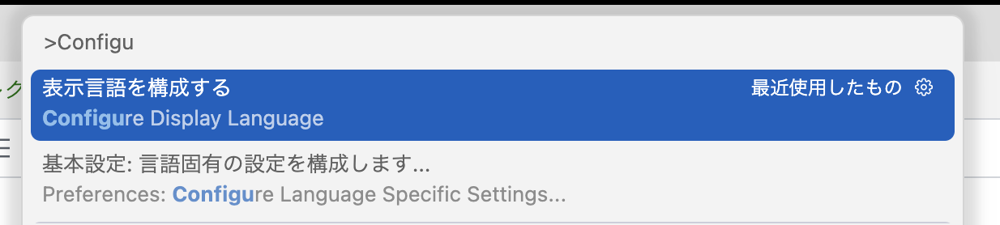

3. 「日本語」を選択

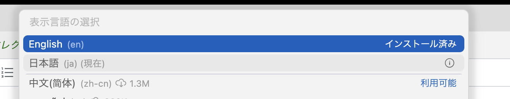

4. Cursorを再起動


### 確認ポイント

- [ ] メニューが日本語になっているか
- [ ] 設定画面が日本語になっているか

---

## 4. プライバシー設定

業務データを扱う場合、プライバシー設定を確認しましょう。

### 手順

1. `Cmd + ,`（Mac）または `Ctrl + ,`（Windows）で設定を開く
2. 左メニューから「Privacy」を選択
3. 以下の設定を確認：

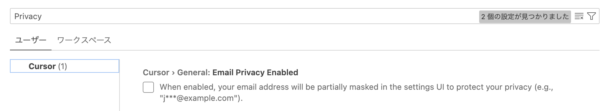

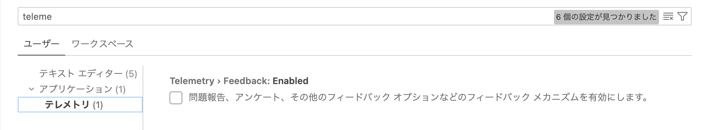

| 設定項目     | 推奨 | 説明                                   |
| -------------- | ------ | ---------------------------------------- |
| Privacy Mode | ON   | コードをCursor社のサーバーに送信しない |
| Telemetry    | OFF  | 使用状況データを送信しない             |

### 注意

- Privacy ModeをONにすると一部の機能が制限される場合があります
- 会社のセキュリティポリシーに従って設定してください

---

## 5. 拡張機能インストール

Cursorの機能を拡張するための拡張機能をインストールします。

### インストール方法

1. 左サイドバーの「拡張機能」アイコン（四角が4つ）をクリック
2. 検索バーに拡張機能名を入力
3. 「インストール」をクリック

### 推奨拡張機能

#### 5.1 Draw.io Integration

図解・フローチャートを作成できます。

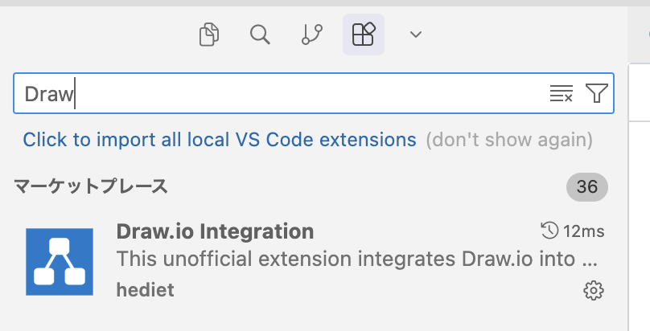

| 項目   | 内容                                     |
| -------- | ------------------------------------------ |
| 検索名 | `Draw.io Integration`                    |
| 用途   | フローチャート、図解の作成               |
| 使い方 | `.drawio` ファイルを作成すると自動で開く |

#### 5.2 PlantUML

テキストからUML図を生成できます。

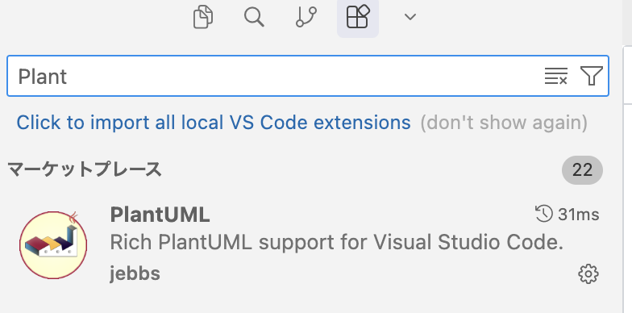

| 項目   | 内容                                           |
| -------- | ------------------------------------------------ |
| 検索名 | `PlantUML`                                     |
| 用途   | シーケンス図、フローチャートをテキストで作成   |
| 使い方 | `.puml` ファイルを作成、`Alt + D` でプレビュー |

**注意**: PlantUMLにはJavaが必要です。

```bash
# Macの場合
brew install java plantuml

# Windowsの場合
# https://plantuml.com/ja/starting からダウンロード
```

#### 5.3 Markdown Preview Enhanced

Markdownのプレビューを強化します。

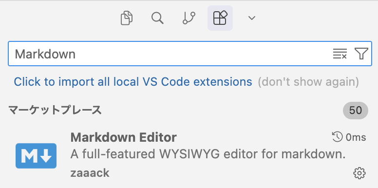

| 項目   | 内容                                            |
| -------- | ------------------------------------------------- |
| 検索名 | `Markdown Preview Enhanced`                     |
| 用途   | Markdownファイルのプレビュー表示                |
| 使い方 | `.md` ファイルを開いて `Cmd + K V` でプレビュー |

#### 5.4 Live Preview

HTMLファイルをリアルタイムでプレビューできます。

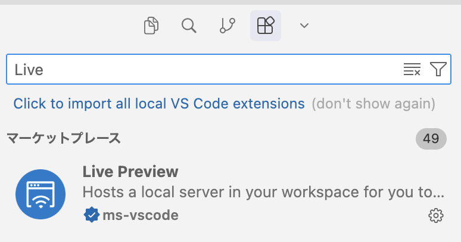

| 項目   | 内容                                        |
| -------- | --------------------------------------------- |
| 検索名 | `Live Preview`                              |
| 用途   | HTMLファイルのブラウザプレビュー            |
| 使い方 | HTMLファイルを右クリック →「Show Preview」 |

### 確認ポイント

- [ ] 4つの拡張機能がインストールされているか
- [ ] 拡張機能一覧に表示されているか

---

## 6. Composerチャットエリアの使い方

CursorのAI機能の中心となるComposerの使い方を学びます。

### 6.1 Composerの開き方

| 方法           | 操作                                    |
| ---------------- | ----------------------------------------- |
| ショートカット | `Cmd + I`（Mac）/ `Ctrl + I`（Windows） |
| メニュー       | 右サイドバーのチャットアイコン          |

### 6.2 モードとモデルの選択

Composerには用途に応じたモードと、使用するAIモデルの選択機能があります。

**モード選択**：
「Agent」「Plan」などのモードを切り替えられます。基本は「Agent」を使用します。

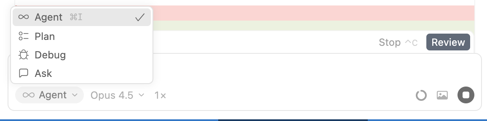

**モデル選択**：
「Claude 3.5 Sonnet」「GPT-4o」などのモデルを選択できます。

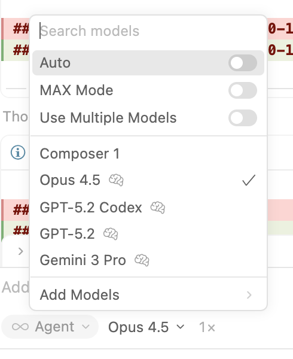

### 6.3 基本的な使い方

#### 質問する

```
このコードは何をしていますか？
```

#### 指示を出す

```
このファイルを日本語でコメントを追加してください
```

#### ファイルを指定する

```
@ファイル名.md を要約してください
```

### 6.3 よく使うプロンプト例


| 用途   | プロンプト例                             |
| -------- | ------------------------------------------ |
| 要約   | 「このファイルを3行で要約して」          |
| 構造化 | 「この議事録を箇条書きに整理して」       |
| 分析   | 「このデータの傾向を分析して」           |
| 生成   | 「〇〇についてのレポートを作成して」     |
| 変換   | 「このテキストをMarkdown形式に変換して」 |

### 6.4 Agentモード

複数の操作を自動で行うモードです。
パネル（ターミナルなど）で実行状況を確認できます。

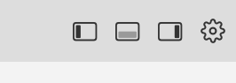

1. Composerで「Agent」タブを選択
2. やりたいことを自然言語で指示
3. AIが複数のファイルを自動で編集

```
例：「このフォルダ内のすべてのmdファイルに目次を追加して」
```

**エージェント一覧**：
カスタムエージェントを作成・管理することも可能です。

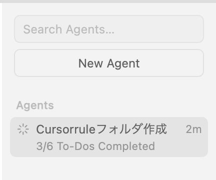

### 6.5 画像を使う

画像をドラッグ&ドロップして解析できます。

```
（画像をドロップして）
この手書きメモの内容をテキストに起こして
```

```
（画像をドロップして）
この図をDrawio形式で再現して
```

### 確認ポイント

- [ ] Composerが開けるか
- [ ] 簡単な質問に回答が返ってくるか
- [ ] ファイルを@で指定できるか

---

## 7. よく使う機能

画面右上のアイコンでレイアウト（サイドバー表示/非表示など）を操作できます。


### 7.1 ショートカット一覧


| 操作             | Mac               | Windows            |
| ------------------ | ------------------- | -------------------- |
| Composer開く     | `Cmd + I`         | `Ctrl + I`         |
| コマンドパレット | `Cmd + Shift + P` | `Ctrl + Shift + P` |
| 設定を開く       | `Cmd + ,`         | `Ctrl + ,`         |
| ファイル検索     | `Cmd + P`         | `Ctrl + P`         |
| 全文検索         | `Cmd + Shift + F` | `Ctrl + Shift + F` |
| サイドバー切替   | `Cmd + B`         | `Ctrl + B`         |

### 7.2 ファイル操作

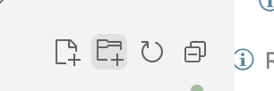

| 操作         | 方法                                                |
| -------------- | ----------------------------------------------------- |
| 新規ファイル | エクスプローラーで右クリック →「新しいファイル」   |
| フォルダ作成 | エクスプローラーで右クリック →「新しいフォルダー」 |
| 名前変更     | ファイルを選択して`Enter`                           |
| 削除         | ファイルを選択して`Delete`                          |

**右クリックメニュー**：
プレビュー表示やFinderで開くなどの操作が可能です。

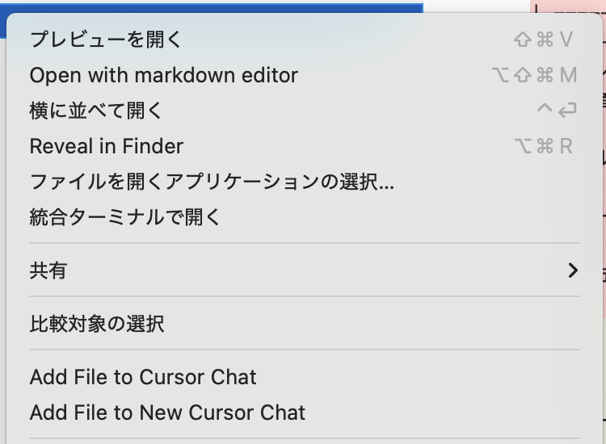

### 7.3 Markdown記法（基本）

```markdown
# 見出し1
## 見出し2
### 見出し3

- 箇条書き
- 箇条書き

1. 番号付きリスト
2. 番号付きリスト

**太字**
*斜体*

| 表 | 表 |
|----|-----|
| A  | B   |

```コード```
```

---

## トラブルシューティング

### Q: Cursorが起動しない

- 再インストールを試す
- PCを再起動してみる

### Q: ログインできない

- ブラウザのキャッシュをクリア
- 別のブラウザで試す

### Q: 拡張機能が動かない

- Cursorを再起動
- 拡張機能を一度無効化→再有効化

### Q: 日本語が文字化けする

- フォント設定を確認
- 設定 → Editor: Font Family を変更

---

## 次のステップ

この基本レクチャーが完了したら、すぐに [2HP分析ワーク.md](./2HP分析ワーク.md) に進みます。

**昼休憩前に新HPプロトタイプを完成させましょう！**
