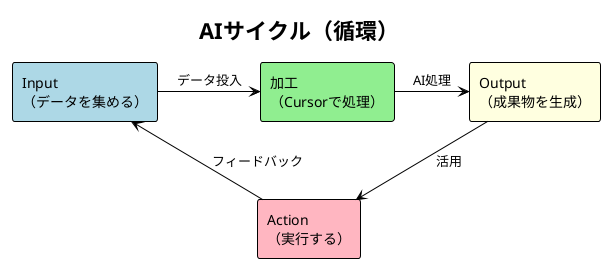
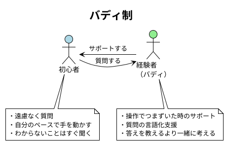
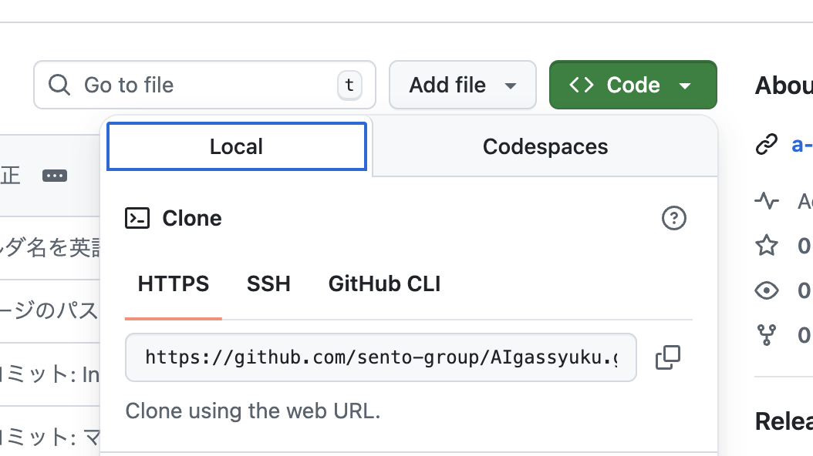
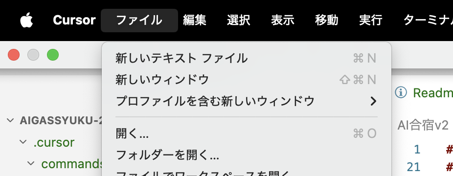
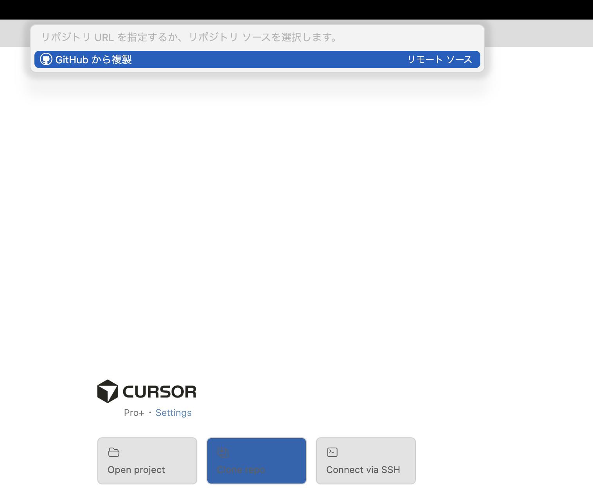
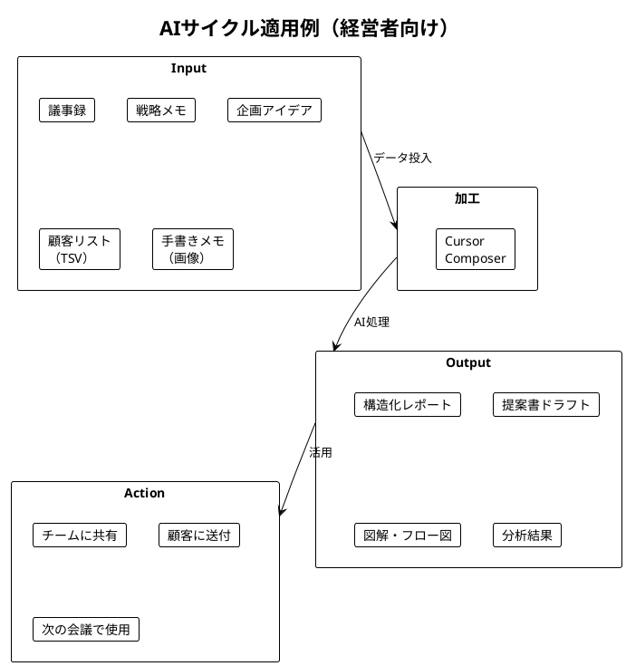
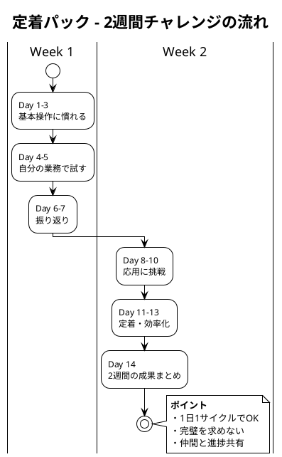

# AI合宿v2 当日進行マニュアル

## 目次

- [目標](#目標)
- [前回との違い](#前回との違い)
- [コンセプト](#コンセプト)
- [基本情報](#基本情報)
- [バディ編成](#バディ編成)
- [タイムテーブル](#タイムテーブル)
- [事前準備](#事前準備github--cursorセットアップ)
- [各フェーズ詳細](#各フェーズ詳細)
- [配布物チェックリスト](#配布物チェックリスト)
- [関連ファイル一覧](#関連ファイル一覧使用順)
- [.cursorフォルダとコマンドの解説](#cursorフォルダとコマンドの解説)
- [PlantUML Tips](#plantuml-tips)
- [運営メモ](#運営メモ)

---

## 目標

本合宿の目標は以下の2点：

1. **Cursorが使えるようになる**
   - 環境構築からComposer操作まで一通り習得
   - 自分で質問・指示ができる状態になる

2. **AIサイクルを実践の中で体感する**
   - 概論ではなく、実際に手を動かしながら習得
   - 自社業務に適用できるイメージを持って帰る

### 📋 合宿終了時のゴールチェック

合宿が終わった時、以下ができていればOK：

- [ ] Cursorで`@ファイル名`を使って質問できる
- [ ] 自社HPの分析レポートと新HPプロトタイプが完成している
- [ ] 提案書たたきが完成し、NotebookLMでスライド構成ができている
- [ ] 「AIサイクル（Input→加工→Output→Action）」を自分の言葉で説明できる
- [ ] 明日から使う具体的なアイデアが1つ以上ある

---

## 前回との違い


| 項目         | 前回（v1）                                     | 今回（v2）                     |
| -------------- | ------------------------------------------------ | -------------------------------- |
| メインテーマ | Cursorの操作方法と<br />LP・システム生成のデモ | 実践の中でAIサイクルを体感する |
| 参加者の状態 | 「AIすごい！」と驚く                           | 「自分でできる」状態で帰る     |
| ゴール       | AIの可能性を知る                               | 業務で使える武器を持ち帰る     |
| フォーカス   | 何ができるか（What）                           | どう使うか（How）              |
| 学び方       | 講義で概念を学ぶ                               | 実習の中で体感する             |

---

## コンセプト

「実践の中でAIサイクル（Input→加工→Output→Action）を体感する」

- 講義で概念を教えるのではなく、**実習を通じて自然と身につける**
- AIサイクルの詳細は [AIサイクルフロー図](./AIサイクルフロー.drawio) を参照

### AIサイクル循環図



**ポイント**：

- Actionが次のInputにつながる **循環構造**
- 一度で終わりではなく、繰り返し回すことで精度が上がる

---

## 基本情報

| 項目   | 内容                                   |
| -------- | ---------------------------------------- |
| 日時   | 9:00〜18:00（9時間）                   |
| 参加者 | 10名（初心者5名 × 経験者5名）         |
| 形式   | バディ制（初心者×経験者ペア）         |
| 対象   | 経営者                                 |
| ゴール | Cursorが使える＋AIサイクルを回せる状態 |

---

## バディ編成


| ペア | 初心者   | 経験者（バディ） |
| ------ | ---------- | ------------------ |
| A    | （氏名） | （氏名）         |
| B    | （氏名） | （氏名）         |
| C    | （氏名） | （氏名）         |
| D    | （氏名） | （氏名）         |
| E    | （氏名） | （氏名）         |

### バディの役割



- **経験者**：操作でつまずいた時のサポート、質問の言語化支援
- **初心者**：遠慮なく質問、自分のペースで手を動かす

---

## タイムテーブル

### スケジュール

**ポイント**：昼休憩前にHP改善を完了させ、中間チェックポイントとする

| 時間        | フェーズ       | 内容                     | 詳細資料                                               |
| ------------- | ---------------- | -------------------------- | -------------------------------------------------------- |
| 9:00-9:30   | オープニング   | 受付・アイスブレイク     | -                                                      |
| 9:30-10:30  | **実習1**      | Cursor基礎レクチャー     | [1Cursor基本レクチャー.md](./1Cursor基本レクチャー.md) |
| 10:30-12:00 | **実習2**      | 自社HP分析＆新HP作成     | [2HP分析ワーク.md](./2HP分析ワーク.md)                 |
| 12:00-13:00 | 昼休憩         | **← 中間チェック完了**   | -                                                      |
| 13:00-13:15 | 午後キックオフ | 定着パック紹介           | [3定着パック.md](./3定着パック.md)                     |
| 13:15-16:00 | **実習3**      | 提案書たたき＆NotebookLM | [4提案書ワーク.md](./4提案書ワーク.md)                 |
| 16:00-17:00 | **発表**       | 成果発表                 | -                                                      |
| 17:00-18:00 | クロージング   | 振り返り                 | -                                                      |

---

## 事前準備：GitHub & Cursorセットアップ

### Step 1: GitHubアカウント作成

1. https://github.com にアクセス
2. 「Sign up」からアカウント作成
3. メール認証を完了

### Step 2: リポジトリをClone

GitHubの画面で緑色の「Code」ボタンを押し、URLをコピーします。



```bash
git clone https://github.com/sento-group/AIgassyuku.git
```

### Step 3: CursorでリポジトリをOpen

1. Cursorを起動 → 「File」→「Open Folder」（またはClone直後の画面から選択）




2. Cloneした `AIgassyuku` フォルダを選択
3. 左サイドバーに `AI合宿v2` フォルダが見えればOK

→ **ここまで完了したら授業開始！**

---

## 各フェーズ詳細

### 実習1：Cursor基礎レクチャー（9:30-10:30）

**目的**：全員がCursorを操作できる状態にする

📄 **詳細資料**：[1Cursor基本レクチャー.md](./1Cursor基本レクチャー.md)

**ミニマムゴール**：Composerで質問ができ、ファイルを`@`で参照できる状態

---

### 実習2：自社HP分析＆新HP作成（10:30-12:00）

**目的**：自社HPを分析し、改善案を出して新しいHPを作成する体験

📄 **詳細資料**：[2HP分析ワーク.md](./2HP分析ワーク.md)

**ミニマムゴール**：自社HPの分析結果と、新HPのプロトタイプHTMLが完成している

**AIサイクル適用例（経営者向け）**：



> **💡 昼休憩前の中間チェック**：ここまでで「AIサイクルを1回回した」状態になっていればOK

---

### 午後キックオフ（13:00-13:15）

**目的**：午後の流れを説明し、定着パックを紹介する

📄 **詳細資料**：[3定着パック.md](./3定着パック.md)

**定着パック概念図**：



---

### 実習3：提案書たたき＆NotebookLM（13:15-16:00）

**目的**：企画アイデアを提案書のたたき台にし、NotebookLMで提案スライドを作成する体験

📄 **詳細資料**：[4提案書ワーク.md](./4提案書ワーク.md)

**ミニマムゴール**：提案書たたきが完成し、NotebookLMでスライド構成ができている

**💡 ポイント**：AIツールを連携させる（Cursor → NotebookLM）ことで、より大きな成果が得られる

---

### 発表（16:00-17:00）

**形式**：各ペア5分発表＋2分質疑

**発表内容**：

1. 何を作ったか
2. AIサイクルをどう回したか
3. 実際のOutput（画面共有）
4. 明日からどう使うか

---

### クロージング（17:00-18:00）

**内容**：

1. 今日の学びの振り返り（バディペアで共有）
2. 定着パック活用のコツ
3. 質疑応答

---

## 配布物チェックリスト


| 配布物                  | タイミング     | リンク                                                 |
| ------------------------- | ---------------- | -------------------------------------------------------- |
| Cursor基本レクチャー    | 実習1開始時    | [1Cursor基本レクチャー.md](./1Cursor基本レクチャー.md) |
| HP分析ワーク            | 実習2開始時    | [2HP分析ワーク.md](./2HP分析ワーク.md)                 |
| 定着パック              | 午後キックオフ | [3定着パック.md](./3定着パック.md)                     |
| 提案書ワーク            | 実習3開始時    | [4提案書ワーク.md](./4提案書ワーク.md)                 |
| サンプルコマンド（3種） | 適宜           | [commandsフォルダ](./commands/)                        |

---

## 関連ファイル一覧（使用順）


| 順番 | ファイル                                               | 用途                       |
| ------ | -------------------------------------------------------- | ---------------------------- |
| 1    | [1Cursor基本レクチャー.md](./1Cursor基本レクチャー.md) | 実習1の詳細手順            |
| 2    | [2HP分析ワーク.md](./2HP分析ワーク.md)                 | 実習2の詳細手順            |
| 3    | [3定着パック.md](./3定着パック.md)                     | 定着用チャレンジプログラム |
| 4    | [4提案書ワーク.md](./4提案書ワーク.md)                 | 実習3の詳細手順            |
| -    | [commands/](./commands/)                               | サンプルコマンド           |

---

## .cursorフォルダとコマンドの解説

### wajima.mdc - 困った時のガイド

進め方に迷った時は、[@wajima.mdc](./../.cursor/rules/wajima.mdc) を参照してください。

```
@wajima.mdc を参照しながら、〇〇について教えてください
```

**活用シーン**：
- 「何から始めればいいか分からない」
- 「Inputがないのに対話ばかりして進まない」
- 「フォルダ構成をどうすればいいか相談したい」

### ファイル種別の違い

| 種別             | 拡張子 | 役割                         | 特徴                                       |
| ------------------ | -------- | ------------------------------ | -------------------------------------------- |
| **Cursor Rules** | `.mdc` | AIの振る舞いを定義           | `@ファイル名` で参照するとAIがルールに従う |
| **コマンド**     | `.md`  | 定型プロンプトのテンプレート | Inputを入れ替えて繰り返し使える            |

### commands/ 配下（サンプル）

| ファイル                                          | Input例          | Output例             |
| --------------------------------------------------- | ------------------ | ---------------------- |
| [営業日報.md](./commands/営業日報.md)             | 商談メモ         | 構造化された営業日報 |
| [競合調査.md](./commands/競合調査.md)             | 競合LP           | 競合分析レポート     |
| [顧客ヒアリング.md](./commands/顧客ヒアリング.md) | インタビューメモ | ヒアリングレポート   |

---

## PlantUML Tips


| 方法                     | 手順                                   |
| -------------------------- | ---------------------------------------- |
| **Cursorでプレビュー**   | `.puml`ファイルを開いて `Alt + D`      |
| **オンラインプレビュー** | https://www.plantuml.com/plantuml/uml/ |

**トラブルシューティング**：

- プレビュー表示されない → PlantUML拡張機能とJavaをインストール
- 日本語文字化け → `skinparam defaultFontName "Hiragino Sans"` を追加

---

## 運営メモ

### 事前準備

- [ ] バディ編成確定
- [ ] 参加者へGitHubアカウント作成の案内送付
- [ ] CloneするリポジトリURLの準備
- [ ] 会場Wi-Fi確認

### 当日持ち物

- [ ] プロジェクター/モニター
- [ ] 延長コード
- [ ] 名札（バディペアがわかるように色分け）
- [ ] タイマー
