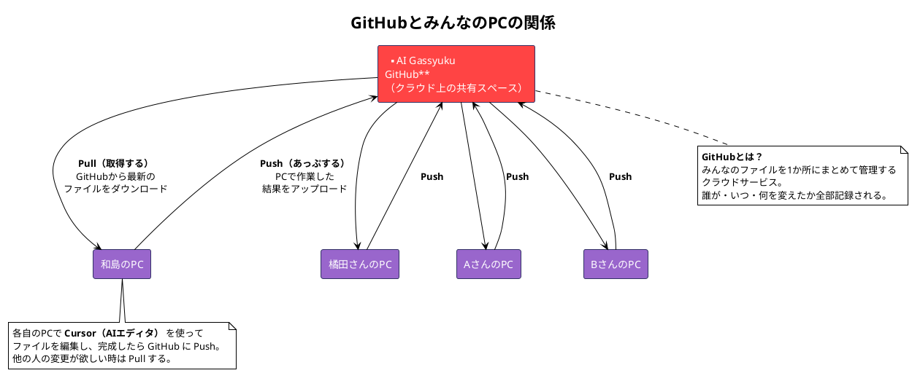
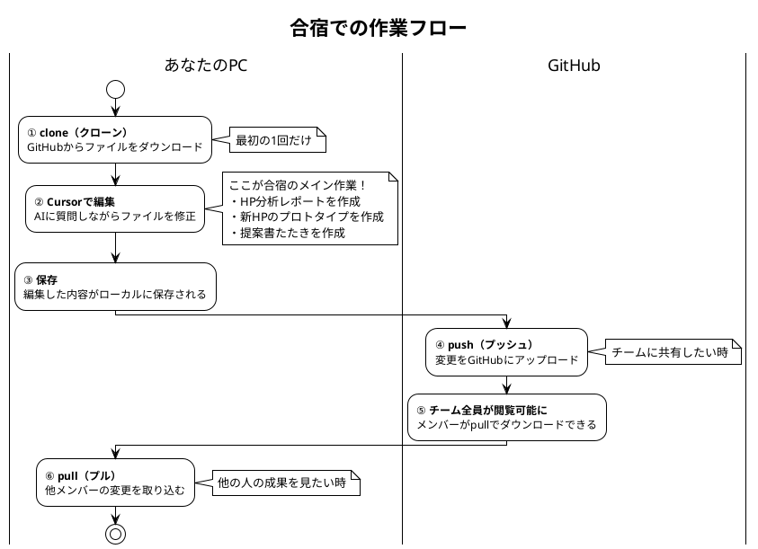
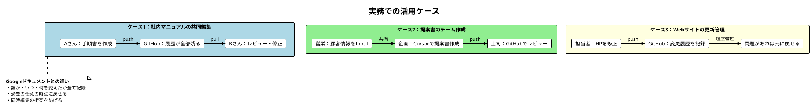

# AI合宿v2 当日進行マニュアル

## 目次

- [Cursorで作れるもの](#-cursorで作れるもの)
- [目標](#目標)
- [前回との違い](#前回との違い)
- [コンセプト](#コンセプト)
- [基本情報](#基本情報)
- [バディ編成](#バディ編成)
- [タイムテーブル](#タイムテーブル)
- [事前準備](#事前準備github--cursorセットアップ)
- [各フェーズ詳細](#各フェーズ詳細)
- [配布物チェックリスト](#配布物チェックリスト)
- [関連ファイル一覧](#関連ファイル一覧使用順)
- [.cursorフォルダとコマンドの解説](#cursorフォルダとコマンドの解説)
- [PlantUML Tips](#plantuml-tips)
- [運営メモ](#運営メモ)

---

## 🎨 Cursorで作れるもの

「Cursorって何が作れるの？」という疑問に答えます。
**プログラミング経験ゼロでも、AIと対話するだけで以下のようなものが作れます。**

### 📄 ドキュメント系

| 作れるもの | 具体例 | 所要時間目安 |
|-----------|--------|-------------|
| **提案書・企画書** | 新規事業提案、サービス企画書 | 30分〜1時間 |
| **営業資料** | 商品説明資料、会社案内 | 20分〜40分 |
| **業務マニュアル** | 新人向け手順書、FAQ | 30分〜1時間 |
| **議事録** | 会議メモから構造化された議事録 | 10分〜20分 |
| **分析レポート** | 競合分析、市場調査レポート | 30分〜1時間 |
| **メール・文章** | 顧客への提案メール、お礼状 | 5分〜15分 |

### 🌐 Webサイト系

| 作れるもの | 具体例 | 所要時間目安 |
|-----------|--------|-------------|
| **ホームページ** | 会社HP、サービスLP | 1〜2時間 |
| **ランディングページ** | キャンペーンLP、採用LP | 30分〜1時間 |
| **ポートフォリオ** | 実績紹介サイト | 1〜2時間 |
| **お問い合わせフォーム** | 見積もり依頼、申し込みフォーム | 30分〜1時間 |

### 🛠️ 業務ツール系

| 作れるもの | 具体例 | 所要時間目安 |
|-----------|--------|-------------|
| **簡易システム** | 顧客管理、在庫管理、予約管理 | 2〜4時間 |
| **計算ツール** | 見積もり計算、ローンシミュレーター | 1〜2時間 |
| **データ変換ツール** | CSV整形、PDF→テキスト変換 | 30分〜1時間 |
| **チェックリスト** | タスク管理、品質チェック | 15分〜30分 |

### 📊 図解・ビジュアル系

| 作れるもの | 具体例 | 所要時間目安 |
|-----------|--------|-------------|
| **フロー図** | 業務フロー、意思決定フロー | 15分〜30分 |
| **組織図** | 会社組織図、プロジェクト体制図 | 10分〜20分 |
| **スライド構成** | プレゼン資料の骨子 | 20分〜40分 |

### 💡 ポイント

> **「自分には作れない」と思っていたものが、AIとの対話だけで作れます。**
> 
> - プログラミング知識は不要
> - 完璧を目指さなくてOK（80%の完成度でまず作る）
> - 作ったものを元に、どんどん改善できる
> 
> 今日の合宿では、この中から **「HP分析＆新HP作成」** と **「提案書」** を実際に作ります！

---

## 目標

本合宿の目標は以下の2点：

1. **Cursorが使えるようになる**
   - 環境構築からComposer操作まで一通り習得
   - 自分で質問・指示ができる状態になる

2. **AIサイクルを実践の中で体感する**
   - 概論ではなく、実際に手を動かしながら習得
   - 自社業務に適用できるイメージを持って帰る

### 📋 合宿終了時のゴールチェック

合宿が終わった時、以下ができていればOK：

- [ ] Cursorで`@ファイル名`を使って質問できる
- [ ] 自社HPの分析レポートと新HPプロトタイプが完成している
- [ ] 提案書たたきが完成し、NotebookLMでスライド構成ができている
- [ ] 「AIサイクル（Input→加工→Output→Action）」を自分の言葉で説明できる
- [ ] 明日から使う具体的なアイデアが1つ以上ある

---

## 前回との違い


| 項目         | 前回（v1）                                     | 今回（v2）                     |
| -------------- | ------------------------------------------------ | -------------------------------- |
| メインテーマ | Cursorの操作方法と<br />LP・システム生成のデモ | 実践の中でAIサイクルを体感する |
| 参加者の状態 | 「AIすごい！」と驚く                           | 「自分でできる」状態で帰る     |
| ゴール       | AIの可能性を知る                               | 業務で使える武器を持ち帰る     |
| フォーカス   | 何ができるか（What）                           | どう使うか（How）              |
| 学び方       | 講義で概念を学ぶ                               | 実習の中で体感する             |

---

## コンセプト

「実践の中でAIサイクル（Input→加工→Output→Action）を体感する」

- 講義で概念を教えるのではなく、**実習を通じて自然と身につける**
- AIサイクルの詳細は [AIサイクルフロー図](./AIサイクルフロー.drawio) を参照

### AIサイクル循環図


**ポイント**：

- Actionが次のInputにつながる **循環構造**
- 一度で終わりではなく、繰り返し回すことで精度が上がる

---

## 基本情報

| 項目   | 内容                                   |
| -------- | ---------------------------------------- |
| 日時   | 9:00〜18:00（9時間）                   |
| 参加者 | 10名（初心者5名 × 経験者5名）         |
| 形式   | バディ制（初心者×経験者ペア）         |
| 対象   | 経営者                                 |
| ゴール | Cursorが使える＋AIサイクルを回せる状態 |

---

## バディ編成


| ペア | 初心者   | 経験者（バディ） |
| ------ | ---------- | ------------------ |
| A    | （氏名） | （氏名）         |
| B    | （氏名） | （氏名）         |
| C    | （氏名） | （氏名）         |
| D    | （氏名） | （氏名）         |
| E    | （氏名） | （氏名）         |

### バディの役割


- **経験者**：操作でつまずいた時のサポート、質問の言語化支援
- **初心者**：遠慮なく質問、自分のペースで手を動かす

---

## タイムテーブル

### スケジュール

**ポイント**：昼休憩前にHP改善を完了させ、中間チェックポイントとする

| 時間        | フェーズ       | 内容                     | 詳細資料                                               |
| ------------- | ---------------- | -------------------------- | -------------------------------------------------------- |
| 9:00-9:30   | オープニング   | 受付・アイスブレイク     | -                                                      |
| 9:30-10:30  | **実習1**      | Cursor基礎レクチャー     | [1Cursor基本レクチャー.md](./1Cursor基本レクチャー.md) |
| 10:30-12:00 | **実習2**      | 自社HP分析＆新HP作成     | [2HP分析ワーク.md](./2HP分析ワーク.md)                 |
| 12:00-13:00 | 昼休憩         | **← 中間チェック完了**   | -                                                      |
| 13:00-13:15 | 午後キックオフ | 定着パック紹介           | [3定着パック.md](./3定着パック.md)                     |
| 13:15-16:00 | **実習3**      | 提案書たたき＆NotebookLM | [4提案書ワーク.md](./4提案書ワーク.md)                 |
| 16:00-17:00 | **発表**       | 成果発表                 | -                                                      |
| 17:00-18:00 | クロージング   | 振り返り                 | -                                                      |

---

## 事前準備：GitHub & Cursorセットアップ

### Step 1: Cursorのダウンロードとインストール

1. https://cursor.com にアクセス
2. 「Download for Mac」または「Download for Windows」をクリック
3. ダウンロードしたファイルを実行してインストール
   - **Mac**: `.dmg` ファイルを開き、CursorアイコンをApplicationsフォルダにドラッグ
   - **Windows**: `.exe` ファイルを実行し、インストーラーの指示に従う
4. Cursorを起動して初期画面が表示されることを確認

📄 **詳細手順**: [1Cursor基本レクチャー.md](./1Cursor基本レクチャー.md) の「1. ダウンロードとインストール」を参照

### Step 2: Cursorアカウント作成

1. Cursor起動後、画面右下の「Sign In」をクリック
2. ブラウザが開いたら、以下のいずれかでサインアップ：
   - **Google** でサインアップ（推奨）
   - **GitHub** でサインアップ
   - **メールアドレス** でサインアップ
3. アカウント作成完了後、Cursorに戻る
4. 右下に自分のアカウント名が表示されれば成功

📄 **詳細手順**: [1Cursor基本レクチャー.md](./1Cursor基本レクチャー.md) の「2. アカウント作成とログイン」を参照

### Step 3: GitHubアカウント作成

#### 3-1. GitHubのサイトにアクセス

1. ブラウザで https://github.com にアクセス
2. 画面右上の「**Sign up**」ボタンをクリック


#### 3-2. メールアドレスの入力

1. 「Enter your email」にメールアドレスを入力
2. 「**Continue**」をクリック


#### 3-3. パスワードの設定

1. パスワードを入力（15文字以上、または数字と小文字を含む8文字以上）
2. 「**Continue**」をクリック


#### 3-4. ユーザー名の設定

1. 好きなユーザー名を入力（英数字とハイフンのみ）
2. 使用可能であれば緑のチェックマークが表示される
3. 「**Continue**」をクリック


#### 3-5. メール設定とロボット認証

1. メール配信の設定（「y」または「n」を入力）
2. ロボットでないことを確認するパズルを解く
3. 「**Create account**」をクリック


#### 3-6. メール認証コードの入力

1. 登録したメールアドレスに届いた認証コード（8桁の数字）を確認
2. GitHub画面に認証コードを入力


#### 3-7. アカウント作成完了

1. 以下のようなダッシュボード画面が表示されれば完了


> **📸 スクリーンショット撮影ガイド（運営向け）**
>
> 上記の手順に沿って実際にアカウントを作成し、各ステップでスクリーンショットを撮影してください。
> ファイルは以下の名前で `image/` フォルダに保存してください：
>
> | ステップ | ファイル名 |
> |----------|------------|
> | 3-1 | `github-top-signup.png` |
> | 3-2 | `github-email.png` |
> | 3-3 | `github-password.png` |
> | 3-4 | `github-username.png` |
> | 3-5 | `github-verify.png` |
> | 3-6 | `github-email-code.png` |
> | 3-7 | `github-welcome.png` |

### 💡 GitHub・Cursor・チーム共有の関係（図解）

GitHubやCursorが何をするものなのか、全体像を把握しましょう。

#### 全体像：GitHubとみんなのPCの関係



**用語まとめ**：
| 用語 | 意味 | イメージ |
|------|------|----------|
| **GitHub** | クラウド上の共有スペース | みんなの共有フォルダ |
| **Push（プッシュ）** | 自分の変更をアップロード | 「できたよ！」と共有する |
| **Pull（プル）** | 最新の変更をダウンロード | 「最新ちょうだい」と取得する |
| **Cursor** | AI付きエディタ | 自分のPCでファイルを編集するツール |

**ポイント**：
- **GitHub** = クラウド上の共有フォルダ。チーム全員がアクセスできる
- **Cursor** = AI付きのエディタ。手元のファイルを編集するツール
- **ローカルPC** = 自分のPCにダウンロードしたファイル。ここで作業する

#### 合宿での作業フロー



**ポイント**：
- **clone**（クローン）= 最初にファイルをダウンロードすること
- **push**（プッシュ）= 自分の変更をGitHubにアップロードすること
- **pull**（プル）= 他の人の変更をダウンロードすること

#### 経営者向け：実務での活用ケース



**Googleドライブとの比較**：

| 項目 | Googleドライブ | GitHub + Cursor |
|------|---------------|-----------------|
| ファイル共有 | ○ できる | ○ できる |
| 変更履歴 | △ 限定的 | ◎ 全変更を完全記録 |
| 過去に戻す | △ 難しい | ◎ いつでも戻せる |
| AI活用 | △ 別ツール必要 | ◎ Cursorに組み込み済み |
| 向いている用途 | 文書・スプレッドシート | コード・HTML・マニュアル等 |

---

### Step 4: リポジトリをClone

GitHubの画面で緑色の「Code」ボタンを押し、URLをコピーします。


```bash
git clone https://github.com/sento-group/AIgassyuku.git
```

### Step 5: CursorでリポジトリをOpen

1. Cursorを起動 → 「File」→「Open Folder」（またはClone直後の画面から選択）


2. Cloneした `AIgassyuku` フォルダを選択
3. 左サイドバーに `AI合宿v2` フォルダが見えればOK

📄 **詳細手順**: [1Cursor基本レクチャー.md](./1Cursor基本レクチャー.md) を参照

→ **ここまで完了したら授業開始！**

---

## 各フェーズ詳細

### 実習1：Cursor基礎レクチャー（9:30-10:30）

**目的**：全員がCursorを操作できる状態にする

📄 **詳細資料**：[1Cursor基本レクチャー.md](./1Cursor基本レクチャー.md)

**ミニマムゴール**：Composerで質問ができ、ファイルを`@`で参照できる状態

---

### 実習2：自社HP分析＆新HP作成（10:30-12:00）

**目的**：自社HPを分析し、改善案を出して新しいHPを作成する体験

📄 **詳細資料**：[2HP分析ワーク.md](./2HP分析ワーク.md)

**ミニマムゴール**：自社HPの分析結果と、新HPのプロトタイプHTMLが完成している

**AIサイクル適用例（経営者向け）**：


> **💡 昼休憩前の中間チェック**：ここまでで「AIサイクルを1回回した」状態になっていればOK

---

### 午後キックオフ（13:00-13:15）

**目的**：午後の流れを説明し、定着パックを紹介する

📄 **詳細資料**：[3定着パック.md](./3定着パック.md)

**定着パック概念図**：


---

### 実習3：提案書たたき＆NotebookLM（13:15-16:00）

**目的**：企画アイデアを提案書のたたき台にし、NotebookLMで提案スライドを作成する体験

📄 **詳細資料**：[4提案書ワーク.md](./4提案書ワーク.md)

**ミニマムゴール**：提案書たたきが完成し、NotebookLMでスライド構成ができている

**💡 ポイント**：AIツールを連携させる（Cursor → NotebookLM）ことで、より大きな成果が得られる

---

### 発表（16:00-17:00）

**形式**：各ペア5分発表＋2分質疑

**発表内容**：

1. 何を作ったか
2. AIサイクルをどう回したか
3. 実際のOutput（画面共有）
4. 明日からどう使うか

---

### クロージング（17:00-18:00）

**内容**：

1. 今日の学びの振り返り（バディペアで共有）
2. 定着パック活用のコツ
3. 質疑応答

---

## 配布物チェックリスト


| 配布物                  | タイミング     | リンク                                                 |
| ------------------------- | ---------------- | -------------------------------------------------------- |
| Cursor基本レクチャー    | 実習1開始時    | [1Cursor基本レクチャー.md](./1Cursor基本レクチャー.md) |
| HP分析ワーク            | 実習2開始時    | [2HP分析ワーク.md](./2HP分析ワーク.md)                 |
| 定着パック              | 午後キックオフ | [3定着パック.md](./3定着パック.md)                     |
| 提案書ワーク            | 実習3開始時    | [4提案書ワーク.md](./4提案書ワーク.md)                 |
| サンプルコマンド（3種） | 適宜           | [commandsフォルダ](./commands/)                        |

---

## 関連ファイル一覧（使用順）


| 順番 | ファイル                                               | 用途                       |
| ------ | -------------------------------------------------------- | ---------------------------- |
| 1    | [1Cursor基本レクチャー.md](./1Cursor基本レクチャー.md) | 実習1の詳細手順            |
| 2    | [2HP分析ワーク.md](./2HP分析ワーク.md)                 | 実習2の詳細手順            |
| 3    | [3定着パック.md](./3定着パック.md)                     | 定着用チャレンジプログラム |
| 4    | [4提案書ワーク.md](./4提案書ワーク.md)                 | 実習3の詳細手順            |
| -    | [commands/](./commands/)                               | サンプルコマンド           |

---

## .cursorフォルダとコマンドの解説

### wajima.mdc - 困った時のガイド

進め方に迷った時は、[@wajima.mdc](./../.cursor/rules/wajima.mdc) を参照してください。

```
@wajima.mdc を参照しながら、〇〇について教えてください
```

**活用シーン**：
- 「何から始めればいいか分からない」
- 「Inputがないのに対話ばかりして進まない」
- 「フォルダ構成をどうすればいいか相談したい」

### ファイル種別の違い

| 種別             | 拡張子 | 役割                         | 特徴                                       |
| ------------------ | -------- | ------------------------------ | -------------------------------------------- |
| **Cursor Rules** | `.mdc` | AIの振る舞いを定義           | `@ファイル名` で参照するとAIがルールに従う |
| **コマンド**     | `.md`  | 定型プロンプトのテンプレート | Inputを入れ替えて繰り返し使える            |

### commands/ 配下（サンプル）

| ファイル                                          | Input例          | Output例             |
| --------------------------------------------------- | ------------------ | ---------------------- |
| [営業日報.md](./commands/営業日報.md)             | 商談メモ         | 構造化された営業日報 |
| [競合調査.md](./commands/競合調査.md)             | 競合LP           | 競合分析レポート     |
| [顧客ヒアリング.md](./commands/顧客ヒアリング.md) | インタビューメモ | ヒアリングレポート   |

---

## PlantUML Tips


| 方法                     | 手順                                   |
| -------------------------- | ---------------------------------------- |
| **Cursorでプレビュー**   | `.puml`ファイルを開いて `Alt + D`      |
| **オンラインプレビュー** | https://www.plantuml.com/plantuml/uml/ |

**トラブルシューティング**：

- プレビュー表示されない → PlantUML拡張機能とJavaをインストール
- 日本語文字化け → `skinparam defaultFontName "Hiragino Sans"` を追加

---

## 運営メモ

### 事前準備

- [ ] バディ編成確定
- [ ] 参加者へGitHubアカウント作成の案内送付
- [ ] CloneするリポジトリURLの準備
- [ ] 会場Wi-Fi確認

### 当日持ち物

- [ ] プロジェクター/モニター
- [ ] 延長コード
- [ ] 名札（バディペアがわかるように色分け）
- [ ] タイマー
