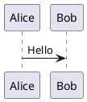

# AIクラブ - 授業セッションライブラリ

sento.group AI部の講義資料をWeb公開するEラーニングサイト。

**公開URL**: Vercel にデプロイ（`vercel.json` 設定済み）

## 概要

AI部で実施した授業セッション（30本以上）をVitePressで構造化し、検索・閲覧・進捗管理ができる講義ライブラリとして公開しています。

### 主な機能

| 機能 | 説明 |
|------|------|
| 授業一覧 | 年別グルーピング、カテゴリバッジ（Claude / NotebookLM / ChatGPT 等）、時系列表示 |
| 全文検索 | MiniSearch によるローカル全文検索（日本語対応） |
| PlantUML | ビルド時にKroki.io経由でSVGをインライン化。MD5キャッシュで高速リビルド |
| 受講進捗 | localStorage で受講完了を管理。トップページにプログレスバー表示 |
| クイズ | 講義内に選択式クイズを埋め込み可能。正解/不正解のフィードバック付き |
| YouTube埋め込み | レスポンシブ対応の動画プレーヤーコンポーネント |
| コメント | Giscus（GitHub Discussions連携）で講義ごとに質問・コメント可能 |

## ディレクトリ構成

```
AIgassyuku/
├── 授業セッション/       # 講義Markdownファイル（30本+）
├── 授業アイデア/         # 未実施の授業案
├── AI合宿v2/            # 過去の合宿資料（サイトからは除外）
├── image/               # 講義で使用する画像
├── docs/                # VitePress ソース
│   ├── .vitepress/
│   │   ├── config.mts   # サイト設定・PlantUMLビルド処理
│   │   └── theme/
│   │       ├── index.ts              # カスタムテーマ
│   │       ├── style.css             # LMS風スタイル
│   │       ├── SessionLayout.vue     # 講義ページレイアウト
│   │       └── components/
│   │           ├── SessionGrid.vue   # 授業一覧リスト
│   │           ├── ProgressBar.vue   # 受講進捗バー
│   │           ├── ProgressTracker.vue # 受講完了ボタン
│   │           ├── Quiz.vue          # クイズコンポーネント
│   │           ├── YouTube.vue       # YouTube埋め込み
│   │           └── GiscusComments.vue # コメント欄
│   ├── sessions -> ../授業セッション  # シンボリックリンク
│   ├── image -> ../image              # シンボリックリンク
│   ├── index.md          # トップページ
│   └── sessions.data.ts  # セッションデータローダー
├── .plantuml-cache/      # PlantUML SVGキャッシュ（gitignore）
├── vercel.json           # Vercelデプロイ設定
└── package.json
```

## セットアップ

```bash
npm install
npm run docs:dev      # 開発サーバー起動（http://localhost:5173）
npm run docs:build    # 本番ビルド
npm run docs:preview  # ビルド結果のプレビュー
```

## 講義の追加方法

`授業セッション/` にMarkdownファイルを追加するだけで自動的にサイトに反映されます。

### ファイル命名規則

```
YYYYMMDD_タイトル.md
```

例: `20260212_ClaudeCowork実践.md`

### フロントマター（必須）

```yaml
---
title: "講義タイトル"
date: 2026-02-12
---
```

### コンポーネントの使い方

```md
<!-- YouTube動画 -->
<YouTube id="dQw4w9WgXcQ" title="デモ動画" />

<!-- クイズ -->
<Quiz
  question="ChatGPTのベースモデルは？"
  :options="['GPT-4', 'BERT', 'LLaMA', 'PaLM']"
  :answer="0"
  explanation="OpenAIのGPTシリーズをベースにしています"
/>

<!-- PlantUML（フェンスドコードブロック） -->

```

## 技術スタック

- **VitePress** v1.6 - 静的サイトジェネレーター
- **Vue 3** - UIコンポーネント
- **Kroki.io** - PlantUML → SVG変換（ビルド時）
- **Giscus** - GitHub Discussions連携コメント
- **MiniSearch** - ローカル全文検索
- **Vercel** - ホスティング・デプロイ

## ライセンス

Private - sento.group
