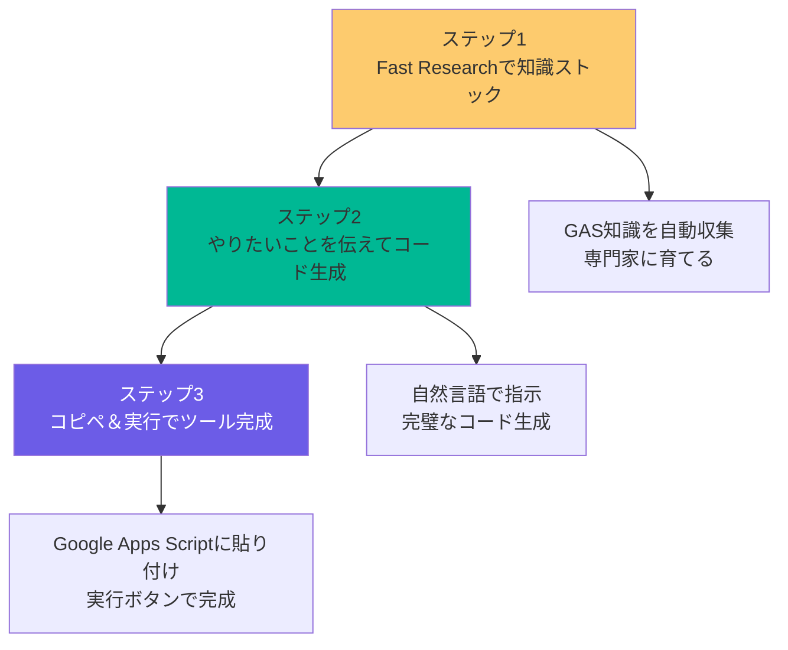
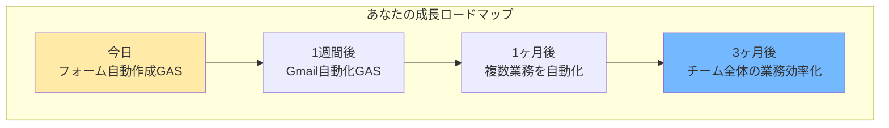

## 🧑‍🍳 セッション設計：NotebookLM × GAS で業務自動化ツールを無限生成

- **開催日**: 2026-01-29
- **所要時間**: 60分
- **対象者**: プログラミング未経験者 / 業務効率化に興味がある方
- **ゴール（成果物）**: NotebookLMでGASコードを生成し、実際にGoogleフォーム自動作成ツールが完成して持ち帰れる
- **使用ツール**: NotebookLM / Google Apps Script / Googleドライブ
- **事前準備**: 
  - NotebookLMアカウント作成
  - Googleアカウント準備（GAS実行権限）
  - 新規ノートブック作成

### 📌 共有リンク / 配布物

- NotebookLM: https://notebooklm.google.com/
- Google Apps Script: https://script.google.com/
- 配布プロンプト集（Notionページ）

### 🧩 当日の流れ（タイムテーブル）

| パート | 時間 | 内容 | 成果 |
|---|---:|---|---|
| 導入 | 10分 | 期待値合わせ・成果物デモ | GASの可能性とゴールが明確になる |
| 解説 | 20分 | Fast Research活用法・コード生成手順 | NotebookLMでGAS知識をストックする方法がわかる |
| 実践 | 25分 | 個人ワーク＋サポート | 実際にGASコードが生成できて実行できる |
| 振り返り | 5分 | 共有＋次アクション | 他の業務自動化アイデアが浮かぶ |

---

## 🧾 参加者に配るプロンプト（コピペ用）

### 0) Fast Research用プロンプト（そのまま貼る）

```text
以下の5つの指示を順番に実行してください：

①「Google Apps Scriptを網羅的に解説しているサイトを調査して」
②「GASの基本的な書き方を詳しく解説した記事を収集して」
③「GASでスプレッドシートを自動化する方法を紹介した記事を収集して」
④「GASの実用的なコード例を豊富に掲載した記事を収集して」
⑤「GASによる業務自動化の事例を解説した記事を収集して」
```

### 1) GASコード生成プロンプト（基本形）

```text
あなたはGAS（Google Apps Script）の専門家です。
目的: （例: AIセミナー後のアンケート用Googleフォームを自動作成するGASを書いて）
前提: 
- プログラミング初心者でも理解できるコード
- コピペでそのまま実行できる形式
- 各処理にコメントを付ける

出力形式:
- ① コード全体（コピペ用）
- ② 実行手順（ステップバイステップ）
- ③ カスタマイズ方法（質問項目を増やす等）
- ④ よくあるエラーと対処法
```

### 2) エラー修正プロンプト（トラブル用）

```text
状況: GASコードを実行したところ、以下のエラーが出ました
症状: （エラーメッセージを貼り付け）
期待: （例: Googleフォームが自動作成される）
制約: （例: 初心者なので簡単な説明も欲しい）

このエラーを修正したコードと、なぜこのエラーが出たかの説明を、初心者にもわかりやすく教えてください。
```

### 3) 改善・カスタマイズプロンプト

```text
現在のGASコード:
（生成されたコードを貼り付け）

改善要望:
- （例: 質問項目を10個に増やしたい）
- （例: フォームの説明文を追加したい）
- （例: 回答期限を設定したい）

改善後のコードを出力してください。
```

---

## 🎬 各フェーズの詳細設計（60分）

### 1. 導入＋成果物確認（10分）

**実際の流れ:**
1. **プロンプトテンプレート共有（3分）**
   - Fast Research用プロンプトとコード生成プロンプトを事前共有
   - 参加者にNotebookLMでコピーしてもらう
   - 「今日はこのプロンプトだけでGASが作れます」と宣言

   **📷 画像貼付け**: NotebookLMの画面でプロンプトを貼り付けた状態のスクショ
   
   （ここに画像を貼る）

2. **現状確認（2分）**
   - 「GASを書いたことある人？」→ ほぼ手が挙がらない想定
   - 「Googleフォームを手動で作ったことある人？」→ 多数
   - 「それを自動化したいと思ったことある人？」→ 全員
   - 「でもプログラミングは難しそうで諦めた人？」→ 全員

3. **成果物デモ（5分）**
   - 完成したGoogleフォーム自動作成ツールを実際にデモ
   - 「これが25分後にはあなたも作れます」と宣言
   - 「プログラミング知識ゼロでも、NotebookLMがあれば業務自動化のエンジニアになれます」と伝える

   **📷 画像貼付け**: 
   - Before: 手動でGoogleフォームを作っている画面
   - After: GAS実行で一瞬でフォームが生成される動画（GIF推奨）
   
   （ここに画像を貼る）

### 2. ツールと手順解説（20分）

**実際の流れ:**
1. **NotebookLM × GASの組み合わせ説明（5分）**
   - NotebookLMの「Fast Research」機能の説明
   - GASとは何か（Googleサービスを自動化するJavaScript）
   - なぜこの組み合わせが強力なのか
   - 「知識をストック → コード生成 → コピペ実行」の流れ

2. **Fast Researchで知識ストック（10分）**
   - 実際にFast Research用プロンプトを実行
   - 収集された情報を確認
   - 「これでNotebookLMがGAS専門家になりました」と説明

3. **コード生成のコツ（5分）**
   - 具体的な指示の出し方
   - エラーが出た時の対処法
   - カスタマイズの依頼方法

**基本操作の3ステップ:**

> NotionでMermaidが表示できない場合は、下のMermaidを別途レンダリングしてスクショを貼ってください（再編集のためにコードは残す）。



**📷 画像貼付け**: 「基本操作の3ステップ」図のスクショ（Mermaidを画像化したもの）

（ここに画像を貼る）

### 3. 実践ワーク（25分）

**実際の流れ:**
1. **Fast Research実行（5分）**
   - 各自でFast Research用プロンプトを実行
   - 知識がストックされたことを確認
   - つまずいている人への個別サポート

2. **コード生成実践（15分）**
   - 基本課題：「アンケート用Googleフォームを自動作成するGAS」
   - NotebookLMに指示を出してコードを生成
   - 生成されたコードを確認

3. **実装・実行（5分）**
   - Google Apps Scriptにコードを貼り付け
   - 実行ボタンを押す
   - 権限承認（初回のみ）
   - 実際にフォームが生成されることを確認

**実践ワークの進め方:**
| 段階 | 時間 | 内容 | サポート方法 |
|------|------|------|-------------|
| Fast Research | 5分 | GAS知識をストック | 全体指導＋画面共有 |
| コード生成 | 10分 | フォーム作成GASを生成 | プロンプト例を配布 |
| 実装・実行 | 5分 | GASに貼り付けて実行 | 個別サポート |
| 応用チャレンジ | 5分（余裕があれば） | カスタマイズや他の自動化 | ヒント提供 |

**📷 画像貼付け**: 
- Google Apps Scriptの画面（コードを貼り付けた状態）
- 実行後のGoogleフォーム生成結果

（ここに画像を貼る）

### 4. 振り返り＋次への一歩（5分）

**実際の流れ:**
1. **成果確認（3分）**
   - 参加者の成果物を簡単に確認
   - 「プログラミング知識ゼロでもできた！」という体験を共有
   - 工夫したポイントがあれば共有

2. **次への一歩（2分）**
   - 他の業務自動化アイデアを紹介
   - 1週間、1ヶ月、3ヶ月の成長ロードマップ
   - 継続学習のためのリソース紹介

**無限錬成の例:**

```text
・Gmail自動化：「特定件名のメールが来たらSlackに通知」
・日報集計：「毎朝スプレッドシートの行を追加して日付を入れる」
・リマインダー：「期限切れのタスクを担当者にメール通知」
・データ集計：「スプレッドシートのデータを自動で集計してレポート作成」
・フォーム回答通知：「フォームに回答があったらメールで通知」
```

**成長ロードマップ:**

> NotionでMermaidが表示できない場合は、下のMermaidを画像化して貼ってください（再編集のためにコードは残す）。



**📷 画像貼付け**: 成長ロードマップ図のスクショ（Mermaidを画像化したもの）

（ここに画像を貼る）

---

## 💡 実践のコツ

### 🌈 構造化と可視化の原則

1. **常に全体像を見せる**
   - 「Fast Research → コード生成 → コピペ実行」の流れを最初に提示
   - 現在地を常に明確にする
   - 「プログラミング知識不要」を強調

2. **3という魔法の数字**
   - 3ステップで完結（知識ストック → 生成 → 実行）
   - 主要ポイントは3つに整理
   - 認知負荷を適切にコントロール

3. **ビジュアル思考の活用**
   - コード生成前後の比較を可視化
   - エラーが出た時の対処フローを図解
   - 色分けで重要度を表現

### 💎 期待される変化

| フェーズ | あなたの状態 | 得られるもの |
|----------|-------------|-------------|
| 導入 | 不安→期待 | 「プログラミングは難しい」から「NotebookLMならできるかも」へ |
| 解説 | 理解→自信 | 「なるほど」から「やってみたい」へ |
| 実践 | 挑戦→達成 | 「難しいかも」から「できた！」へ |
| 振り返り | 誇り→意欲 | 「自分もできた」から「他も自動化したい」へ |

### 🎯 よくある質問と回答

**Q: エラーが出たらどうすればいい？**
A: エラーメッセージをNotebookLMに貼り付けて「このエラーを修正して」と伝えるだけ。AIが即座に修正コードを出してくれます。

**Q: もっと複雑な自動化はできる？**
A: はい。一度Fast Researchで知識をストックすれば、どんなGASでも生成可能です。アイデア次第で無限に作れます。

**Q: プログラミングを覚える必要はない？**
A: 基本的には不要です。ただし、NotebookLMが生成したコードを読むことで、自然とGASの書き方が身につきます。

---

*このセッションは、参加者の「プログラミングは難しい」という常識を「NotebookLMがあれば誰でも業務自動化のエンジニアになれる」という新しい可能性に変える体験を提供します。小さな成功体験から始めて、確実に成長を実感できる構造が特徴です。*
