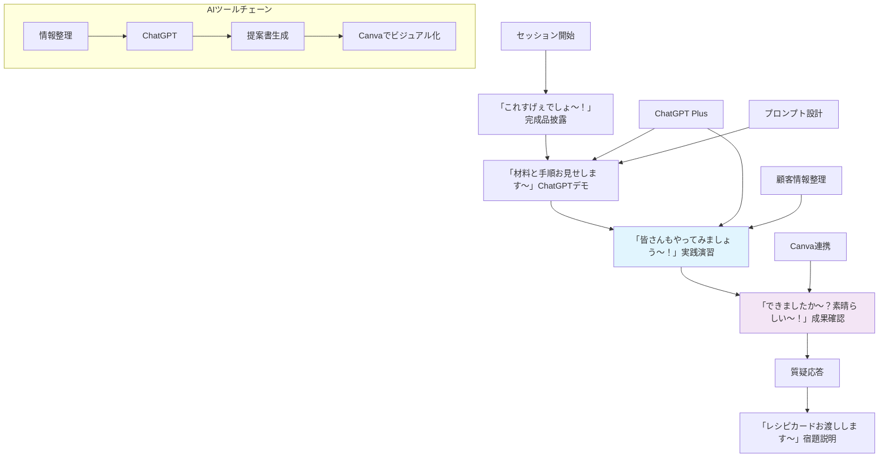

# 生成AI部セッション アジェンダ 🎬
**Week 2: 営業資料作成マスター - ChatGPTで提案書30分作成！**

## 📋 事前準備（必須）
**「さあ、今日は何ができちゃうでしょうか〜？」**

参加前に以下の準備をお願いします：

- [ ] **ChatGPT Plusアカウント**の作成・ログイン確認（必須）
- [ ] **Canvaアカウント**の作成（無料版でOK）
- [ ] **実際の顧客情報**を1社分準備（匿名化OK）
- [ ] これまで作成した**提案書のサンプル**を1つ用意（参考用）
- [ ] ChatGPTで簡単な文書作成を1回試してみる（任意）
- [ ] 自社の強み・特徴を3つ書き出しておく（任意）

## 基本情報
- **授業日**: 2025/01/31 (金) 19:00-20:00
- **テーマ**: ChatGPTで営業提案書・企画書を効率的に作成する
- **対象レベル**: 初級〜中級
- **参加形式**: オンライン（Zoom）

## 使用ツール・環境（今日の材料たち〜！）

| ツール名 | URL | アカウント要件 | 事前準備 |
|---------|-----|-------------|---------|
| ChatGPT Plus | https://chat.openai.com/ | 有料プラン必須（月額$20） | アカウント作成・ログイン確認 |
| Canva | https://www.canva.com/ | 無料版でOK | アカウント作成 |
| Google Docs | https://docs.google.com/ | Googleアカウント | 特になし |

## 🎬 導入「これ、すげぇでしょ〜！」

> **現状の課題**
> 営業提案書の作成に毎回2-3時間かかってしまい、肝心の営業活動や顧客対応の時間が削られてしまう状況が続いています。しかも、一からじっくり考えて作成するため、どうしても似たような構成になってしまったり、相手企業に合わせたカスタマイズが十分にできていない状況もあります。
> 
> **今日の解決策「じゃじゃ〜ん！」**
> 今日は、ChatGPTを活用して30分で企業別にカスタマイズされた質の高い営業提案書を作成する具体的な方法をお見せします〜！プロンプト設計から実際の文書作成、さらにはビジュアル要素の追加まで、一連の流れを体験いただけます！
> 
> **期待される成果「おうちでも絶対できます〜！」**
> この手法を身につけることで、提案書作成時間を1/4に短縮し、より戦略的な営業活動に集中できるようになります！しかも、AIが生成する多角的な視点により、これまで以上に説得力のある提案書を作成できるようになります！
> さあ、一緒に体験してみましょう〜！

## 今日学ぶこと（完成品はこれ〜！）
### 学習目標
1. 効果的な提案書作成プロンプトの設計方法
2. 顧客情報を基にしたカスタマイズ技術
3. AI生成コンテンツの品質向上テクニック

### 習得スキル
- **プロンプトエンジニアリング**: 意図した提案書を生成するための指示文作成
- **情報構造化**: 顧客ニーズを整理してAIに効果的に伝える方法
- **品質管理**: AI生成文書の確認・修正・改善プロセス

## Before / After 比較表「これが変わっちゃいます〜！」

| 項目 | Before（現在） | After（セッション後） |
|------|---------------|-------------------|
| 所要時間 | 平均2.5時間/1件 | 30-45分/1件（75%短縮） |
| 品質レベル | 標準的、差別化不足 | 高品質、差別化された内容 |
| 主な課題1 | ❌ 提案書作成に2-3時間必要 | ✅ 30分で提案書の初稿完成 |
| 主な課題2 | ❌ 似たような構成・内容になりがち | ✅ 顧客に特化したオリジナル提案 |
| 主な課題3 | ❌ 顧客別カスタマイズが不十分 | ✅ 多角的な視点からの提案内容 |
| その他の効果 | アイデア出しに時間がかかる | 豊富なアイデアから最適案を選択 |

## 全体構成図



## 🎬 セッション詳細スケジュール（3分クッキング方式）

| 時間 | セクション | 所要時間 | 内容 | テンション |
|------|----------|---------|------|--------|
| 19:00 - 19:05 | オープニング | 5分 | 前回振り返り＋「今日は何ができちゃうでしょうか〜？」予告 | 🎬 |
| 19:05 - 19:20 | **「これすげぇでしょ〜！」** | 15分 | 和島が完成した提案書をドカンと披露！「じゃじゃ〜ん！30分でこれができちゃいました〜！」 | ✨ |
| 19:20 - 19:25 | **「材料はこちら〜！」** | 5分 | 「使った材料はこちら！」ChatGPT Plus、プロンプト、顧客情報を紹介 | 📝 |
| 19:25 - 19:40 | **「手順はとっても簡単〜！」** | 15分 | 「手順はとっても簡単！」ステップバイステップでプロンプト作成〜生成まで実演 | 👨‍🍳 |
| 19:40 - 19:55 | **「皆さんもやってみて〜！」** | 15分 | 「はい、皆さんもやってみてください〜！」実践タイム・個別サポート | 🤝 |
| 19:55 - 19:58 | **「できましたか〜？」** | 3分 | 「できましたか〜？素晴らしい〜！」成果確認・参加者共有 | 🎉 |
| 19:58 - 20:00 | **「レシピカード〜！」** | 2分 | 「レシピカードお渡しします〜おうちでも作ってくださいね〜」まとめ | 📋 |

## 🎁 お持ち帰りレシピカード

### 今週の宿題「おうちでも作ってみてくださいね〜！」
1. **実践課題**: 実際の営業案件で今日学んだ手法を使って提案書を1件作成
2. **改善レポート**: 従来方法との比較（時間・品質・顧客反応）をメモ

### フォローアップ「失敗しても大丈夫〜！」
- **質問受付**: Slackチャンネル #生成AI部 で随時対応
- **進捗確認**: 来週火曜日にSlackで宿題の進捗確認
- **次回までの目標**: 提案書作成時間を50%短縮

## 関連リソース「追加の材料たち〜！」

### 参考資料
- **ChatGPT提案書プロンプト集**: https://bit.ly/chatgpt-proposal-prompts
- **効果的な営業提案書の構成**: https://bit.ly/proposal-structure-guide

### 追加学習
- **ChatGPT活用事例集**: https://openai.com/customer-stories
- **プロンプトエンジニアリング基礎**: https://platform.openai.com/docs/guides/prompt-engineering

## トラブルシューティング「うまくいかない時はここ見て〜！」

### よくある問題と解決策
1. **ChatGPTの回答が期待と違う**
   - 解決策: より具体的な指示を追加、例文を提示、段階的に質問

2. **生成された文章が硬すぎる/柔らかすぎる**
   - 解決策: トーン指定プロンプトを追加（「親しみやすく」「フォーマルに」など）

3. **顧客情報の整理方法がわからない**
   - 解決策: 提供するワークシートのテンプレートを活用

## 実践演習用ワークシート「一緒に作ってみましょう〜！」

### 顧客情報整理シート
```
■ 基本情報
- 会社名: _______________
- 業界: _______________
- 規模: _______________
- 担当者: _______________

■ 課題・ニーズ
1. _______________
2. _______________
3. _______________

■ 提案したい解決策
- メイン提案: _______________
- サブ提案: _______________

■ 競合他社情報
- 主要競合: _______________
- 差別化ポイント: _______________
```

### プロンプトテンプレート「これが秘伝のタレ〜！」
```
以下の情報を基に、効果的な営業提案書を作成してください。

【顧客情報】
[上記ワークシートの内容を転記]

【提案書の要件】
- 文字数: 1500-2000文字
- 構成: 課題認識→解決策→メリット→次のステップ
- トーン: [親しみやすく/フォーマル/専門的 etc.]

【特に重視する点】
- 顧客の業界特性を踏まえた内容
- 具体的な効果・数値を含める
- 次回アクションを明確に示す
```

---

**🎉 「今日から皆さんも提案書作成マスターですね〜！おうちでもぜひ作ってみてくださいね〜！」** 