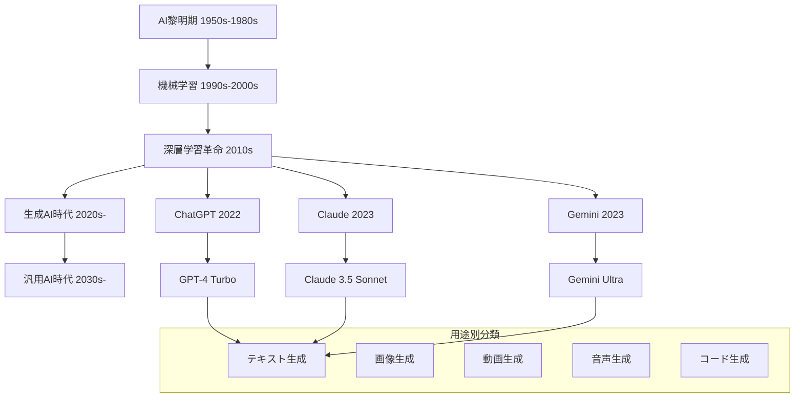
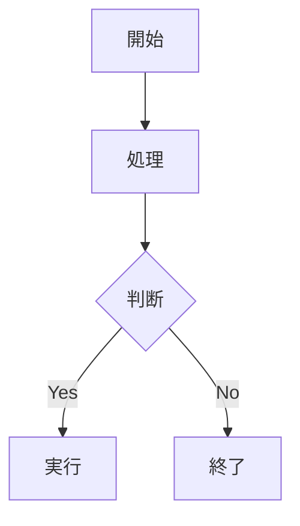
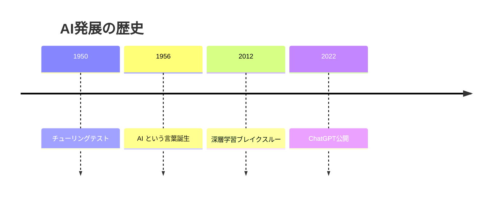
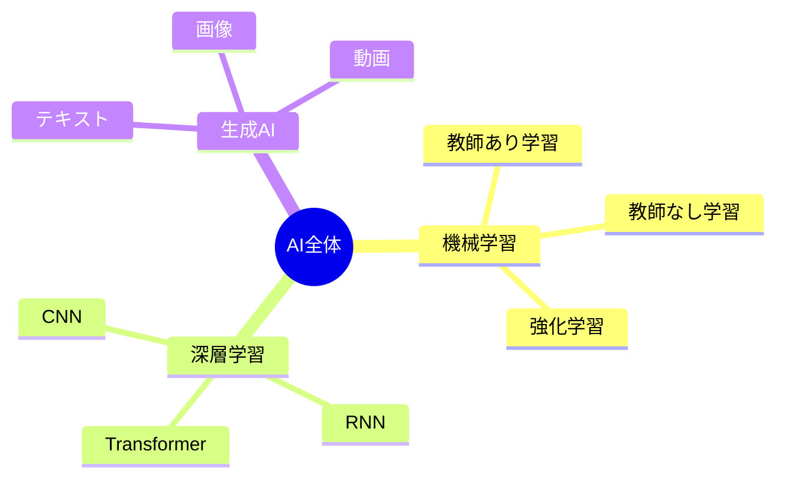
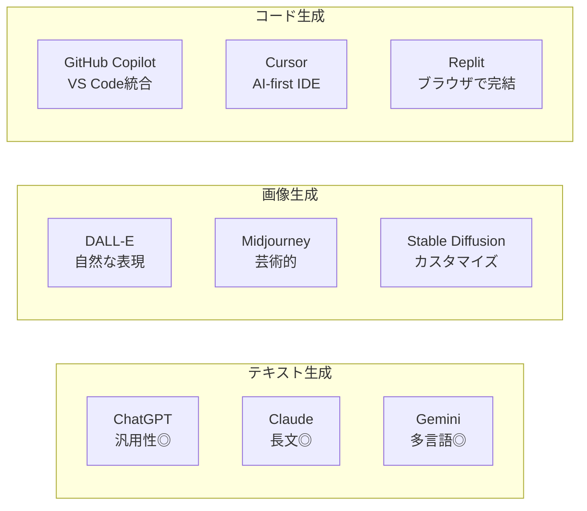
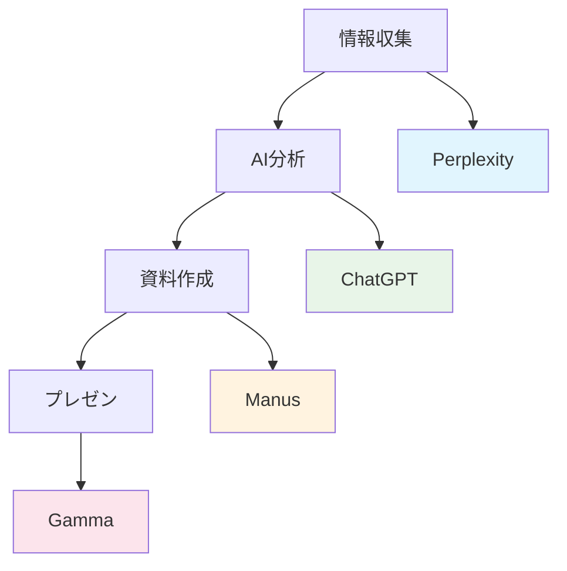

# AIの全体像が60分で一目瞭然！Mermaidで描くAI業界マップ作成術

**開催日時**: 2025年7月31日（木）朝
**対象**: AIの全体像を理解したい方、情報整理が苦手な方  
**ゴール**: 複雑なAI業界の全体像を一枚の図で理解し、自分でも情報を可視化できるようになる

---

## 📊 本セッションで解決する参加者要望

| メンバー | カテゴリ | 具体的な要望 |
|----------|----------|--------------|
| 天野 | AIツール・基礎知識 | AI概論（基本、歴史、未来） |
| 江本 | AIツール・基礎知識 | AIの基礎（最新のサービス） |
| 武田 | AIツール・基礎知識 | 基本的な知識、各ツールの特製、それぞれの基本的な使い方と応用 |
| 高田、安田 | AIツール・基礎知識 | 最新AIツール情報＋事例共有 |
| 佐藤 | AIツール・基礎知識 | 各AIツールの得意分野（どのツールがどのアウトプットが得意か） |
| 吉田 | AIツール・基礎知識 | 各AIツールのおすすめの使い方と応用 |

---

## 🎯 コンセプト

AIの歴史から最新動向まで、頭の中でバラバラになっている情報を一枚の図で整理整頓。Mermaidを使って自分専用のAI業界マップを作成し、「AIって結局何なの？」から「AIを戦略的に活用できる」レベルまで一気に到達する。

---

## ⏱️ セッションタイムテーブル（60分）

| 時間 | フェーズ | 内容 | ポイント |
|------|----------|------|----------|
| 10分 | 導入＋成果物確認 | AI概論の課題→Mermaid図の威力実演→本日の成果物デモ | 「バラバラ情報が一枚で整理」のインパクト |
| 10分 | ツールと手順解説 | Mermaid記法紹介→図表作成手順→AI情報整理法 | 誰でも作成できる簡単手順 |
| 20分 | 実践ワーク | AI業界マップ作成体験 | 全員が自分専用マップ完成 |
| 20分 | 結果共有＋質疑応答 | 作成図表発表→活用方法→継続学習の設計 | 実務活用の具体化 |

---

## 🎬 セッション詳細

### 1. 導入＋成果物確認（10分）

### 📋 現状の課題認識

「AIの情報、頭の中でぐちゃぐちゃになっていませんか？」

- ChatGPT、Claude、Gemini...違いがよくわからない
- AI関連のニュースを見ても全体像が見えない
- 「どのAIをいつ使えばいいか」判断できない
- 新しいAIツールが出ても位置づけがわからない

### 🚀 Mermaid図の威力（ライブデモ）

**実演**: AIの歴史から現在、未来予測まで一枚の図で可視化



### 🎯 本日のゴール宣言

「今日帰る時には、AIの全体像が整理され、新しいAIツールが出ても迷わず位置づけできるようになってもらいます！」

### 2. ツールと手順解説（10分）

### 🛠️ 使用ツール

- **ChatGPT** (Mermaid図作成アシスタント)
- **Claude** (情報整理・分析)
- **Mermaid Live Editor** (図表の調整・確認)
- **Notion、Obsidian等** (図表の保存・活用)

### 📝 Mermaid基本記法

```markdown
# 基本的な図表記法

## フローチャート


## タイムライン


## マインドマップ


### 🔄 AI情報整理フロー

1. **情報収集**（5分）: AI関連情報をリストアップ
2. **分類整理**（10分）: 時系列・用途別・技術別に分類
3. **図表作成**（15分）: Mermaidで可視化
4. **関係性整理**（5分）: 矢印や階層で関係性を明確化

### 3. 実践ワーク（20分）

### 💼 ワーク内容

各参加者が自分専用のAI業界マップを作成

**作成テーマ（選択制）**:
1. **AI発展の歴史タイムライン**
2. **現在のAIツール関係図**
3. **業務別AI活用マップ**
4. **AI技術分類図**

**作成手順**:
1. テーマ選択（2分）
2. 情報収集・整理（8分）
3. Mermaid図作成（10分）

**講師サポート**:
- Mermaid記法の個別指導
- 情報整理のアドバイス
- 図表デザインの最適化

### 📊 目標成果物

- 自分専用AI業界マップ（Mermaid形式）
- 図表の説明・活用方法
- 継続更新の仕組み

### 4. 結果共有＋質疑応答（20分）

### 🗣️ 成果発表（10分）

- 3-5名による作成図表発表
- 異なる視点での整理方法共有
- 相互学習による理解深化

### ❓ 質疑応答（10分）

- 複雑な情報の整理方法
- Mermaidの高度な使い方
- 図表の継続更新方法
- 他の可視化ツールとの使い分け

---

## 📚 補足資料

### 🎨 用途別Mermaidテンプレート

**AIツール比較表**:


**業務プロセス図**:


### 🔧 情報整理のコツ

1. **階層構造を意識**
   - 大分類→中分類→小分類の順で整理
   
2. **時系列の活用**
   - 過去→現在→未来の流れで理解
   
3. **関係性の明確化**
   - 影響関係、類似関係、対立関係を矢印で表現

4. **色分けの活用**
   - カテゴリごとに色を変えて視認性向上

### 💡 よくある質問と解決策

**Q**: Mermaidが複雑すぎて覚えられない
**A**: 基本の3つ（graph、timeline、mindmap）だけでも十分。慣れたら徐々に追加。

**Q**: 情報が多すぎて整理できない
**A**: まず大枠（3-5個）で分類し、徐々に詳細化。完璧を求めず「80点でOK」の精神で。

**Q**: 図が見にくくなってしまう
**A**: 1つの図に詰め込みすぎない。複数の図に分割して関連付け。

### 🚀 さらなる学習リソース

- **Mermaid公式ドキュメント**: 全記法の詳細説明
- **AI情報サイト**: 継続的な情報収集源
- **可視化ツール比較**: Mermaid以外の選択肢
- **情報整理術**: より効果的な整理方法

---

## 🎉 今日の学びを明日から活用

### ✅ 今日覚えて帰ること

- [ ] Mermaidの基本記法（graph、timeline、mindmap）
- [ ] AI情報の効果的な整理方法
- [ ] 図表による情報可視化の威力
- [ ] 継続的な情報更新の仕組み

### 🎯 来週実践してほしいこと

1. 作成したAI業界マップの継続更新
2. 業務情報のMermaid図表化
3. チームメンバーへの図表共有
4. 新しいAIツール情報の図表への追加

### 🌟 応用活用例

- **営業資料**: 競合分析図、市場ポジション図
- **企画書**: アイデアマップ、実行フロー図
- **教育・研修**: 学習コンテンツの体系図
- **プロジェクト管理**: タスクフロー、進捗マップ

**「AIが整理されて、全体が見えるようになった！」そんな感想をいただけるセッションにしていきます。** 