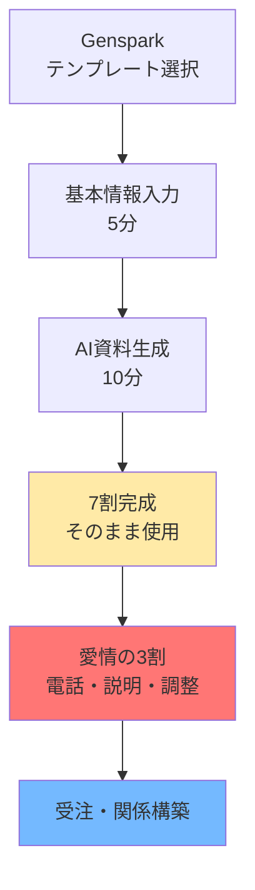

# Genspark活用営業資料作成術：テンプレート選択で15分資料作成
## 〜AI7割＋人間愛情3割の効率的営業スタイル〜

**開催日時**: 2025年8月21日  
**所要時間**: 30分  
**対象者**: 営業資料作成を効率化したい方、AI活用で本質的な営業活動に集中したい方

---

## 🎯 セッション概要

営業資料はAIで7割の精度をさくっと作成し、残り3割は人間の愛情（電話・説明・社内調整）で補完する新しい営業スタイルを習得するセッションです。Gensparkのテンプレート機能を使って15分で基本資料を作成し、その後の顧客フォローに時間を集中させる方法を学びます。

### このセッション後にできること
- Gensparkテンプレートで15分資料作成
- スライド精度より顧客コミュニケーションを重視する営業スタイル
- 7割AI＋3割愛情の効率的な営業プロセス

---

## ⏱️ セッションタイムテーブル（30分）

| 時間 | フェーズ | 内容 | 学習ステージ |
|------|---------|------|-------------|
| 5分 | 成果物確認 | AI7割＋愛情3割のコンセプト説明 | マインドセット共有 |
| 10分 | 実践デモ | テンプレート選択→15分作成→完成 | 基本操作習得 |
| 10分 | 実践ワーク | 各自でGensparkテンプレート作成 | 体験と実践 |
| 5分 | 愛情フォロー | 残り3割での差別化戦略 | 継続意欲 |

---

## 📋 新時代の営業プロセス



---

## 💡 1. 新しい営業マインドセット（5分）

### 🔄 従来の考え方 vs 新しいアプローチ

| 従来の営業資料作成 | 新しいアプローチ |
|------------------|----------------|
| ❌ 完璧な資料作成に3時間 | ⭕ AI7割資料を15分で作成 |
| ❌ スライドの見た目にこだわる | ⭕ 顧客との対話に時間を使う |
| ❌ 一人で資料を完成させる | ⭕ AIパートナーとの協働 |
| ❌ 資料で勝負する営業 | ⭕ 関係性で勝負する営業 |

### 🎯 AI7割＋愛情3割の考え方

**AI担当領域（7割）**
- 基本的な資料構成
- 業界情報の収集
- 一般的な課題分析
- デザインレイアウト

**人間の愛情領域（3割）**
- 顧客との直接対話
- 個別ニーズの深掘り
- フォローアップ電話
- 社内調整・カスタマイズ

---

## 🚀 2. Genspark実践デモ（10分）

### 📱 基本操作：3ステップで完成

#### ステップ1：テンプレート選択（2分）
- 「営業提案資料」テンプレートを選択
- 業界別テンプレート（製造業・IT・小売等）から最適なものを選ぶ
- ロゴアップロード＆カラー設定

#### ステップ2：基本情報入力（3分）
- 自社サービス概要
- クライアント企業名
- 提案内容の概要
- 予算感・スケジュール

#### ステップ3：AI生成＋微調整（10分）
- Gensparkが自動で8-12ページ生成
- スライドフォーマット選択（シンプル・フォーマル・カジュアル）
- 必要に応じてロゴ・色調整

---

## 🎯 システムプロンプト設定エリア

### 📝 営業資料生成用プロンプト

```
※ここにシステムプロンプトを挿入予定

- 業界別カスタマイズ指示
- デザインテンプレート指定
- 必須要素の指定
- 出力形式の指定

（このセクションは別途システムプロンプトを挿入します）
```

---

## 🎯 3. 実践ワーク（10分）：「みんなで作ってみる」

### 📱 Gensparkハンズオン

**実践項目**
1. **テンプレート選択**（2分）
   - 営業提案テンプレートを選択
   - 業界に応じたデザイン選択

2. **基本情報入力**（3分）
   - 自社サービス名・URL入力
   - クライアント企業名
   - 提案概要をざっくり入力

3. **AI生成確認**（5分）
   - 生成された資料をチェック
   - ロゴ・カラー微調整
   - フォーマット変更（必要に応じて）

**参加者同士でのシェア**
- 「この業界だとこのテンプレートが良い」
- 「こんな感じで生成されました」

---

## ❤️ 4. 愛情3割戦略（5分）：「AI後の差別化方法」

### 🎯 7割完成後にやるべきこと

**AIでできた資料 → 人間愛情でレベルアップ**

| AI資料（7割） | 愛情フォロー（3割） | 効果 |
|-------------|-----------------|------|
| 基本的な提案内容 | 📞 事前電話で課題ヒアリング | 的確な提案に |
| 一般的な業界分析 | 💬 個別相談時間を設定 | 信頼関係構築 |
| 標準的なスケジュール | 🤝 社内調整・カスタマイズ | 実現可能性向上 |
| テンプレートデザイン | 📧 フォローメール・追加説明 | 受注確率アップ |

### 💡 愛情3割の具体例

**提案前**
- クライアントに事前電話：「資料送る前に、現在の課題感を教えてください」
- 現場担当者にもヒアリング
- 社内の意思決定プロセス確認

**提案後**
- 資料説明の丁寧なフォロー
- 追加質問への即座対応
- 導入時期・予算の柔軟な調整提案

**継続フォロー**
- 定期的な状況確認
- 業界トレンド情報の共有
- 他社事例の紹介

### 🚀 成果最大化の考え方

```
完璧な資料作成 3時間 + 提案1回
VS
AI資料作成 15分 + 愛情フォロー 2時間45分

→ 後者の方が受注率が高い！
```

**理由：資料の完成度より、顧客との関係性が受注を決める**

---

## 📈 継続活用プラン

### 🎯 今日から始める3ステップ

1. **今日**：Gensparkで1つ試作
2. **今週**：実案件で1回使用
3. **来月**：AI7割＋愛情3割を習慣化

### 💎 成長指標

| 期間 | 資料作成時間 | 顧客フォロー時間 | 目標 |
|------|-------------|----------------|------|
| 従来 | 3時間 | 30分 | - |
| 1週間後 | 30分 | 2.5時間 | 新しいスタイル体験 |
| 1ヶ月後 | 15分 | 3時間 | 習慣化・受注率向上 |
| 3ヶ月後 | 10分 | 3.5時間 | チーム全体での標準化 |

---

## ✅ 簡単チェックリスト

**今日の目標**
- [ ] Genspark基本操作習得
- [ ] AI7割＋愛情3割マインド理解
- [ ] 1つサンプル資料作成

**継続のコツ**
- 資料の完璧さを求めすぎない
- 顧客とのコミュニケーション時間を大切に
- AIは相棒、人間関係は自分が主役

---

*営業は資料ではなく、人と人との信頼関係で決まります。AIで効率化した時間を、顧客との価値ある対話に使いましょう。*  