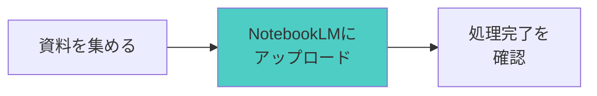
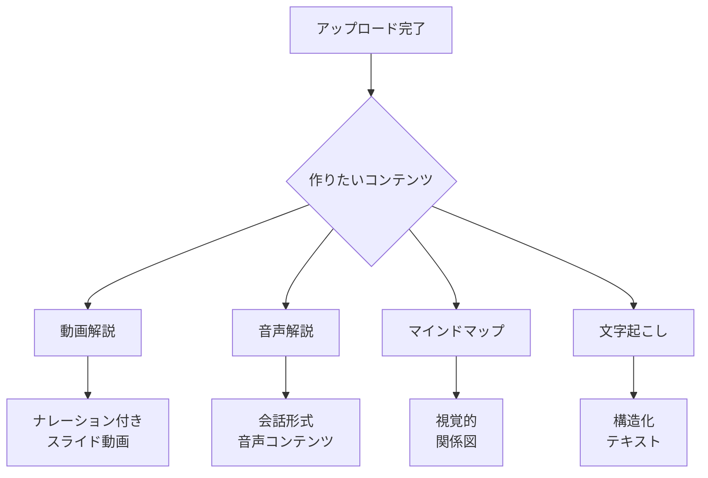
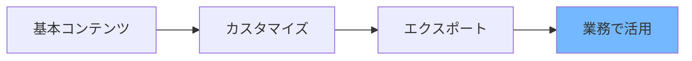

# NotebookLM活用術：資料から動画・音声・AIボットまで一気通貫で作る60分

## 〜情報収集・整理・アウトプット創出の完全自動化〜

**開催日時**: 2025年8月28日（木）12:00-13:00
**対象者**: 情報整理や資料作成に時間を取られている方、AIを使った効率的なコンテンツ作成を学びたい方

---

## 🎯 このセッションで得られるもの

### あなたの現状課題


| 課題                         | 従来の方法             | 時間     |
| ------------------------------ | ------------------------ | ---------- |
| 大量の資料から要点をまとめる | 手動でメモ・整理       | 3-4時間  |
| プレゼン用のスライド作成     | PowerPointで一から作成 | 2-3時間  |
| 会議録音の文字起こし         | 手動入力または外注     | 2-5時間  |
| 学習資料のマインドマップ化   | 手動で関係性を整理     | 1-2時間  |
| 動画解説コンテンツ作成       | 台本作成→撮影→編集   | 5-10時間 |

### セッション後のあなた

**資料をアップロードするだけで、自動的に以下が生成されます：**

- 📹 **ナレーション付き動画解説**（10分）
- 🎧 **会話形式の音声コンテンツ**（移動中に最適）
- 🧠 **視覚的なマインドマップ**（全体像の把握）
- 📝 **構造化された要約**（重要ポイントの抽出）
- 🎤 **音声ファイルの完全文字起こし**
- 🤖 **専門知識を持ったAIボット**（質疑応答対応）

**時間短縮効果**: 従来の作業時間を**80%削減**

---

## 🎬 成果物デモ

**今日作成する実際の成果物:**

### 1. 動画生成の例

```
入力: 企業の売上レポート（PDF）
↓ NotebookLM処理
出力: スライド形式のナレーション付き解説動画
- 主要数値の変化を視覚的に説明
- 背景要因の分析
- 今後の予測と提案
```

### 2. AIボット生成の例

```
入力: 商品マニュアル（複数ファイル）
↓ NotebookLM処理  
出力: 専門知識を持ったサポートボット
- 顧客からの質問に24時間対応
- 適切な回答と参照元を提示
- 不明点は人間の担当者にエスカレーション
```

---

## 🛠️ 使用ツール＆準備

### メインツール

- **NotebookLM**（Google）
  - 料金: 完全無料
  - 必要: Googleアカウントのみ
  - URL: https://notebooklm.google.com

### 連携ツール

- **Google Drive**（ファイル管理）

### 今日持参するもの

- 分析したい資料（PDF/Word/PPT）3-5ファイル
- 文字起こししたい音声ファイル（mp3/wav）
- 作成したいコンテンツのテーマ

---

## ⏱️ セッションの流れ


| 時間 | フェーズ       | 内容                              |
| ------ | ---------------- | ----------------------------------- |
| 10分 | 導入＋デモ確認 | 課題共感→理想像→成果物実演      |
| 10分 | ツール解説     | NotebookLM機能紹介→3ステップ手順 |
| 20分 | 実践ワーク     | 個人作業でコンテンツ作成体験      |
| 20分 | 成果共有       | 発表→相互学習→継続プラン        |

---

## 📋 実践手順（3ステップ）

### Step 1: ソース準備＋アップロード（5分）



**操作手順:**

1. NotebookLMにアクセス
2. 「新しいノートブック」を作成
3. 資料をドラッグ＆ドロップでアップロード
4. 処理完了まで待機（通常1-2分）

### Step 2: コンテンツ自動生成（10分）



**各機能の使い方:**

- **動画生成**: 「Video Overview」ボタンをクリック
- **音声生成**: 「Audio Overview」ボタンをクリック
- **マインドマップ**: 右側パネルの「マップ表示」を選択
- **質問対応**: チャット欄で自由に質問

### Step 3: カスタマイズ＋エクスポート（5分）



**カスタマイズのポイント:**

- 音声解説：長さや口調の調整
- 動画解説：重点ポイントの指定
- マインドマップ：表示項目の取捨選択
- AIボット：回答スタイルの設定

---

## 🎯 実践ワーク（20分）

### 段階別チャレンジ

#### 【核】最初の一歩（5分）

- 提供サンプル資料を使ってNotebookLMの基本操作を体験
- 音声解説の自動生成を実際に聞いてみる
- 「こんなことができるのか！」を実感

#### 【第1層】基本実践（8分）

- 自分の持参資料でコンテンツ作成にチャレンジ
- 動画解説または音声解説の生成
- 生成されたコンテンツの確認と評価

#### 【第2層】応用チャレンジ（7分）

- 複数の資料を組み合わせた統合コンテンツ作成
- Web検索機能を使った情報補完
- Google Driveと連携したAIボット構築

### サポート体制

- 各段階で講師が巡回指導
- つまずきポイントを事前に把握してクイック解決
- 参加者同士の教え合いを促進

---

## 💡 成功のコツ＆よくある失敗

### 🌟 成功のコツ

1. **資料の質を意識する**

   - 文字が読める状態のPDFを使用
   - ファイル名を分かりやすく設定
   - 関連性のある資料をセットで投入
2. **段階的に活用範囲を広げる**

   - まずは1つの機能を完璧にマスター
   - 慣れてから複数機能を組み合わせ
   - 業務での実践を通じて改善
3. **AIの特性を理解する**

   - 80%の完成度で満足する
   - 残り20%は人間の判断で補完
   - 継続的な改善プロセスを組み込む

### ⚠️ よくある失敗と対策


| 失敗例             | 原因                       | 対策                             |
| -------------------- | ---------------------------- | ---------------------------------- |
| 動画が生成されない | ファイル形式の問題         | PDF形式で再保存してアップロード  |
| 音声が不自然       | 専門用語が多すぎる         | 用語集を別途作成してアップロード |
| 回答が的外れ       | 情報が不足                 | 関連資料を追加でアップロード     |
| 処理が遅い         | ファイルサイズが大きすぎる | ファイルを分割してアップロード   |

---

## 📈 継続活用ロードマップ

### 1週間後の目標

- [ ] 業務資料1件をNotebookLMで処理
- [ ] 生成されたコンテンツを実際に活用
- [ ] 効果測定（時間短縮効果を記録）

### 1ヶ月後の目標

- [ ] 定期的な情報処理ルーチンを確立
- [ ] チーム内でのコンテンツ共有開始
- [ ] カスタマイズのコツを習得

### 3ヶ月後の目標

- [ ] 部署全体での活用体制構築
- [ ] 独自のプロンプトテンプレート作成
- [ ] ROI測定と改善提案

---

## 🎤 参加者発表タイム

### 発表内容（1人3分）

1. **作成したコンテンツの紹介**
2. **工夫したポイント・発見した機能**
3. **業務での活用アイデア**
4. **感想・気づき**

### 相互学習のポイント

- 異なるアプローチの発見
- 新しい活用方法のヒント
- 実践での注意点の共有

---

## 📚 補足リソース

### トラブルシューティング

#### Q1: 動画生成に時間がかかる

**A**: ファイルサイズを確認し、必要に応じて圧縮または分割してください。

#### Q2: 日本語の音声が不自然

**A**: 設定で音声言語を「日本語」に明示的に指定し、専門用語は読み方を併記してください。

#### Q3: 期待した内容が生成されない

**A**: より具体的なプロンプトを使用し、関連資料を追加でアップロードしてください。

### 発展学習リソース

- NotebookLM公式ヘルプセンター
- YouTube: NotebookLM活用事例集

---

## 📊 セッション後チェックリスト

### 即日実践項目

- [ ] 自分の業務資料でNotebookLMを試す
- [ ] 生成されたコンテンツの質を評価
- [ ] 業務での活用場面をリストアップ

### 1週間以内の目標

- [ ] 1件の実務案件でNotebookLMを活用
- [ ] 時間短縮効果を測定・記録
- [ ] チームメンバーに成果を共有

### 継続的改善

- [ ] 月1回のスキルアップセッション参加
- [ ] 新機能のキャッチアップ
- [ ] 他部署との活用事例共有

---

*このセッションを通じて、情報処理の概念が根本的に変わることを体験してください。「不可能」だと思っていた作業の自動化が「当たり前」になる瞬間を、一緒に味わいましょう。*

