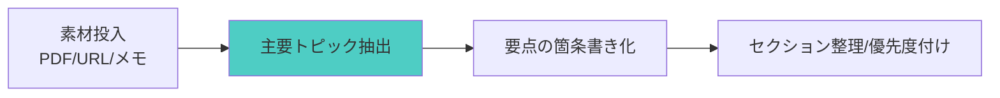
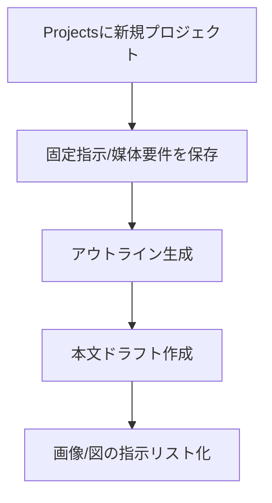
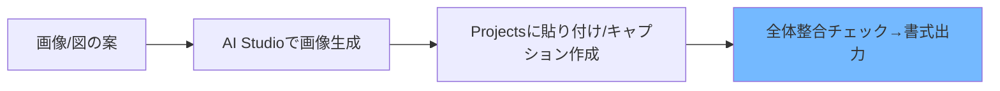

# Google AI Studio × ChatGPT Projectsで作る高速記事制作：60分実践

## 〜@cooking.mdc準拠：情報収集→構成→執筆→仕上げを一気通貫〜

**開催候補日**: 2025年9月以降（60分）  
**対象者**: 業務ブログ・ナレッジ記事・勉強会資料を効率良く量産したい方

---

## 🎯 このセッションで得られるもの

### あなたの現状課題

| 課題 | 従来の方法 | 時間 |
| --- | --- | --- |
| 情報の収集と要点抽出 | 手作業で読み込み・まとめ | 2-4時間 |
| 記事構成作成 | 白紙から見出しを設計 | 1-2時間 |
| 本文ドラフト作成 | 手打ちで初稿作成 | 2-3時間 |
| 画像・図の準備 | 外部ツールで個別作成 | 1-2時間 |
| 全体整合・ファイル管理 | フォルダ手動管理 | 0.5-1時間 |

### セッション後のあなた

**Google AI Studio（Gemini 2.5 Pro）とChatGPTのProjectsを併用して、以下を60分で体験的に実現：**

- 🧭 構造化された記事アウトライン（見出し・小見出し・要点）
- ✍️ 3分クッキング式の本文ドラフト（読みやすい段落と箇条書き）
- 🖼️ キービジュアル／図解（必要に応じて生成画像を差し込み）
- 📦 プロジェクト内での素材・指示・版管理（ChatGPT Projects）
- ⏱️ 作業時間の大幅短縮（従来比80%削減を目安）

---

## 🎬 成果物デモ

**今日作る実際の成果物（例）:**

### 1. 構成→本文→図を一気通貫で作った記事

```
入力: 社内ナレッジ素材（議事録/提案書/社内メモ）
↓ Google AI Studioで要点抽出・セクション化
↓ ChatGPT Projectsで「プロジェクト化」して指示・ファイル統合
出力: 見出し・本文ドラフト・図解アイデア・画像差し込み案
```

### 2. プロジェクト運用テンプレ

```
入力: @cooking.mdcのルール、社内の書式
↓ Projectsに固定指示とフォルダ構成を保存
出力: 毎回同じ品質で開始できる記事制作プロジェクト
```

---

## 🛠️ 使用ツール＆準備

### メインツール

- **Google AI Studio**（Gemini 2.5 Pro 搭載）
  - 用途: 情報抽出、長文整形、下ごしらえの自動化
  - 特徴: 長文安定処理、画像生成・コード生成にも対応
  - 参考: `https://momo-gpt.com/column/googleaistudio/?utm_source=openai`

- **ChatGPT Projects**
  - 用途: 指示・ファイルの一元管理、反復更新、版管理
  - 特徴: 複数文書やカスタム指示をワークスペース化
  - 参考: `https://weel.co.jp/media/innovator/chatgpt-projects/?utm_source=openai`

### 今日持参するもの

- 元資料（PDF/Docs/Slides/Markdown いずれか）
- 参考URL（2-5本）
- 掲載先の媒体要件（字数/トーン/画像サイズ）

---

## ⏱️ セッションの流れ（@cooking.mdc準拠）

| 時間 | フェーズ | 内容 |
| --- | --- | --- |
| 10分 | 導入＋デモ確認 | 課題共感→理想像→成果物実演 |
| 10分 | ツール解説 | Google AI Studio/Projectsの役割分担と手順 |
| 20分 | 実践ワーク | 個人作業で記事作成体験（段階別） |
| 20分 | 成果共有 | 発表→相互学習→継続プラン |

---

## 📋 実践手順（3ステップ）

### Step 1: 情報収集・下ごしらえ（Google AI Studio）



**操作ポイント:**

1. 素材を貼り付け、主要トピックとキーワードを抽出
2. セクション候補を3つに整理（導入/やり方/実践の流れ）
3. 図・画像の候補や必要なデータをメモとして出力

### Step 2: 構成とドラフト執筆（ChatGPT Projects）



**実装ポイント:**

- プロジェクト内に「指示」「素材」「出力」フォルダを用意
- 固定指示: トーン、禁止表現、@cooking.mdc準拠の3分構成
- 下ごしらえ結果（要点/セクション案）を貼り付け→見出し案生成
- 見出しごとに本文をドラフト化し、箇条書き→段落へ整形

### Step 3: 画像・整合・仕上げ（両者併用）



**仕上げのコツ:**

- 画像生成は代替案を2-3種作り、記事の意図に最適なものを選ぶ
- セクション間の論理接続語（だから/一方で/具体的には）を整える
- 公開媒体の書式（md/HTML/Docs）に合わせてエクスポート

---

## 🎯 実践ワーク（20分）

### 段階別チャレンジ

#### 【核】最初の一歩（5分）

- 提供サンプルをAI Studioへ投入し、要点抽出→セクション化を実体験
- Projectsで固定指示テンプレを読み込み、アウトラインを作成

#### 【第1層】基本実践（8分）

- 自分の素材でアウトライン→本文ドラフトを作成
- 1点だけ画像/図を挿入（代替案の比較）

#### 【第2層】応用チャレンジ（7分）

- 2つ以上の素材を統合して、比較・対比セクションを設計
- 再現性確保のため、Projectsにチェックリストを保存

### サポート体制

- 巡回指導＋よくある詰まりポイントをクイック解決
- 参加者同士の成果共有で発想の幅を拡張

---

## 💡 成功のコツ＆よくある失敗

### 🌟 成功のコツ

1. **3という単位で考える**: 見出し・主張・根拠を3点に絞る
2. **下ごしらえ重視**: 抽出→箇条書き→並べ替えの順で安定
3. **80/20の原則**: 仕上げの20%は人間が担い、読み手最適化を行う

### ⚠️ よくある失敗と対策

| 失敗例 | 原因 | 対策 |
| --- | --- | --- |
| 冗長で読みにくい | 要点が未整理 | 先に箇条書き→段落化を徹底 |
| 画像が記事意図とズレる | 指示が抽象的 | 構図/色/用途を具体化して指示 |
| 版が散らばる | ファイル管理が手動 | Projectsで指示・素材・出力を統一管理 |

---

## 📈 継続活用ロードマップ

### 1週間後の目標

- [ ] テンプレ化したProjectsを使い、1本作成
- [ ] 画像生成の指示テンプレを整備
- [ ] 所要時間の実測・短縮点の特定

### 1ヶ月後の目標

- [ ] 週1本ペースで安定運用
- [ ] 校正観点チェックリストを確立
- [ ] メディア別の出力書式を保存

### 3ヶ月後の目標

- [ ] チーム共有テンプレ（固定指示＋フォルダ構成）を標準化
- [ ] QA観点（事実確認/引用/著作権）を運用に組み込み
- [ ] 効果測定（作業時間/品質評価）を継続

---

## 📚 補足リソース

- Google AI Studio（概要・機能紹介）: `https://momo-gpt.com/column/googleaistudio/?utm_source=openai`
- ChatGPT Projects（機能と使い方）: `https://weel.co.jp/media/innovator/chatgpt-projects/?utm_source=openai`
- 画像生成のプロンプト設計入門（構図/色/用途の指定例）

---

## 📊 セッション後チェックリスト

### 即日実践項目

- [ ] 既存素材で1本、構成→本文→画像まで通しで作成
- [ ] Projectsに「指示/素材/出力」フォルダを作成
- [ ] 固定指示テンプレを保存（媒体名・トーン・禁止表現）

### 1週間以内の目標

- [ ] 2本目の制作で所要時間を30%短縮
- [ ] 画像代替案を2種以上作り比較検討
- [ ] フィードバック観点をテンプレに反映

### 継続的改善

- [ ] 月次でテンプレ更新（用語・図版スタイル・参照規則）
- [ ] 成果物サンプル集をProjectsに蓄積
- [ ] 執筆・校正の役割分担ルールを明文化

---

*本セッションは「3分クッキング方式」（1. 結果を見せる、2. やり方を説明する、3. 実践してみる）に準拠し、AIは80%のたたき台を作る役割、人間が最後の20%を磨く前提で設計しています。*


