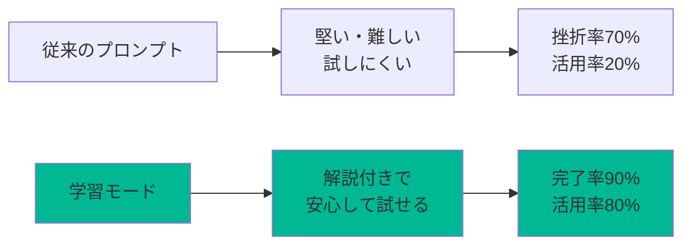
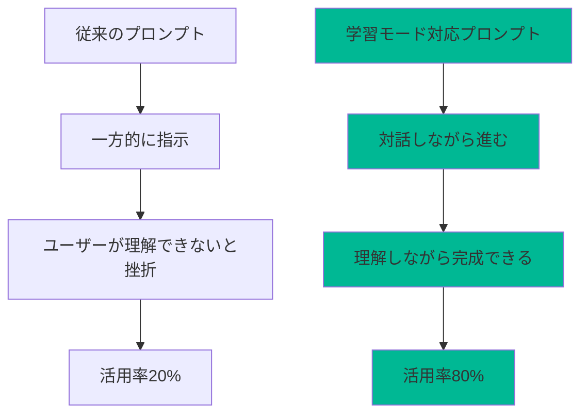
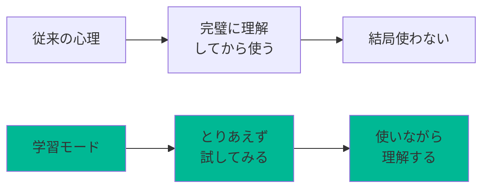
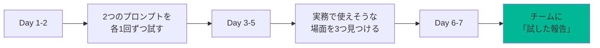
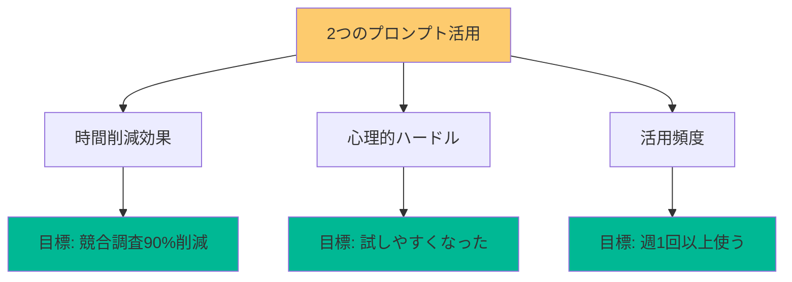

# ChatGPT学習モード×AI活用最前線：解説しながら進む実務プロンプト活用術

## 〜「堅くて試しにくい」を「分かりやすくて実務で使える」に変える60分〜

**開催日時**: 2025年10月2日（木）12:00-13:00
**対象者**: プロンプトが「難しそう」「試しにくい」と感じている方、実務レベルのAI活用を学びたい方

---

## 🎯 このセッションで得られるもの

### あなたの現状課題

| 課題 | 従来の方法 | 問題点 |
|------|-----------|--------|
| プロンプトが堅くて試しにくい | 完璧に理解してから使おうとする | 「間違ってはいけない感」で試せない |
| 簡単すぎると実務で使えない | シンプルなプロンプトを使う | 精度が低い、調整が大変 |
| 複雑な構造を理解するのが大変 | マニュアルを読み込む | 時間がかかる、挫折する |
| 競合調査に膨大な時間がかかる | 手動で情報収集・整理 | 2-3時間かかる |

### セッション後のあなた

**3つの新しいAI活用スキルを習得：**

1. 📚 **ChatGPT学習モード**：AIが解説しながら一緒に進めてくれる「伴走型」活用法
2. ⚡ **対話型コマンドベースプロンプト**：段階的に理解しながら作れる（実物を共有）
3. 🤖 **競合調査自動化エージェント**：URLを渡すだけで包括的レポート生成（実物を共有）

**時間短縮効果**: 競合調査を**2.5時間→15分に短縮**、心理的ハードルを**90%削減**

---

## 🎬 成果物デモ

### 今日実現できること



### 1. 学習モード活用の例

**従来の課題:**
```
複雑なプロンプトを渡される
↓
「これ、どう使えばいいの？」
「間違えたらどうしよう」
↓
結局使わない（挫折）
```

**学習モード適用後:**
```
同じプロンプトでも...
ChatGPTが「まず、このプロンプトは○○を実現するものです」
と解説しながら、質問に答えてくれる
↓
「あ、こういう使い方か！」
「試してみよう」
↓
実務で活用できる
```

### 2. 対話型コマンドベースプロンプトの実例

**従来の問題:**
```
「このプロンプト、項目が多すぎて...」
「どこから手をつければ？」
「間違ってはいけない感がすごい」
```

**対話型に改善:**
```
【フェーズ1】理解フェーズ
ChatGPT: 「何を作りたいですか？」
あなた: 「SEO記事を作りたい」

【フェーズ2】設計フェーズ
ChatGPT: 「では3段階で作りましょう。まずC1は...」
→ 理由も説明してくれる

【フェーズ3】洗練フェーズ
ChatGPT: 「これで良いですか？調整したい箇所は？」
→ 一緒に作り上げる感覚
```

**実物を今日共有します**

### 3. 競合調査自動化エージェントの実例

**Before（手動調査）:**
```
1. Google検索（30分）
2. 情報整理（1時間）
3. SWOT分析作成（30分）
4. レポート作成（30分）
→ 合計2.5時間
```

**After（自動化エージェント）:**
```
競合サイトのURLを渡すだけ
↓
15分で以下が自動生成：
・基本プロファイル
・STP分析、3C分析、SWOT分析
・デジタル施策分析（SEO/UI/UX）
・競合比較マトリクス（★評価付き）
・差別化機会と推奨アクション
```

**実物を今日共有します**

---

## 🛠️ 使用ツール＆準備

### メインツール

- **ChatGPT**（OpenAI）
  - 推奨: ChatGPT Plus（学習モードに最適）
  - 無料版でも基本機能は利用可能
  - URL: https://chat.openai.com

### 今日共有する実物プロンプト

1. **対話型コマンドベースプロンプト**
   - 段階的にシステムプロンプトを設計するアシスタント
   - 3フェーズ（理解→設計→洗練）で一緒に作る
   
2. **競合調査自動化エージェント**
   - URLを渡すだけで包括的な競合分析レポート生成
   - STP/3C/SWOT分析を自動実行

### 今日持参するもの

- 作りたいシステムプロンプトのアイデア（漠然としていてもOK）
- 調査したい競合サイトのURL（1-2個）
- 「試しにくい」と感じたプロンプトの経験

---

## ⏱️ セッションの流れ

| 時間 | フェーズ | 内容 |
|------|---------|------|
| 10分 | 導入＋デモ確認 | 課題共感→理想像→3つの機能実演 |
| 10分 | 学習モード解説 | 「解説しながら進める」とは？→活用法 |
| 20分 | 実践ワーク | 2つのプロンプトを実際に使ってみる |
| 20分 | 成果共有 | 発表→相互学習→継続プラン |

---

## 📋 学習モードとは？

### 定義

**ChatGPTが「解説しながら一緒に進めてくれる」モード**

複雑なプロンプトやタスクでも、ChatGPTが：
- 「これは○○を実現するものです」と目的を説明
- 「まず△△から始めましょう」と段階的に案内
- 「不明点はありますか？」と確認しながら進む
- 「こうすると××になります」と理由も教えてくれる

→ **「堅くて試しにくい」が「分かりやすくて安心」に変わる**

### 従来のプロンプトとの違い



### なぜ「学習モード」が必要なのか？

#### 生徒からの実際の声

**質問:**
「コマンドベースプロンプトが少し堅く難しい。もっとわかりやすいレベル感にできませんか？」

**本質的な課題:**
- 構造がわかりにくい → 運用に乗らない
- 簡単すぎる → 実務に耐えない
- 堅いフォーマット → 「間違ってはいけない感」で試しにくい

**解決策:**
複雑さはそのままに、ChatGPTが「解説しながら進めてくれる」ことで：
- 構造を理解しながら使える
- 実務レベルを保ちつつ、心理的ハードルを下げる
- 「一緒に作る」感覚で安心して試せる

---

## 🎯 実践手順：2つのプロンプトを体験する

### Step 1: 対話型コマンドベースプロンプトを使う（10分）

#### このプロンプトの特徴

**従来のコマンドベースプロンプトの問題:**
```
- 項目が多すぎて圧倒される
- どこから手をつければいいかわからない
- 完璧に理解してから使わないと...
```

**対話型に改善した結果:**
```
3つのフェーズで段階的に作成：

【フェーズ1】理解フェーズ
→ Q1〜Q6の質問に答えるだけ（全部答えなくてもOK）
→ ChatGPTがあなたの状況を理解

【フェーズ2】設計フェーズ
→ ChatGPTが最適な段階構成を提案
→ 「なぜこの構造か」も説明してくれる
→ 調整したい箇所を指示できる

【フェーズ3】洗練フェーズ
→ 最終プロンプトを生成
→ フィードバックを受けて微調整
```

#### 実践の流れ

**やってみること:**

1. プロンプトを ChatGPT に入力
2. 「開始」と入力して、質問に答える
3. 提案された構成を確認
4. 調整したい箇所があれば指示
5. 完成したプロンプトを受け取る

**所要時間:** 初回は10-15分、慣れれば5分

**ポイント:**
- 全部の質問に答えなくてもOK
- 途中で調整できるので気軽に
- 「やり直し」と言えば何度でも調整可能

---

### Step 2: 競合調査自動化エージェントを使う（10分）

#### このプロンプトの特徴

**従来の競合調査の問題:**
```
1. Google検索で情報収集（30分）
2. Excel に整理（1時間）
3. SWOT分析作成（30分）
4. レポート作成（30分）
→ 合計2.5時間
```

**自動化エージェントの効果:**
```
URLを渡すだけで、以下が15分で完成：

✅ 基本プロファイル
   - 企業名、設立年、サービス概要、価格帯、ターゲット
   
✅ マーケティング戦略分析
   - STP分析（セグメント/ターゲット/ポジション）
   - 3C分析（自社/顧客/競合）
   - SWOT分析（強み/弱み/機会/脅威）
   
✅ デジタル施策分析
   - SEO戦略（H1/H2構造、狙いキーワード）
   - UI/UX設計（導線、CTA配置）
   - SNS・広告施策
   
✅ 競合比較マトリクス
   - 8項目を★評価（価格/機能/UI/SEO/ブランド等）
   
✅ 戦略的示唆
   - 差別化機会（勝てるポイント）
   - リスク・弱点
   - 推奨アクションプラン（短期/中期/長期）
```

#### 実践の流れ

**やってみること:**

1. プロンプトを ChatGPT に入力
2. 調査したい競合サイトのURLを渡す
3. 15分待つ（ChatGPTが自動で全工程実行）
4. 包括的なレポートを受け取る

**所要時間:** 15分（完全自動）

**ポイント:**
- URLを渡すだけ、段階的な確認は不要
- 一気通貫で全分析を実行
- レポートはMarkdown形式で構造化

---

## 💡 学習モードのコツ：「堅さ」を「安心感」に変える5つのポイント

### ポイント1: 「完璧主義」を捨てる



**具体的なアクション:**
- 対話型プロンプトは全部の質問に答えなくてもOK
- 「やり直し」と言えば何度でも調整可能
- 80%の理解で使い始める

### ポイント2: ChatGPTに「理由」を聞く

**効果的な質問例:**
```
❌ 「これでいいですか？」（漠然としている）

✅ 「なぜこの段階構成なんですか？」
✅ 「この項目は何のためにありますか？」
✅ 「もっとシンプルにできませんか？」
```

→ 理由を理解すると、「間違ってはいけない感」が消える

### ポイント3: 段階的に複雑化する

| 段階 | やること | 目的 |
|------|---------|------|
| 1回目 | 最小限の項目で試す | 基本構造の理解 |
| 2回目 | 項目を1-2個追加 | 徐々に慣れる |
| 3回目 | フル機能で使う | 実務レベルで活用 |

### ポイント4: 「失敗=学び」と捉える

**対話型プロンプトの設計思想:**
```
「押し付けない」
→ ユーザーの選択を尊重

「理由を説明する」
→ ブラックボックスにしない

「失敗を歓迎する」
→ 一緒に改善する姿勢
```

→ この思想を知ると、気軽に試せる

### ポイント5: チームで「試した報告会」をする

**個人で試す（孤独）:**
- うまくいかないと挫折
- 自分だけ理解できてない気がする

**チームで共有（安心）:**
- 「こうしたらうまくいった」
- 「ここで詰まった」
- 「こんな使い方発見した」

→ 心理的安全性が生まれる

---

## ⚠️ よくある失敗と対策

### 失敗パターンと解決策

| 失敗例 | 原因 | 対策 |
|--------|------|------|
| プロンプトが長すぎて入力できない | コピペミス | プロンプトをテキストファイルで管理 |
| 期待した結果が出ない | ChatGPTのバージョンの違い | ChatGPT-4以上を推奨 |
| 競合調査で情報が取得できない | URLが間違っている | httpから始まる正しいURLか確認 |
| 対話が途中で止まる | ChatGPTが待っている | 「次へ」「OK」などの返答が必要 |

### 心理的な失敗と対策

| 心理状態 | 対策 |
|---------|------|
| 「これでいいのか不安」 | ChatGPTに「これで合ってますか？」と確認 |
| 「間違えたらどうしよう」 | 新しいチャットで試せばリセットできる |
| 「難しすぎる」 | 一番簡単な質問だけ答えて試す |
| 「使いこなせない気がする」 | チームで一緒に試す

---

## 🎯 実践ワーク（20分）

### 段階別チャレンジ

#### 【核】最初の一歩（5分）

**対話型プロンプトを触ってみる:**
1. プロンプトをChatGPTに入力
2. 「開始」と入力
3. 最初の質問（Q1だけでもOK）に答える
4. ChatGPTの反応を見る

**目的:** 「こういう感じか！」を体験する

#### 【第1層】基本実践（8分）

**どちらか1つを完走する:**

**選択肢A: 対話型プロンプトでシステムプロンプト作成**
- フェーズ1〜3を通して完成させる
- 自分の業務に使えるプロンプトを1つ作る

**選択肢B: 競合調査エージェントで実際に調査**
- 気になる競合サイトのURLを渡す
- 15分でレポート生成を体験

**目的:** 最後まで完走する達成感を得る

#### 【第2層】応用チャレンジ（7分）

**両方のプロンプトを試してみる:**
- 対話型プロンプトで作ったシステムプロンプトを実際に使う
- 競合調査レポートを業務で使える形に調整
- 自分なりのカスタマイズを加える

**目的:** 実務での活用イメージを掴む

### サポート体制

- 各段階で講師が巡回指導
- 「ここで詰まった」を即座に解決
- 参加者同士の教え合いを促進
- スクリーンで実演しながら説明

---

## 📈 継続活用ロードマップ

### 1週間後の目標



- [ ] 対話型プロンプトで1つのシステムプロンプトを作成
- [ ] 競合調査エージェントで1社を調査
- [ ] 「こう使えそう」を3つ以上発見

### 1ヶ月後の目標

- [ ] 週1回は2つのプロンプトのどちらかを使う
- [ ] チーム内で「活用報告会」を開催
- [ ] 自分なりのカスタマイズを1つ追加

### 3ヶ月後の目標

- [ ] 自分専用のシステムプロンプトを5個作成
- [ ] チーム全体でのプロンプト共有体制構築
- [ ] 「堅くて試しにくい」→「当たり前に使える」に

---

## 🎤 参加者発表タイム

### 発表内容（1人3分）

1. **どちらのプロンプトを試したか**
2. **やってみてどうだったか（率直な感想）**
3. **「ここが良かった」「ここで詰まった」**
4. **実務でどう使えそうか**

### 相互学習のポイント

- 「こういう使い方もあるのか！」の発見
- 詰まったポイントの共有（同じところで詰まる人が多い）
- 予想外の活用アイデア
- 「まだ試してない人」への励まし

---

## 💼 業務別活用事例

### 営業職

| 業務 | 使うプロンプト | 効果 |
|------|--------------|------|
| 競合分析 | 競合調査エージェント | 2.5時間→15分 |
| 提案書作成 | 対話型で「提案書作成アシスタント」を設計 | 型ができて毎回使える |
| 顧客ヒアリング項目設計 | 対話型で「ヒアリングガイド生成」を作成 | 漏れがなくなる |

### 企画職

| 業務 | 使うプロンプト | 効果 |
|------|--------------|------|
| 市場調査 | 競合調査エージェント | 包括的な分析が15分 |
| 企画書テンプレート作成 | 対話型で「企画書アシスタント」を設計 | 社内標準化できる |
| アイデア発想支援 | 対話型で「アイデア発想ガイド」を作成 | 発想の型ができる |

### マーケティング職

| 業務 | 使うプロンプト | 効果 |
|------|--------------|------|
| 競合のSEO戦略分析 | 競合調査エージェント | SEO視点の分析も自動 |
| コンテンツ企画 | 対話型で「コンテンツ企画アシスタント」を設計 | 企画の質が安定 |
| レポート作成 | 対話型で「レポート自動生成」を作成 | 毎週のレポートが楽に

---

## 📚 補足リソース

### 対話型コマンドベースプロンプトの活用Tips

#### プロンプトの構造を理解する

**3つのフェーズ:**
1. **理解フェーズ** - あなたの状況を把握
2. **設計フェーズ** - 最適な構成を提案
3. **洗練フェーズ** - フィードバックで調整

**設計思想:**
- 押し付けない（ユーザーの選択を尊重）
- 理由を説明する（ブラックボックスにしない）
- 失敗を歓迎する（一緒に改善）

#### 使いこなすコツ

- Q1〜Q6全部に答えなくてOK
- 「なぜこの構成？」と理由を聞く
- 「もっとシンプルに」と調整を依頼
- 「やり直し」で何度でも作り直せる

### 競合調査自動化エージェントの活用Tips

#### 出力される情報

**7つの主要分析:**
1. 基本プロファイル
2. STP分析
3. 3C分析
4. SWOT分析
5. デジタル施策分析
6. 競合比較マトリクス
7. 戦略的示唆

#### 使いこなすコツ

- URLは必ずhttpから始まる完全なURL
- ChatGPT-4以上を推奨（Plusプラン）
- 生成されたレポートはMarkdownをコピーして保存
- 定期的に再調査して変化を追跡

### トラブルシューティング

#### Q1: 対話が途中で止まる

**A**: ChatGPTがあなたの返答を待っています
- 「次へ」「OK」「このまま進めて」などと返答

#### Q2: 競合調査で情報が取得できない

**A**: URLを確認してください
- https://から始まる正しいURL
- サイトがアクセス可能か確認

#### Q3: プロンプトが長すぎて入力しづらい

**A**: テキストファイルで管理がおすすめ
- .txtファイルに保存
- 使うときにコピペ

---

## 📊 効果測定の方法

### 測定すべき3つの指標



### 測定シート例

| 業務 | Before | After | 削減率 |
|------|--------|-------|--------|
| 競合調査 | 2.5時間 | 15分 | 90% |
| システムプロンプト作成 | 挫折 | 完成 | - |
| プロンプト活用頻度 | 月1回 | 週1回 | 4倍 |

---

## 📝 セッション後チェックリスト

### 即日実践項目

- [ ] 2つのプロンプトをChatGPTに保存（お気に入り登録）
- [ ] どちらか1つを実務で1回使ってみる
- [ ] 「こう使えそう」を1つ発見

### 1週間以内の目標

- [ ] 両方のプロンプトを各1回ずつ使う
- [ ] 効果測定（時間削減、心理的ハードル）
- [ ] チームに「試した報告」を共有

### 継続的改善

- [ ] 週1回はどちらかのプロンプトを使う
- [ ] 月1回のチーム内活用報告会
- [ ] 自分なりのカスタマイズを追加

---

## 🎁 本日のお土産

### 1. 対話型コマンドベースプロンプト（実物）

```
システムプロンプトを3つのフェーズで段階的に設計するアシスタント
・理解フェーズ：Q1-Q6で状況把握
・設計フェーズ：最適な構成を提案
・洗練フェーズ：フィードバックで調整

特徴：
- 押し付けない
- 理由を説明する
- 失敗を歓迎する
```

**プロンプトの全文は別途共有**

### 2. 競合調査自動化エージェント（実物）

```
URLを渡すだけで包括的な競合分析レポートを15分で生成
・基本プロファイル
・STP/3C/SWOT分析
・デジタル施策分析
・競合比較マトリクス
・戦略的示唆
```

**プロンプトの全文は別途共有**

### 3. 効果測定シート

| 項目 | 測定方法 | 目標値 |
|------|---------|--------|
| 時間削減 | Before/After比較 | 競合調査90%削減 |
| 心理的ハードル | 主観評価（5段階） | 「試しやすい」4以上 |
| 活用頻度 | 週次カウント | 週1回以上 |

### 4. 追加リソース（Notionで共有）

- プロンプトの使い方詳細ガイド
- カスタマイズ事例集
- よくある質問Q&A

---

*このセッションを通じて、「堅くて試しにくい」プロンプトが「分かりやすくて実務で使える」ツールに変わる瞬間を体験してください。ChatGPTの「学習モード」＝解説しながら一緒に進めてくれる機能は、AI活用の心理的ハードルを劇的に下げる武器です。今日から、気軽に試して、実務で活用していきましょう。*

