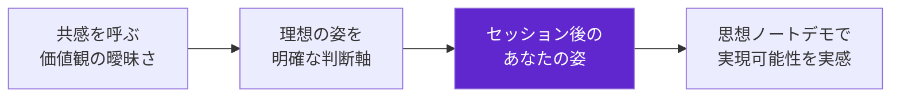
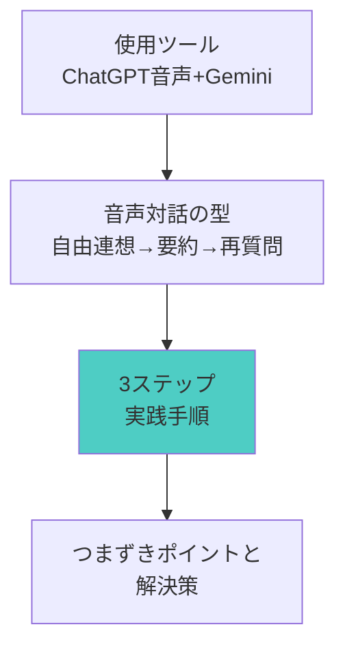
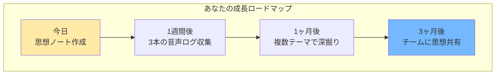
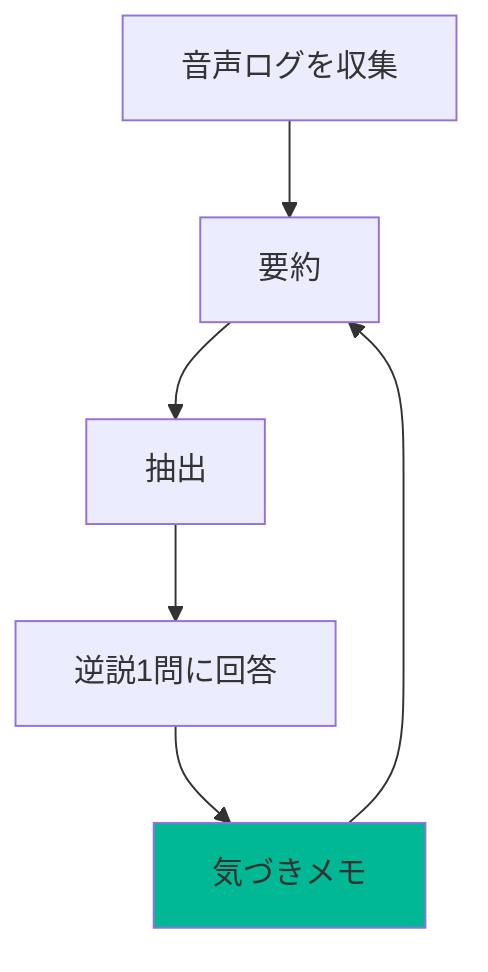
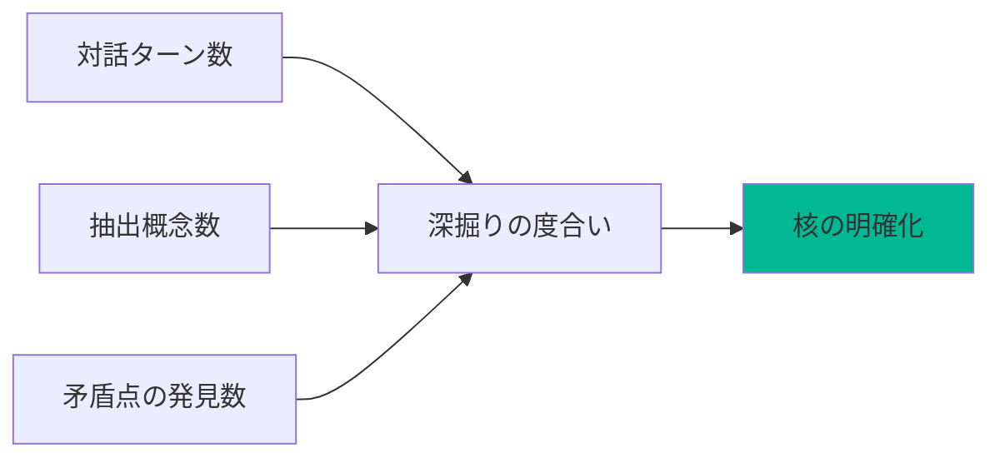
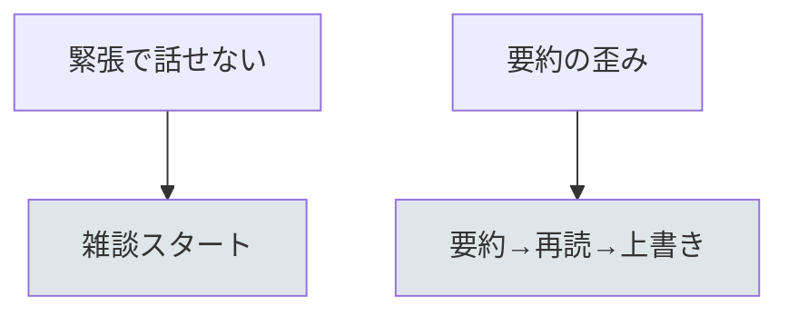

# 「思想ノート作成術」60分実践フォーマット
## 〜音声対話で自分の核を掘り下げる実践型セッション〜

## 🎯 このセッションでできるようになること
- 自分の価値観・判断軸が明確になる
- 思想ノートが作成できるようになる
- 音声対話で深い自己理解ができるようになる

## 📊 セッション全体の流れ


## 💎 核となるメッセージ

**ビジネスアスリートにとって、試行回数は最も重要な成長指標です。**

生成AIは、この試行回数を劇的に増やすための強力な武器。完璧を目指さず、まず80点のたたき台を大量に作る。その中から本当に輝く1個を見つけ出す。この繰り返しが、あなたを次のレベルに引き上げます。

---

## 📐 60分セッションの基本構造

### 基本フロー（時間は目安）
| フェーズ | 時間目安 | 内容 | ポイント |
|----------|----------|------|----------|
| **導入＋成果物確認** | 10分 | 目的共有→音声対話の型→完成イメージ | 期待感醸成と実現可能性の実感 |
| **ツールと手順解説** | 10分 | ChatGPT音声機能→Gemini補助→3ステップ手順 | 基礎理解と実践への準備 |
| **実践ワーク** | 30分 | 音声対話R1→抽出→音声対話R2→コア定義 | 体験と実践による習得 |
| **振り返り＋次への一歩** | 10分 | 成果確認→次週への準備 | 継続意欲の醸成 |

※ 共有セッションは必要に応じて実施

---

## 🎬 各フェーズの詳細設計

### 1. 導入＋成果物確認（10分）

**📍 導入の3ステップ構造**



**基本的な流れ:**
1. **課題共感フェーズ**
   - 「自分の価値観って何だろう？」「判断に迷うことが多い」
   - 「こんな悩み、ありますよね...」と共感を引き出す
   - 具体的な数値での比較（例：「迷いの時間：30分→5分に短縮」）

2. **理想提示フェーズ**
   - 音声対話を活用した理想的な状態を視覚的に示す
   - 「このセッションを受けた後のあなた」を具体的に描写
   - 成長のビフォーアフターを明確化

3. **成果物確認フェーズ**
   - 完成した思想ノートを実際にデモ
   - 「これが60分後にはあなたも作れます」と宣言
   - 段階的成長の考え方を自然に導入

**🚫 避けるべきこと:**
- 心理学的な手法名の明記
- 「驚きの」「魔法の」などの主観的表現
- 過度な期待を煽る表現

### 2. ツールと手順解説（10分）

**📊 構造化された解説方式**



**解説の構成:**
- **ツール紹介（3分）**
  - ChatGPT音声機能の特徴と使い方
  - Gemini補助要約の活用方法
  - 無料・有料の代替案提示

- **手順の構造化（5分）**
  - 大きな流れを3つのステップに整理
  - 各ステップを視覚的に図解
  - 「ここがポイント」を明確に指摘

- **実践のコツ（2分）**
  - よくあるつまずきポイントの先回り解説
  - 音声対話の「魔法の言葉」紹介
  - 成功率を上げる具体的Tips

### 3. 実践ワーク（30分）

**🎯 段階的実践プロセス**

| 段階 | 時間 | 内容 | サポート方法 |
|------|------|------|-------------|
| 核（10分） | 音声対話R1 | テーマ選定→5-10分口述→要約生成 | 全体指導＋画面共有 |
| 第1層（10分） | 抽出・可視化 | 要約から価値観・判断軸・感情トリガー抽出 | 巡回個別サポート |
| 第2層（10分） | 音声対話R2→コア定義 | 逆説質問で再深掘り→コアラベル命名→3箇条作成 | ヒント提供＋相互支援 |

**実践ワークの工夫:**
- 小さな成功体験を最初に作る
- つまずいている人を素早く発見・支援
- 「できた！」の瞬間を全体で共有
- 進度別の追加課題を用意

### 4. 振り返り＋次への一歩（10分）

**📈 成長の可視化と継続への道筋**



**振り返りセッションの構成:**
- **成果確認（5分）**
  - 参加者の思想ノートを簡単に確認
  - 工夫したポイントを共有
  - 他の参加者からの質問や感想（時間がある場合）

- **次への一歩（5分）**
  - 今日から始める具体的アクション
  - 1週間、1ヶ月、3ヶ月の成長ロードマップ
  - 継続学習のためのリソース紹介

---

## 💡 セッション設計の重要ポイント

### 🌈 構造化と可視化の原則

1. **常に全体像を見せる**
   - セッション開始時に全体の流れを図示
   - 現在地を常に明確にする
   - ゴールまでの道筋を可視化

2. **3という魔法の数字**
   - 主要ポイントは3つに整理
   - ステップも3段階で構成
   - 認知負荷を適切にコントロール

3. **ビジュアル思考の活用**
   - Mermaidなどで関係性を図解
   - 表形式で情報を整理
   - 色分けで重要度を表現

### 💎 感情デザインの進化

| フェーズ | 感情状態 | 演出方法 |
|----------|----------|----------|
| 導入 | 共感→期待 | 「あるある」から「できるかも」へ |
| 解説 | 理解→自信 | 「なるほど」から「やってみたい」へ |
| 実践 | 挑戦→達成 | 「難しいかも」から「できた！」へ |
| 振り返り | 誇り→意欲 | 「自分もできた」から「もっとやりたい」へ |

### 🎭 ファシリテーションの技法

**問いかけの技術:**
- オープンクエスチョンで思考を促進
- 「なぜそう思いますか？」で深掘り
- 「他にどんな価値観が見えてきそう？」で発想を広げる

**承認の技術:**
- 小さな成功も見逃さず承認
- 「いいですね！」の具体的な理由を述べる
- 失敗も学びとしてポジティブに転換

**巻き込みの技術:**
- 全員が発言する機会を創出
- ペアワークで参加のハードルを下げる
- 「教え合い」で理解を深める

---

## 📝 補足情報の配置（セッション資料の最後に）

### 詳細情報セクション
以下の情報は、メインセッションを妨げないよう資料の最後にまとめて配置：

1. **音声対話プロンプト集**
   - 基本対話のテンプレート
   - テーマ別カスタマイズ例
   - 深掘りのための質問集

2. **トラブルシューティング**
   - よくあるエラーと対処法
   - つまずきやすいポイントの解決策
   - Q&A集

3. **発展学習リソース**
   - 推奨する次の学習ステップ
   - 参考になる外部リソース
   - コミュニティやフォーラム情報

4. **実践チェックリスト**
   - セッション後の実践項目
   - 1週間、1ヶ月後の目標設定
   - 成長を測る指標

---

## 🚀 タイトル設計の原則

### ✅ 効果的なタイトル例
- 「思想ノート作成術」60分実践フォーマット
- 「価値観明確化術」60分実践フォーマット  
- 「音声対話自己理解術」60分実践フォーマット
- 「判断軸構築術」60分実践フォーマット

### 📊 タイトル構成の基本形
```
「[具体的な成果物]作成術」60分実践フォーマット
```

### ❌ 避けるべき表現
- 「効率化」「最適化」などの抽象的用語
- 「驚きの」「革命的」などの誇大表現
- 心理学的用語の羅列
- 参加者メリットが不明確な表現

---

## 🎯 成功指標とフィードバック

### 定量的指標
- 参加者の完成率（目標：90%以上）
- アンケート満足度（目標：4.5/5.0以上）
- 実践継続率（1週間後の追跡調査）

### 定性的指標
- 「明日から使える」という声
- 「思ったより簡単だった」という感想
- 「続きを学びたい」という意欲

---

## 📋 宿題（平日15-30分×3回）
- 音声ログを最低3本（各5分以上）
- 各ログに対して「要約→抽出→逆説1問に回答」を実施



## 📊 計測指標（簡易）
- 対話ターン数、抽出概念数、矛盾点の発見数



## ⚠️ リスクと対策
- 緊張で話せない → 雑談トピックから開始
- 要約の歪み → 音声→要約→再読上書きの二段階確認



---

*このフォーマットは、参加者の「不可能が可能になる」転換体験を、段階的成長の思想で自然に設計しています。小さな成功体験から始めて、確実に成長を実感できる構造が特徴です。*