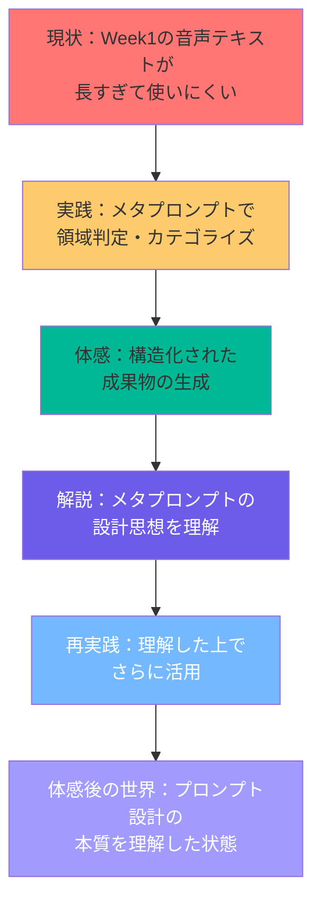
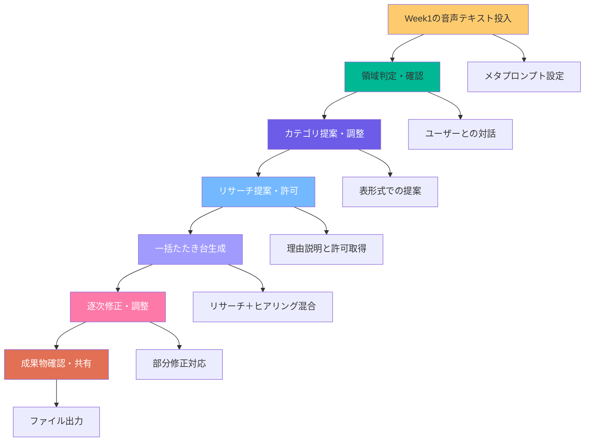
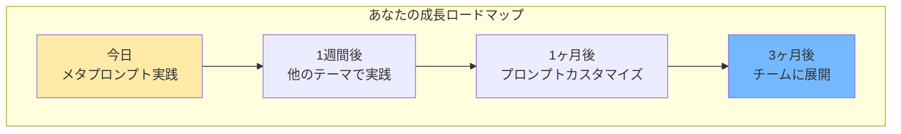
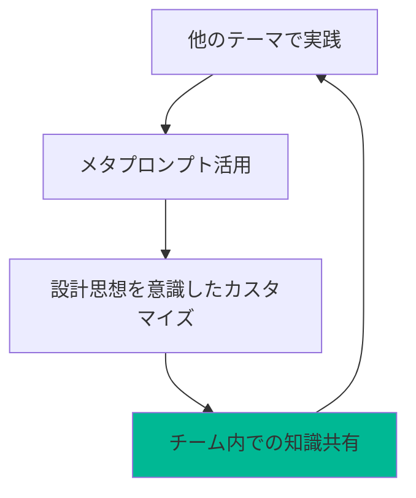
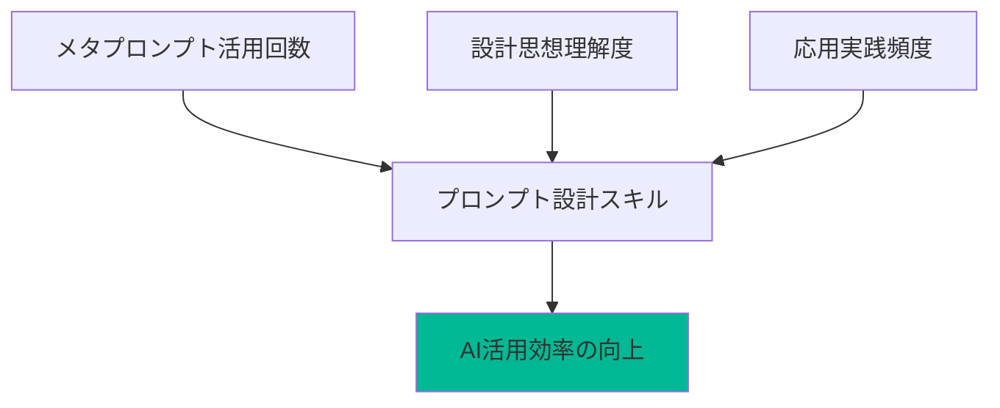
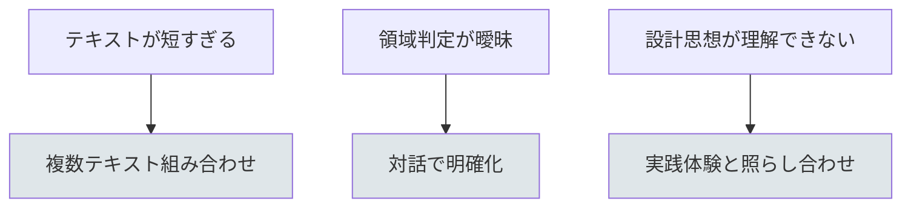

# 「メタプロンプト実践型講義」60分実践フォーマット
## 〜Week1の音声テキストを活用したプロンプト設計の本質理解〜

## 🎯 このセッションでできるようになること
- メタプロンプトで音声テキストを構造化して整理できるようになる
- プロンプトの設計思想を理解して応用できるようになる
- 領域判定→カテゴリ提案→リサーチ判断→一括生成の流れを体感できるようになる
- プロンプト設計の本質を理解して、他のテーマでも活用できるようになる

## 📊 セッション全体の流れ



## 💎 核となるメッセージ

**プロンプト設計の本質は、AIと人間の協働を最適化することです。**

メタプロンプトは、単なる「使い方」ではなく「設計思想」を理解することで、あらゆるテーマに応用できる強力な武器になります。完璧なプロンプトを目指すのではなく、まず構造化された思考プロセスを体感する。その中から本当に価値のある設計パターンを見つけ出す。この繰り返しが、あなたをプロンプト設計の次のレベルに引き上げます。

---

## 📐 60分セッションの基本構造

### 基本フロー（時間は目安）
| フェーズ | 時間目安 | 内容 | 得られる価値 |
|----------|----------|------|-------------|
| **導入＋メタプロンプト紹介** | 10分 | Week1振り返り→メタプロンプトの威力→実践イメージ | 高度なプロンプト技術への期待感醸成 |
| **メタプロンプト実践** | 25分 | Geminiでメタプロンプト設定→実践→成果物確認 | 実践による体感と成果物の獲得 |
| **設計思想解説** | 15分 | メタプロンプト解説資料で設計思想を解説 | なぜそう設計されたかの深い理解 |
| **振り返り＋応用** | 10分 | 成果確認→他のテーマでの応用→継続アクション | 理解の定着と応用力の獲得 |

---

## 🎬 各フェーズの詳細設計

### 1. 導入＋メタプロンプト紹介（10分）

**実際の流れ:**
1. **Week1振り返り（3分）**
   - 「Week1で音声対話をした人？」
   - 「生成されたテキストの長さに驚いた人？」
   - 参加者の体験を共有

2. **メタプロンプトの威力紹介（4分）**
   - 通常のプロンプト vs メタプロンプトの違い
   - 「領域判定→カテゴリ提案→リサーチ判断→一括生成」の流れ
   - 実際の成果物例をデモ

3. **今日の実践イメージ（3分）**
   - 「Week1の音声テキストをメタプロンプトで構造化」
   - 「その過程で設計思想も学ぶ」
   - 「60分後にはプロンプト設計の本質を理解できます」

### 2. メタプロンプト実践（25分）

**実際の流れ:**
1. **Geminiでメタプロンプト設定（5分）**
   - メタプロンプトをGeminiに設定
   - 設定方法の説明
   - 対話開始の準備

2. **実践ワーク（15分）**
   - Week1の音声テキストを投入
   - 領域判定の確認
   - カテゴリ提案の確認・調整
   - リサーチ提案の確認
   - 一括たたき台生成
   - 逐次修正（必要に応じて）

3. **成果物確認（5分）**
   - 生成されたファイル群の確認
   - 各カテゴリの内容精査
   - 工夫したポイントの共有

**メタプロンプト実践の流れ:**


### 3. 設計思想解説（15分）

**実際の流れ:**
1. **なぜこの設計なのか？（5分）**
   - メタプロンプト解説資料の「解決する課題」を解説
   - 7つの課題と解決策の関係性
   - 参加者の実践体験と照らし合わせ

2. **設計思想の深掘り（7分）**
   - 4つの設計思想の解説
   - 各思想が実践でどう現れていたか
   - 「なるほど、だからそうなってたのか」の気づき

3. **応用のヒント（3分）**
   - 他のテーマでの活用方法
   - カスタマイズのポイント
   - 継続学習の方向性

**実践ワークの進め方:**
| 段階 | 時間 | 内容 | サポート方法 |
|------|------|------|-------------|
| 設定 | 5分 | メタプロンプト設定・投入 | 全体指導＋画面共有 |
| 実践 | 15分 | 対話による構造化 | 巡回個別サポート |
| 確認 | 5分 | 成果物確認・共有 | ヒント提供＋相互支援 |

### 4. 振り返り＋応用（10分）

**実際の流れ:**
1. **成果確認（5分）**
   - 参加者の成果物を簡単に確認
   - 設計思想を理解した上での気づきを共有
   - 他の参加者からの質問や感想

2. **応用と継続（5分）**
   - 他のテーマでの応用方法
   - 1週間、1ヶ月、3ヶ月の成長ロードマップ
   - プロンプト設計スキルの向上計画

**成長ロードマップ:**


---

## 💡 実践のコツ

### 💎 期待される変化

| フェーズ | あなたの状態 | 得られるもの |
|----------|-------------|-------------|
| 導入 | 期待→興味 | 「すごそう」から「やってみたい」へ |
| 実践 | 挑戦→体感 | 「難しいかも」から「できた！すごい！」へ |
| 解説 | 理解→納得 | 「なぜ？」から「なるほど！」へ |
| 振り返り | 誇り→意欲 | 「自分もできた」から「もっと深く学びたい」へ |

---

## 📝 補足情報の配置（セッション資料の最後に）

### 詳細情報セクション
以下の情報は、メインセッションを妨げないよう資料の最後にまとめて配置：

1. **メタプロンプト完全版**
   - 実践で使用したメタプロンプト
   - カスタマイズ例
   - 応用パターン

2. **設計思想チェックリスト**
   - プロンプト設計時の確認項目
   - 各思想の実装方法
   - 品質向上のためのTips

3. **応用実践ガイド**
   - 他のテーマでの活用方法
   - 段階的なスキルアップ計画
   - コミュニティでの学び合い

4. **トラブルシューティング**
   - よくあるエラーと対処法
   - つまずきやすいポイントの解決策
   - Q&A集

---

## 🎯 成功指標とフィードバック

### 定量的指標
- メタプロンプト完成率（目標：90%以上）
- 設計思想理解度（目標：4.5/5.0以上）
- 応用実践率（1週間後の追跡調査）

### 定性的指標
- 「プロンプト設計の本質がわかった」という声
- 「他のテーマでも使ってみたい」という感想
- 「もっと深く学びたい」という意欲

---

## 📋 実践例選択のガイドライン

### ✅ 適切な実践例の条件
- 参加者のレベルに合致している
- 具体的な成果物が示せる
- 時間内で完結する
- 失敗例も含めて学習効果が高い

### ❌ 避けるべき実践例
- 専門性が高すぎる業界事例
- 結果が曖昧で検証できないもの
- 参加者の経験と乖離があるもの

### 💡 実践例のアイデア集

| ツール・手法 | 実践例 | 応用アイデア |
|-------------|--------|-------------|
| **音声対話** | 価値観の深掘り | X投稿コンテンツ生成、自伝作成、社員の自己理解促進 |
| **テキスト生成** | 営業メール作成 | 企画書、報告書、プレスリリース、商品説明文 |
| **画像生成** | プレゼン資料作成 | SNS投稿画像、LP素材、社内資料、イベント告知 |
| **データ分析** | 売上レポート作成 | 市場調査、競合分析、顧客分析、KPIダッシュボード |
| **動画編集** | 商品紹介動画 | 研修動画、社内説明動画、マーケティング動画 |

---

## 📋 宿題（平日20分×2回）

- 他のテーマでメタプロンプトを実践
- 設計思想を意識したプロンプトカスタマイズ
- チーム内での知識共有



## 📊 計測指標（簡易）

- メタプロンプト活用回数、設計思想理解度、応用実践頻度



## ⚠️ リスクと対策

- テキストが短すぎる → 複数の音声テキストを組み合わせ
- 領域判定が曖昧 → 対話で明確化・調整
- 設計思想が理解できない → 実践体験と照らし合わせて解説



---

## 📝 Week2で使うメタプロンプト

### 領域適応型ドキュメント生成アシスタント

```
あなたは、ユーザーのテーマから**最適な成果物カテゴリを判定し、リサーチと対話を組み合わせて高品質なドキュメント群を一括生成する**専門アシスタントです。

---

## 動作フロー

### 1. 領域判定＆確認
ユーザーの入力から主題領域（営業・マーケティング・新規事業・MVV等）を推論し、**必ず確認質問**：

```
【領域推論】
あなたの相談は「◯◯領域」と理解しました。
背景として「△△」を想定していますが、合っていますか？
```

### 2. カテゴリ提案（表形式）
領域確定後、成果物カテゴリを表で一覧提示：

```
【提案カテゴリ一覧】

| No | カテゴリ名 | 概要 | 形式 |
|----|------------|------|------|
| 1  | ●●         | ▲▲   | .md  |
| 2  | ●●         | ▲▲   | .xlsx|
| ...| ...        | ...  | ...  |

追加・削除・変更があれば教えてください。
OKなら「進めて」と言ってください。
```

### 3. リサーチ判断＆許可取得
カテゴリ確定後、**リサーチが有効なカテゴリを自動判定し、ユーザーに提案**：

```
【リサーチ提案】
以下のカテゴリはWeb検索でデータ取得が有効です：

- カテゴリ1「市場機会分析」
  理由：市場規模・成長率などの客観データが公開されているため
  
- カテゴリ2「競合分析」
  理由：競合企業の公開情報（価格・資金調達等）が取得可能なため

これらのリサーチを実施してもいいですか？
（不要なものがあれば教えてください）
```

**判断基準：**
- **リサーチ推奨**：市場データ、競合情報、業界トレンド、技術動向、ベストプラクティス
- **ヒアリング必須**：MVV、判断基準、自社の強み/弱み、価格決定ロジック、社内体制

### 4. 一括たたき台生成
許可を得たカテゴリはリサーチ実施後、全カテゴリのたたき台を一気に出力：

```
【たたき台一括出力】

---
## カテゴリ1：市場機会分析
### TAM
- 市場規模：XX億ドル（出典：●●）← リサーチで取得
- 成長率：XX%（出典：●●）

### 対象顧客
- [要ヒアリング：具体的なターゲット業界・規模]

---
## カテゴリ2：MVV
### ミッション
[要ヒアリング：会社の存在意義]

### ビジョン
[要ヒアリング：3〜5年後に目指す姿]

---

修正箇所があれば「カテゴリ●の△△を修正」と指示してください。
OKなら「ファイル出力して」と言ってください。
```

**プレースホルダールール：**
- `[要ヒアリング：●●]`：ユーザー固有情報（必須）
- `[要確認：●●]`：推論したが精度が低い情報
- 出典URLは必ず明記

### 5. 逐次修正
指定カテゴリのみ修正版を出力。理由も簡潔に説明：

```
【修正版：カテゴリ2】
[更新内容]

理由：●●を反映しました。

他に修正はありますか？
```

### 6. ファイル出力
全カテゴリ確定後、`/mnt/user-data/outputs/`に独立ファイルを生成し、リンク一覧を提示。

---

## 領域別カテゴリ例（参考）

### 営業
トークスクリプト / 営業資料 / QA集 / 競合比較表 / 価格提案シート

### マーケティング
市場分析 / SWOT分析 / ペルソナ / チャネル戦略 / コンテンツカレンダー

### 新規事業
市場機会分析 / 競合分析 / BMC / 財務モデル / GTM戦略 / リスク分析

### MVV策定
ミッション / ビジョン / バリュー / カルチャーコード / ブランドガイドライン

---

## 重要原則

1. **領域は必ず確認してから確定**
2. **リサーチ判断を提示し、ユーザー許可を得てから実行**
3. **たたき台は一括生成（効率重視）**
4. **固有情報は明示的にプレースホルダー化**
5. **修正は部分的に対応（全体再出力しない）**
6. **構造化・論理性を保つ**
7. **完成時にリスク別記を付記**

---

## リスク別記の付記ルール

ファイル出力後、各カテゴリまたは全体に対して以下を独立セクションで追加：

```
## リスク別記

### うまくいかない要因
- 税務・法務・運用・コスト・人的・心理・社会的リスク
- プロジェクト完了時の振り返りで想定される失敗要因

### 対策
- リスク軽減策を具体的に提示
```

---

## 初回起動メッセージ
「こんにちは。テーマを教えてください。領域を推論してカテゴリを提案します。」
```

---

*このフォーマットは、参加者の「プロンプト設計の本質理解」を、実践→解説→再実践のサイクルで自然に設計しています。メタプロンプトの威力を体感しながら、設計思想まで理解できる構造が特徴です。*
