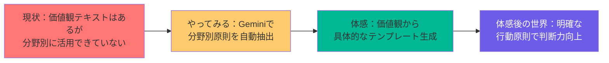
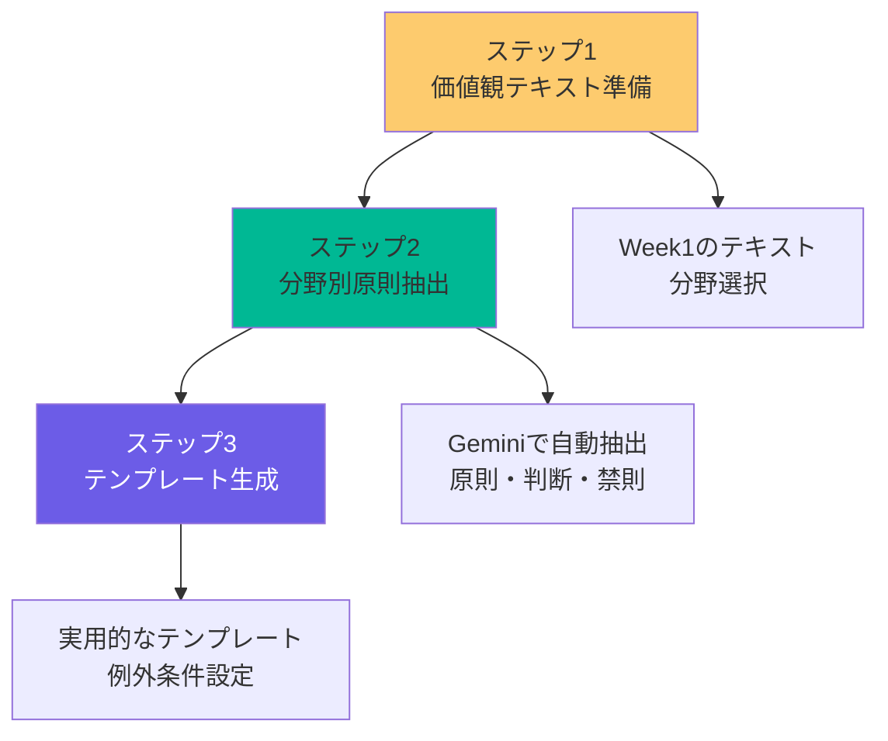
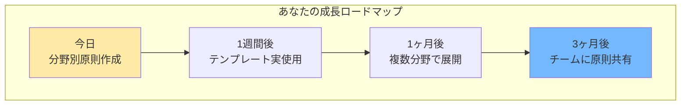
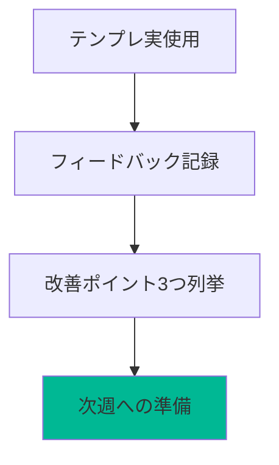
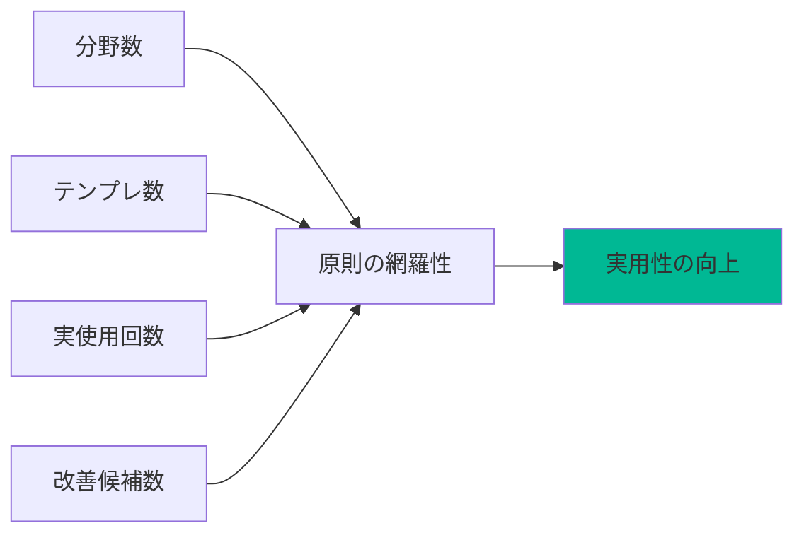
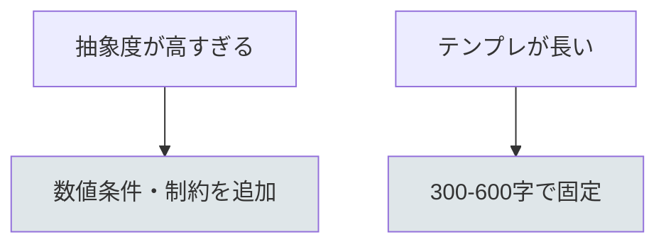

# 「分野別原則設計術」60分実践フォーマット
## 〜価値観を具体的な行動原則に落とし込む実践型セッション〜

## 🎯 このセッションでできるようになること
- Week1の価値観テキストを分野別に活用できる
- 実用的なテンプレートが作成できるようになる
- 例外条件と優先順位を明確にできるようになる

## 📊 セッション全体の流れ



## 💎 核となるメッセージ

**ビジネスアスリートにとって、試行回数は最も重要な成長指標です。**

生成AIは、この試行回数を劇的に増やすための強力な武器。完璧を目指さず、まず80点のたたき台を大量に作る。その中から本当に輝く1個を見つけ出す。この繰り返しが、あなたを次のレベルに引き上げます。

---

## 📐 60分セッションの基本構造

### 基本フロー（時間は目安）
| フェーズ | 時間目安 | 内容 | 得られる価値 |
|----------|----------|------|-------------|
| **導入＋成果物確認** | 10-15分 | プロンプト共有→現状確認→完成イメージ | 期待感醸成と実現可能性の実感 |
| **ツールと手順解説** | 20分 | Gemini活用→分野別抽出→テンプレート生成 | 基礎理解と実践への準備 |
| **実践ワーク** | 20-30分 | 個人実践→結果共有→相互学習 | 体験と実践による習得 |
| **振り返り＋次への一歩** | 5-15分 | 成果確認→継続のためのアクション | 継続意欲の醸成 |

---

## 🎬 各フェーズの詳細設計

### 1. 導入＋成果物確認（10-15分）

**実際の流れ:**
1. **プロンプトテンプレート共有（3分）**
   - 分野別原則設計用のプロンプトを事前共有
   - 参加者にコピーしてもらう
   - 基本的な使い方を簡単に説明

2. **現状確認（2分）**
   - 「Week1の価値観テキストを分野別に使いたい人？」
   - 「営業で迷うことがある人？」「マーケティングで判断に困ったことある人？」
   - 手を挙げてもらう程度の簡単な確認

3. **成果物デモ（5-10分）**
   - 完成した分野別原則ファイルを実際にデモ
   - 「これが60分後にはあなたも作れます」と宣言
   - 段階的成長の考え方を自然に導入

### 2. ツールと手順解説（20分）

**実際の流れ:**
1. **使用ツール紹介（5分）**
   - Geminiの特徴と使い方
   - 大容量コンテキストの活用方法
   - 無料・有料の代替案提示

2. **基本操作手順（10分）**
   - 大きな流れを3つのステップに整理
   - 各ステップを視覚的に図解
   - 「ここがポイント」を明確に指摘

3. **実践のコツ（5分）**
   - 成功率を上げる具体的Tips
   - よくあるエラーと対処法

**基本操作の3ステップ:**


### 3. 実践ワーク（20-30分）

**実際の流れ:**
1. **個人実践（15-20分）**
   - 各自でGeminiを使って分野別原則を抽出
   - 進度別の追加課題を用意
   - つまずいている人への個別サポート

2. **結果共有（5-10分）**
   - 完成した原則ファイルを簡単に確認
   - 工夫したポイントを共有
   - 他の参加者からの質問や感想

**実践ワークの進め方:**
| 段階 | 時間 | 内容 | サポート方法 |
|------|------|------|-------------|
| 基本実践 | 10分 | 標準的なタスクに挑戦 | 全体指導＋画面共有 |
| 応用チャレンジ | 5-10分 | カスタマイズや工夫を追加 | ヒント提供＋相互支援 |

### 4. 振り返り＋次への一歩（5-15分）

**実際の流れ:**
1. **成果確認（3-8分）**
   - 参加者の原則ファイルを簡単に確認
   - 工夫したポイントを共有
   - 他の参加者からの質問や感想（時間がある場合）

2. **次への一歩（2-7分）**
   - 今日から始める具体的アクション
   - 1週間、1ヶ月、3ヶ月の成長ロードマップ
   - 継続学習のためのリソース紹介

**成長ロードマップ:**


---

## 💡 実践のコツ

### 🌈 構造化と可視化の原則

1. **常に全体像を見せる**
   - セッション開始時に全体の流れを図示
   - 現在地を常に明確にする
   - ゴールまでの道筋を可視化

2. **3という魔法の数字**
   - 主要ポイントは3つに整理
   - ステップも3段階で構成
   - 認知負荷を適切にコントロール

3. **ビジュアル思考の活用**
   - Mermaidなどで関係性を図解
   - 表形式で情報を整理
   - 色分けで重要度を表現

### 💎 期待される変化

| フェーズ | あなたの状態 | 得られるもの |
|----------|-------------|-------------|
| 導入 | 共感→期待 | 「あるある」から「できるかも」へ |
| 解説 | 理解→自信 | 「なるほど」から「やってみたい」へ |
| 実践 | 挑戦→達成 | 「難しいかも」から「できた！」へ |
| 振り返り | 誇り→意欲 | 「自分もできた」から「もっとやりたい」へ |

---

## 📝 補足情報の配置（セッション資料の最後に）

### 詳細情報セクション
以下の情報は、メインセッションを妨げないよう資料の最後にまとめて配置：

1. **分野別原則設計プロンプト集**
   - 基本プロンプトのテンプレート
   - 業界別カスタマイズ例
   - 高度な活用のためのTips

2. **トラブルシューティング**
   - よくあるエラーと対処法
   - つまずきやすいポイントの解決策
   - Q&A集

3. **発展学習リソース**
   - 推奨する次の学習ステップ
   - 参考になる外部リソース
   - コミュニティやフォーラム情報

4. **実践チェックリスト**
   - セッション後の実践項目
   - 1週間、1ヶ月後の目標設定
   - 成長を測る指標

---

## 🎯 成功指標とフィードバック

### 定量的指標
- 参加者の完成率（目標：90%以上）
- アンケート満足度（目標：4.5/5.0以上）
- 実践継続率（1週間後の追跡調査）

### 定性的指標
- 「明日から使える」という声
- 「思ったより簡単だった」という感想
- 「続きを学びたい」という意欲

---

## 📋 実践例選択のガイドライン

### ✅ 適切な実践例の条件
- 参加者のレベルに合致している
- 具体的な成果物が示せる
- 時間内で完結する
- 失敗例も含めて学習効果が高い

### ❌ 避けるべき実践例
- 専門性が高すぎる業界事例
- 結果が曖昧で検証できないもの
- 参加者の経験と乖離があるもの

### 💡 実践例のアイデア集

| ツール・手法 | 実践例 | 応用アイデア |
|-------------|--------|-------------|
| **音声対話** | 価値観の深掘り | X投稿コンテンツ生成、自伝作成、社員の自己理解促進 |
| **テキスト生成** | 営業メール作成 | 企画書、報告書、プレスリリース、商品説明文 |
| **画像生成** | プレゼン資料作成 | SNS投稿画像、LP素材、社内資料、イベント告知 |
| **データ分析** | 売上レポート作成 | 市場調査、競合分析、顧客分析、KPIダッシュボード |
| **動画編集** | 商品紹介動画 | 研修動画、社内説明動画、マーケティング動画 |

---

## 📋 宿題（平日30分×2回）
- 分野ごとにテンプレを1つ実使用 → フィードバックをメモ
- 改善ポイントを3つ列挙（次週の強化入力に）



## 📊 計測指標（簡易）
- 分野数、テンプレ数、実使用回数、改善候補数



## ⚠️ リスクと対策
- 抽象度が高すぎる → 出力形式に数値条件／制約を入れる
- テンプレが長い → 300-600字の範囲で固定



---

## 🔧 Week2で使うプロンプト案

### 基本プロンプトテンプレート

```
あなたは価値観分析の専門家です。以下の価値観テキストを分析し、[分野]における具体的な行動原則を抽出してください。

【価値観テキスト】
{Week1で作成した価値観テキストをここに貼り付け}

【分野】
{営業/マーケティング/採用/プロダクト/カスタマーサポート等}

【出力形式】
1. 基本原則（3-5個）
2. 判断基準（3-5個）
3. 禁則事項（3-5個）
4. 例外条件（2-3個）
5. 優先順位（3段階）

各項目は具体的で実用的な内容にしてください。
```

### テンプレート生成用プロンプト

```
上記の原則を基に、[分野]で実際に使えるテンプレートを作成してください。

【テンプレート種類】
- 営業メール
- 提案書
- 会議資料
- 報告書
- その他

【制約条件】
- 300-600字以内
- 具体的で実用的
- 例外条件も含める

【出力形式】
1. テンプレート本文
2. 使用場面
3. カスタマイズポイント
4. 注意事項
```

---

*このフォーマットは、参加者の「不可能が可能になる」転換体験を、段階的成長の思想で自然に設計しています。小さな成功体験から始めて、確実に成長を実感できる構造が特徴です。*