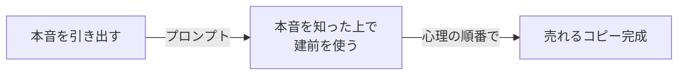
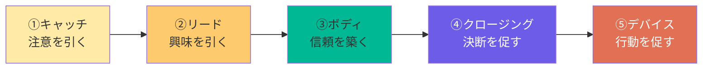
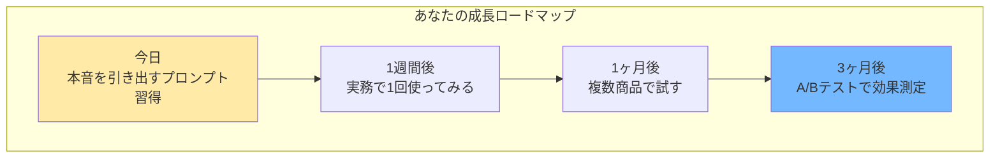

## 🧑‍🍳 セッション設計：プロンプトで顧客の本音を引き出すコピーライティング術

- **開催日**: 2026-02-21
- **所要時間**: 60分
- **対象者**: マーケター / 営業 / コピーライター / 商品・サービスを売りたい方
- **ゴール（成果物）**: ChatGPTで顧客の本音を引き出し、実際に売れるコピーが完成して持ち帰れる
- **使用ツール**: ChatGPT / メモアプリ
- **事前準備**: 
  - ChatGPTアカウント準備
  - 売りたい商品・サービスを1つ決めておく（例: 高級オーガニック食品、食洗機等）

### 📌 共有リンク / 配布物

- ChatGPT: https://chat.openai.com/
- 配布プロンプト集（Notionページ）

### 🧩 当日の流れ（タイムテーブル）

| パート | 時間 | 内容 | ゴール |
|---|---:|---|---|
| 導入 | 10分 | コピーの課題と解決策 | 「本音を知れば変わるんだ」と期待を持つ |
| 解説 | 20分 | 本音の引き出し方と使い方 | 「なるほど、こうすればいいのか」と納得する |
| 実践 | 25分 | 売れるコピー作成ワーク | 実際にコピーが完成する |
| 振り返り | 5分 | 次のアクション | 明日から使えるイメージを持つ |

---

## 🎬 セッションの流れ

### 1. 導入：コピーの課題と解決策（10分）

#### コピーライティング、難しいですよね

商品やサービスを売るためのコピー、書いたことありますか？

「ターゲットを決めて、ベネフィットを書いて、行動を促す」

理屈はわかっている。でも、いざ書いてみると...

- 「なんか響かないな...」
- 「他社と似たような文言になる」
- 「お客さんが反応してくれない」

#### 実は、コピーの問題は「書き方」じゃない

多くの人は「文章力」や「キャッチコピーのテクニック」を学びます。

でも、どれだけ上手に書いても、**お客さんの心に刺さらないコピー**ってありますよね。

その原因は何だと思いますか？

**「お客さんの本音を知らないまま書いている」から**です。

#### 例を見てみましょう

高級オーガニック食品を売るとします。

普通のコピー：
> 「安心・安全な有機野菜をお届けします」

悪くはない。でも、**誰にでも書ける**し、**誰にも響かない**。

なぜなら、お客さんの本音を知らないから。

高級オーガニック食品を買う人の本音って、何だと思いますか？

「健康になりたい」？それは表面上の理由です。

本音はこうです：

> 「ちゃんとした母親に見られたい」
> 「子供の健康に気を使える、良い親だと思われたい」
> 「スーパーの安い野菜を買ってる自分が嫌」

この本音を知った上でコピーを書くと：
> 「あなたはいつも、家族の健康を想っている。」

**📷 画像貼付け**: Before/Afterのコピー比較

（ここに画像を貼る）

本音をストレートに突いていないのに、なぜか心に刺さる。

これが **「本音を知った上で建前を使う」** というテクニックです。

#### 今日、この技術を身につけます

60分後には、皆さんも「本音を知った上で建前を使う」コピーが書けるようになります。

ChatGPTに特定のプロンプトを入れるだけで、お客さんの本音を引き出せます。

**全体像:**



**📷 画像貼付け**: 全体像

（ここに画像を貼る）

---

### 2. 解説：本音の引き出し方と使い方（20分）

#### 「本音を引き出す」って具体的にどうやるの？

ChatGPTに普通に聞いても、表面的な回答しか返ってきません。

「高級オーガニック食品を買う人のニーズを教えて」と聞くと...

> - 健康志向が高い
> - 安心・安全な食品を求めている
> - 環境に配慮したい

これ、知ってましたよね。こんな回答では売れるコピーは書けません。

#### コツは「恥ずかしい」と「矛盾」

お客さんの本当の購買動機は、**恥ずかしくて言えないこと**や**矛盾した感情**の中にあります。

例えば、食洗機を買う人の本音：

- 「楽したい。でも、怠け者と思われたくない」
- 「時短したい。でも、主婦として手抜きと思われたくない」

この矛盾こそが、購買を後押しする感情です。

#### 実際にやってみましょう

ChatGPTにこう聞きます：

**📷 画像貼付け**: ChatGPTで本音を引き出している画面

（ここに画像を貼る）

すると、こんな回答が返ってきます：

```text
食洗機を買おうとしている私。

正直に言うと...毎日の皿洗いがしんどい。
食器を見るたびにため息が出る。

でも、それを言うのは恥ずかしい。
「楽したいだけでしょ」って思われそう。
「母親なのに」「妻なのに」って。

だから本当の理由は言えない。
「時短して子供との時間を増やしたい」とか、
「手荒れがひどいから」とか、
もっともらしい理由を探してしまう。
```

これが本音です。この本音を知った上でコピーを書くと、精度が一気に上がります。

#### 本音を引き出す3つのプロンプト

本音を引き出すには、3つの角度から聞くのが効果的です：

| 角度 | 聞き方 | 引き出せるもの |
|------|--------|---------------|
| 恥ずかしい本音 | 「恥ずかしくて言えない生々しい本音を一人称で語って」 | 隠された購買動機 |
| 恥ずかしいタイミング | 「必要性に気づく恥ずかしいタイミングを描写して」 | 購買のきっかけ |
| 矛盾した感情 | 「〜したい、でも〜という矛盾した感情を10個挙げて」 | 購買を阻むブレーキ |

#### 「本音を知った上で建前を使う」とは？

本音を引き出したら、次に重要なのは **本音をストレートに突かないこと**。

「ちゃんとした母親に見られたい」という本音を知って、

> 「他人にどう見られるか気になりますよね？」

と書いたら、お客さんは心を閉ざします。図星を突かれて恥ずかしいからです。

代わりに、本音を知った上で、**建前に寄り添う**。

> 「あなたはいつも、家族の健康を想っている。」

これなら、お客さんは「そうそう、そうなんです」と心を開いてくれます。

**泥水を聖水にろ過する**

本音（泥水）をそのまま突きつけるのではなく、美しい言葉（聖水）に変換する。

これがコピーライティングの本質です。

#### 人間心理の順番で構成する

コピーには正しい順番があります。



**📷 画像貼付け**: 人間心理の順番

（ここに画像を貼る）

この順番を無視すると、どれだけ良いコピーを書いても読まれません。

---

## 🧾 配布プロンプト（コピペ用）

### 0) 本音を引き出すプロンプト①（恥ずかしい本音）

お客さんが口に出せない本音を引き出します。

```text
（商品名）を買う人が、恥ずかしくて言えない生々しい本音を一人称で語って。
```

**なぜこう指定するの？**
| 指定内容 | 理由 |
|----------|------|
| 恥ずかしくて言えない | 表面的な理由ではなく、本当の購買動機を引き出す |
| 生々しい | 抽象的ではなく具体的な感情を引き出す |
| 一人称で語って | リアルな心の声として出力させる |

### 1) 本音を引き出すプロンプト②（恥ずかしいタイミング）

購買のきっかけとなる瞬間を引き出します。

```text
（商品名）の必要性に気づく恥ずかしいタイミングを具体的に描写してください。
```

### 2) 矛盾を引き出すプロンプト③（購買ブレーキ）

「買いたい」と「買えない」の間にある葛藤を引き出します。

```text
（商品名）を買う人が抱える「〜したい、でも〜」という矛盾した生々しい感情を10個挙げて。
```

### 3) ペルソナ深掘りプロンプト（応用）

3つの角度を一度に聞く、まとめプロンプトです。

```text
（商品名）を買う人のペルソナを深掘りしてください。
特に以下の観点で分析してください：
- 恥ずかしくて言えない本音
- 商品の必要性に気づく恥ずかしいタイミング
- 「〜したい、でも〜」という矛盾した感情
- 見せたくない傷を治す絆創膏としての商品の位置づけ
```

### 4) コピー生成プロンプト（本音を知った上で建前を使う）

引き出した本音を基に、売れるコピーを生成します。

```text
商品: （商品名）
顧客の本音: （上記プロンプトで引き出した本音を貼り付け）

この本音を知った上で、あえて建前に寄り添うコピーを作成してください。
本音をストレートに突くのではなく、顧客の心の奥を理解した上で最適な言葉を選んでください。

出力形式:
- ① キャッチコピー（注意を引く）
- ② リード文（興味を引く）
- ③ ボディ（信頼を築く）
- ④ クロージング（決断を促す）
- ⑤ デバイス（行動を促す）

人間心理の順番（注意→興味→信頼→決断→行動）を守って構成してください。
```

### 5) コピー改善プロンプト（うまくいかない時）

```text
現在のコピー:
（生成されたコピーを貼り付け）

改善要望:
- もっと顧客の心に響く表現に
- 本音を知った上で建前を使うアプローチを強化
- 人間心理の順番をより明確に

改善後のコピーを出力してください。
```

---

### 3. 実践ワーク（25分）

#### 準備（2分）

では実際にやってみましょう。

今日の題材は「あなたが売りたい商品・サービス」です。

事前に決めてきた商品を使います。まだ決まっていない方は、以下から選んでください：

**練習用の商品例:**

```text
・高級オーガニック食品
・食洗機
・オンライン英会話
・転職エージェント
・高級美容液
```

#### ステップ1：本音を引き出す（10分）

**やること:**
1. ChatGPTを開く
2. プロンプト①「恥ずかしい本音」を実行
3. プロンプト②「恥ずかしいタイミング」を実行
4. プロンプト③「矛盾した感情」を実行
5. 出てきた本音の中で「これは使える！」と思うものをメモ

**確認ポイント:**
- 違和感のある回答が出てきたら、それが「売り手と消費者のズレ」
- この違和感こそが、売れるコピーのヒントになる

#### ステップ2：コピーを生成する（10分）

**やること:**
1. プロンプト④「コピー生成プロンプト」をコピー
2. 商品名と、ステップ1で引き出した本音を貼り付け
3. 実行して、生成されたコピーを確認

**確認ポイント:**
- 本音をストレートに突いていないか
- 建前に寄り添った表現になっているか
- 人間心理の順番（注意→興味→信頼→決断→行動）になっているか

#### ステップ3：改善＆共有（5分）

**やること:**
1. 生成されたコピーを読み直す
2. 気になる点があれば、プロンプト⑤で改善
3. 「これは使える！」と思った部分を共有

**共有のポイント:**
- どんな本音が引き出せたか
- その本音をどう「建前」に変換したか
- 工夫したポイント

---

### 4. 振り返り＋次への一歩（5分）

#### ブラッシュアップ方法

完成したコピーは、さらに磨くことができます。

**できること:**
- 複数パターンのコピーを生成して比較
- A/Bテストで効果を測定
- 定期的に本音を引き出し直す（顧客の変化をキャッチ）

#### 今日のまとめ

**「本音を知った上で建前を使う」**

今日学んだ方法を使えば：
1. お客さんの本音を引き出せる
2. 本音をストレートに突かず、建前に寄り添える
3. 人間心理の順番で構成できる

**結果、「なぜか心に刺さる」コピーが書けるようになります。**

#### 成長ロードマップ



**📷 画像貼付け**: 成長ロードマップ

（ここに画像を貼る）

---

## 💡 よくある質問と対処法

### Q. 違和感のある回答が出てきたらどうすればいい？

A. その違和感こそが「売り手と消費者のズレ」です。記録して分析することで、より効果的なコピーが作れます。むしろ違和感のある回答が出てきたら「当たり」と思ってください。

### Q. 本音をストレートに突いてはいけないの？

A. 基本的には避けた方が良いです。「ちゃんとした母親に見られたい」という本音を直接突くと、顧客は恥ずかしくなって心を閉ざします。本音を知った上で、建前に寄り添う表現を選びましょう。

### Q. 人間心理の順番を守らないとどうなる？

A. どれだけ良いコピーを書いても読まれません。例えば、いきなり「今すぐ購入！」と言われても行動できませんよね。注意→興味→信頼→決断→行動の順番を守ることで、自然と最後まで読んでもらえるコピーになります。

### Q. プロンプトを組み合わせて使える？

A. はい。むしろ組み合わせた方が効果的です。3つの角度（恥ずかしい本音、恥ずかしいタイミング、矛盾した感情）から引き出した本音を全て使うことで、より立体的な顧客理解ができます。

---

## 💎 このセッションで得られること

| フェーズ | 内容 | 得られるもの |
|----------|-------------|-------------|
| 導入 | コピーの課題と解決策 | 「本音を知れば変わる」と理解できる |
| 解説 | 本音の引き出し方と使い方 | 方法論が腹落ちする |
| 実践 | 売れるコピー作成ワーク | 実際に使えるコピーが完成する |
| 振り返り | 次のアクション | 明日から実務で使えるイメージが湧く |

---

## 📋 参考：商品別の本音と建前の例

| 商品・サービス | 本音の例 | 建前に寄り添うコピーの例 |
|-------------|---------|---------------------|
| **高級オーガニック食品** | 「ちゃんとした母親に見られたい」 | 「あなたはいつも、家族の健康を想っている」 |
| **食洗機** | 「楽したい、でも怠け者と思われたくない」 | 「家族との時間を大切にするあなたのために」 |
| **ジム** | 「痩せたい、でも続けられるか不安」 | 「あなたの健康な未来を、今日から始めませんか」 |
| **オンライン講座** | 「スキルアップしたい、でも時間がない」 | 「忙しいあなたでも、効率的に学べる」 |
| **転職エージェント** | 「逃げたい、でも逃げと思われたくない」 | 「あなたの経験を、次のステージで活かしませんか」 |

---

*このセッションでは「本音を知った上で建前を使う」というコピーライティングの本質を学びます。泥水（本音）を聖水（美しい言葉）にろ過する技術を身につけて、「なぜか心に刺さる」コピーを作れるようになりましょう。*
