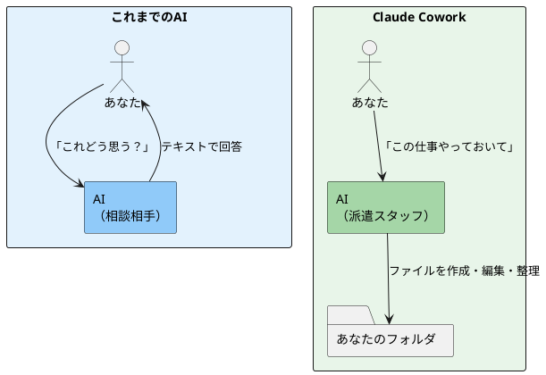
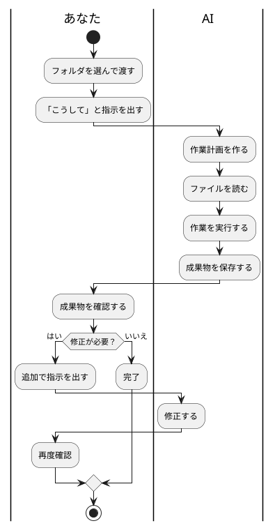
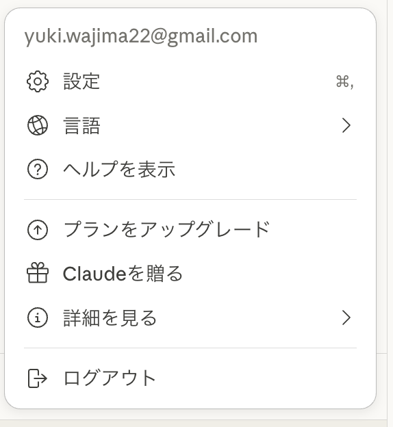
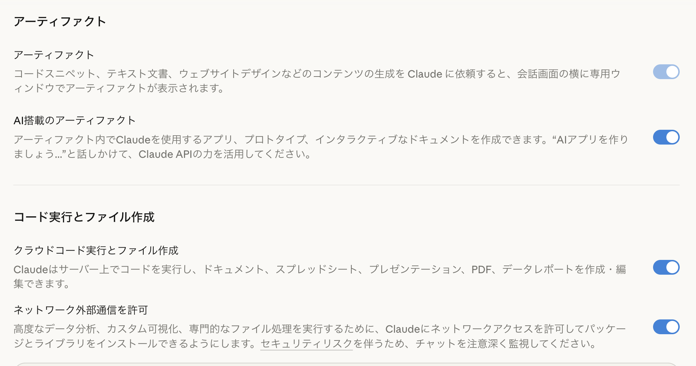
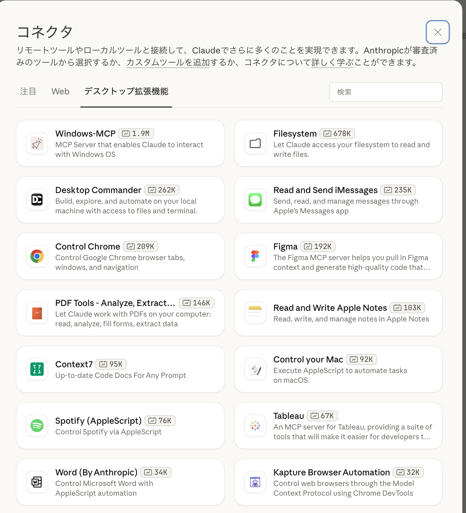
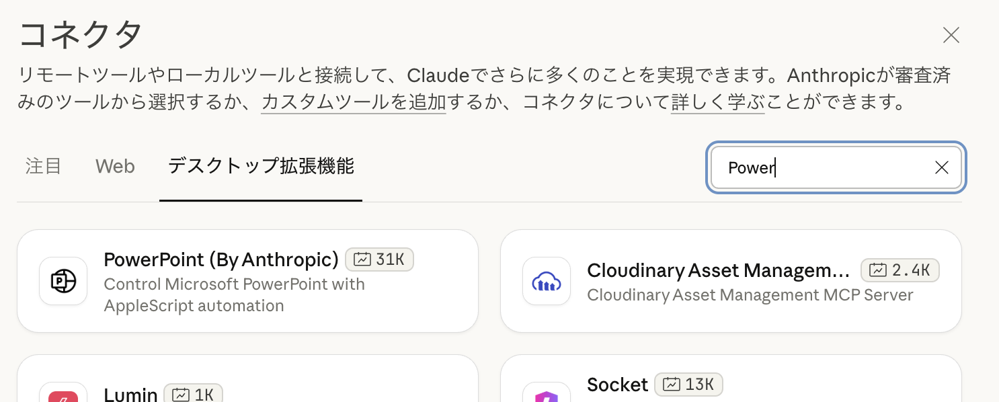
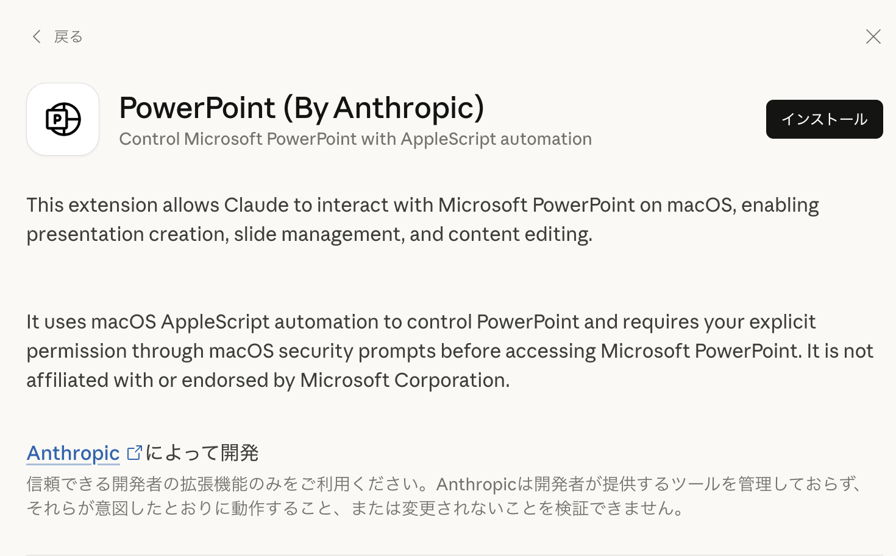

# 🤖 Claude Cowork — AIに仕事を「任せる」実践講座

> 60分後には、AIにフォルダ整理やスライド作成を任せられるようになります。

---

## まずは見てください

こんなダウンロードフォルダ、心当たりありませんか？

> 【画像010を取る】散らかったダウンロードフォルダの状態（Before）

```
Downloads/
├── IMG_3842.jpg
├── 見積書_最終_v3.pdf
├── スクリーンショット 2026-02-01.png
├── 議事録.docx
├── IMG_3901.jpg
├── presentation_draft.pptx
├── 領収書_1月.pdf
├── ... （あと200個）
```

この状態から、AIに一言こう伝えます。

> 「このフォルダの中身を種類ごとに分類して、フォルダ分けして」

30秒後にはこうなります。

```
Downloads/
├── 📁 画像/
│   ├── 写真/
│   │   ├── IMG_3842.jpg
│   │   └── IMG_3901.jpg
│   └── スクリーンショット/
│       └── スクリーンショット 2026-02-01.png
├── 📁 書類/
│   ├── 見積書_最終_v3.pdf
│   ├── 議事録.docx
│   └── 領収書_1月.pdf
└── 📁 プレゼン/
    └── presentation_draft.pptx
```

> 【画像011を取る】整理後のフォルダ構造（After）

**コピペもドラッグもしていません。** AIが中身を読んで、自分で判断して、ファイルを動かしました。

これが今日やることです。

---

## これは何か？

これまでのAI（ChatGPTやClaude）は、**相談相手**でした。
「これどう思う？」と聞くと、テキストで答えが返ってくる。

Claude Coworkは違います。**派遣スタッフ**です。
「この仕事やっておいて」と頼むと、あなたのPC上で実際に作業してくれます。




|            | これまでのAI   | Claude Cowork            |
| ------------ | ---------------- | -------------------------- |
| 例えるなら | 相談相手       | 派遣スタッフ             |
| できること | 質問に答える   | PCを操作して作業する     |
| ファイル   | コピペで渡す   | フォルダごと渡す         |
| 成果物     | テキストの回答 | ファイルとして保存される |

---

## 使い方（3ステップ）

### Step 1：作業場を渡す

Claude Desktopアプリの「Cowork」タブを開いて、「Work in a folder」をクリックします。
作業させたいフォルダを選んでください。

> 「AIに仕事部屋を与える」感覚です。その部屋に入れた資料だけを見て、その中で成果物を作ります。

⚠️ 「ファイルの読み取り・編集・削除を許可しますか？」と聞かれます。「Allow」を押してください。


*フォルダ（Desktopなど）を選んだ状態で「始めましょう」を押す前に*


*「許可」を押すとCoworkがフォルダ内のファイルを操作できるようになる*

### Step 2：ゴールを伝える

AIに「何をしてほしいか」を伝えます。コツは **「相談」ではなく「作業依頼」** にすること。

- ❌ 「このファイルどう思う？」（相談）
- ✅ 「このフォルダの中身を整理して」（作業依頼）
- ✅ 「このメモからスライドを作って」（成果物を指定）

伝えるポイントは3つだけです。

1. **何をしてほしいか**（整理、作成、分析…）
2. **成果物の形式**（スライド、CSV、フォルダ分け…）
3. **参考情報**があれば添える（URL、ブランドカラー等）

### Step 3：AIの動きを見て確認する

画面の右側に、AIが今やっていることが表示されます。

- **Progress** — To-Doリスト（AIが自分で作った作業計画）
- **Artifacts** — 作成された成果物
- **Context** — 参照しているファイル

マネージャーとして、AIの動きを見守ってください。完了したらファイルを開いて確認し、修正があれば追加で指示を出します。


*進行状況・成果物（Slide作成）・コンテキストが右側に表示される*



---

## こんなことができる

### ① フォルダ・ファイル整理

> 「ダウンロードフォルダの画像を種類ごとに分類してフォルダ分けして」

散らかった数百個のファイルを自動で分類します。ファイル名の一括変更もできます。

### ② プレゼン資料の作成

> 「散らばったメモとブランドガイドラインを読み込んで、スポンサー向けのプレゼンを作って」

メモからPowerPoint形式のスライドを生成します。ブランドカラーやロゴも自動で適用できます。

**PowerPoint作成の手順（実践済み）**は、下記「PowerPointをCoworkで作る手順」を参照してください。

### ③ SNSコンテンツの量産

> 「直近20本のYouTube動画から、LinkedIn・TikTok用の投稿文を作って。CSV形式で出力して」

1つの素材から複数プラットフォーム用に展開できます。管理ツールにインポートできる形式で出力も可能です。

### ④ リサーチ・競合調査

> 「競合他社のWebサイトを巡回して、価格と特徴をスプレッドシートにまとめて」

ブラウザを自動操作して情報を集め、表にまとめます。アイデアから製品仕様書まで一気に作ることもできます。

### ⑤ データ分析

> 「クレジットカード明細からサブスクリプション一覧を作って。解約方法と節約額も出して」

PDFやExcelを読み込んで、分析結果をファイルとして出力します。

---

## PowerPointをCoworkで作る手順（実践済み）

パワポ作成はCoworkの代表的な活用例です。以下は実際にやった手順です。

### 事前準備：設定と拡張機能

#### 1. アーティファクト・コード実行を有効にする

Claude Desktopの**設定**（⌘,）を開き、以下の項目をオンにします。





- **アーティファクト** — 成果物を専用ウィンドウに表示
- **クラウドコード実行とファイル作成** — PowerPointを含むドキュメント作成に**必須**
- （必要に応じて）**ネットワーク外部通信を許可**

> 【画像003を取る】クラウドコード実行がオフの場合のエラー画面（対比用）

#### 2. PowerPoint拡張機能（コネクタ）を追加する

1. **設定** → **拡張機能** を開く


2. **「拡張機能を参照」**または**「詳細設定」**からコネクタ画面へ
3. **「デスクトップ拡張機能」**タブを選択



4. 検索で **「Power」** と入力して **PowerPoint (By Anthropic)** を探す



5. **PowerPoint** をクリック → **インストール** を押す



6. macOSのセキュリティプロンプトが出たら **許可** する（AppleScript経由でPowerPointを操作するため）

> 【画像004を取る】PowerPointを実際に作成している指示入力〜実行中の画面
> 【画像005を取る】Coworkが作成したPowerPointを開いた状態のスクショ

### 手順まとめ


| ステップ | やること                                                                |
| ---------- | ------------------------------------------------------------------------- |
| 1        | 作成したい内容のメモや資料を1つのフォルダに入れる                       |
| 2        | Coworkでそのフォルダを「Work in a folder」で指定                        |
| 3        | 「このメモから〇〇向けのプレゼンを作って。スライドは5枚で」のように指示 |
| 4        | Progress・Artifactsで進捗を確認し、完成したら.pptxを開いて確認          |

---

## やってみよう

以下の3つから、自分に合ったレベルを選んでください。


| レベル      | テーマ           | やること                                                                                   |
| ------------- | ------------------ | -------------------------------------------------------------------------------------------- |
| ⭐ 初級     | フォルダ整理     | ダウンロードフォルダ（の複製）をCoworkに渡して整理させる                                   |
| ⭐⭐ 中級   | スライド作成     | 自分のメモや資料からプレゼンスライドを作らせる（上記「PowerPointをCoworkで作る手順」参照） |
| ⭐⭐⭐ 上級 | リサーチ → 資料 | テーマを決めて、Web調査 → レポート作成まで一気にやらせる                                  |

**手順はこの通りです。**

1. デスクトップに新しいフォルダを作る
2. 素材を入れる（整理したいファイル、またはメモ）
3. Coworkでそのフォルダを指定する
4. 指示を出して、AIの動きを観察する
5. 成果物を確認する → グループで共有

---

## 気をつけること

### 1. 必ずバックアップを取る

Coworkはファイルを **本当に削除** できます。作業前にフォルダを複製しておいてください。「消してもいいフォルダ」で試すのが鉄則です。

### 2. 機密情報を入れない

パスワード、APIキー、個人情報が入ったフォルダは渡さないでください。

### 3. 小さく始める

エージェントはトークン（利用料）を大量に消費します。最初は小さなタスクから試して、感覚をつかんでください。有料プラン（Pro/Team）が必要です。

---

## 今日のまとめ & 明日からやること

### 今日やったこと

1. Claude Coworkは、AIに **PCの作業を任せる** 機能
2. 使い方は3ステップ：**フォルダ渡す → 指示出す → 確認する**
3. 整理・資料作成・リサーチ・分析、何でも任せられる

### 次のアクション

- [ ] Claude Desktop（有料プラン）でCoworkタブを開いてみる
- [ ] まずはダウンロードフォルダの整理から試す（バックアップ忘れずに）
- [ ] 自分の仕事で「これAIに任せられないかな？」を1つ見つける

*ソース: AI部 Cowork授業メモ*
