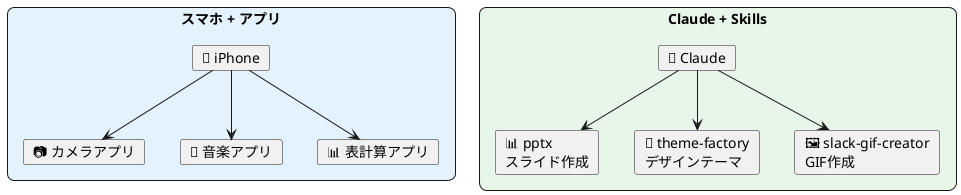

# Claude Skills Marketplace — AIに「専門スキル」を装備する

> 60分後には、Claudeにプレゼン作成・デザイン・GIF生成などの専門スキルを自在に追加して使えるようになります。

---

## まずは見てください

前回のCowork授業で、AIに「フォルダ整理して」「スライド作って」と頼めるようになりました。

でもこんな経験はありませんか？

> 「プレゼン作って」と頼んだら、**地味なスライド**が出てきた…

今日紹介するのは、Claudeに **専門スキルを追加する方法** です。

例えば「theme-factory」というスキルをオンにして、こう頼むだけで——

> 「Ocean Depthsテーマでプレゼン作って」

すると、プロのデザイナーが作ったような **カラーパレット付きのプレゼン** が出てきます。


*theme-factoryスキルを使うと、10種類のプリセットテーマから選べる。右側にはカラーパレットとフォントのプレビューが表示される*

**特別なソフトも、デザインの知識も不要です。** スキルをオンにして、テーマ名を伝えるだけ。

これが今日のゴールです。

---

## これは何か？

スマートフォンにアプリを入れると、新しいことができるようになりますよね。

Claude Skillsは、それと同じです。 **AIにアプリを入れる** 感覚で、専門能力を追加できます。



| | スマホのアプリ | Claude Skills |
| --- | --- | --- |
| 本体 | iPhone / Android | Claude |
| 追加機能 | App Storeからインストール | 設定画面でオンにする |
| 動き方 | タップして起動 | Claudeが自動で判断して起動 |
| 種類 | 数百万のアプリ | 18万以上のスキル |

ポイントは **「Claudeが自動で判断して起動」** するところです。「このスキルを使って」と明示的に言わなくても、あなたのリクエスト内容を見て、適切なスキルを自動で呼び出してくれます。

---

## 使い方（3ステップ）

### Step 1：設定画面でスキルをオンにする

Claude.aiまたはClaude Desktopアプリの **設定** を開いて、**「機能」** セクションに進みます。

「スキル」の一覧が表示されるので、使いたいスキルの **トグルをオン** にしてください。


*設定 > 機能 > スキル に表示される一覧。「サンプルスキル」タブを選ぶと、Anthropic公式のスキルが並ぶ*

「あなたのスキル」タブには自分でアップロードしたスキル、「サンプルスキル」タブにはAnthropicが用意したスキルが表示されます。

### Step 2：スキルをオンにして「チャットで試す」

使いたいスキルのトグルをオンにすると、**「チャットで試す」** ボタンが表示されます。
これをクリックすると、そのスキルが有効な状態でチャット画面に移動します。


*トグルをオン（青）にすると「チャットで試す」ボタンが出現。クリックするとすぐに試せる*

### Step 3：いつも通り指示を出す

あとはいつも通り、やりたいことを伝えるだけです。スキルがオンになっていれば、Claudeが自動的にそのスキルの知識を使って対応してくれます。

```
例：theme-factoryスキルをオンにした場合

あなた：「どんなテーマがあるの」

Claude：theme-factoryには10種類のプリセットテーマが用意されています：
  1. Ocean Depths — 落ち着いたマリンブルー系
  2. Sunset Boulevard — 暖かく鮮やかなサンセットカラー
  3. Forest Canopy — 自然なアーストーン
  ...
  何かに適用してみたいものはありますか？
```

---

## どんなスキルがある？（サンプルスキル一覧）

Anthropicが公式に用意している **サンプルスキル** は以下の通りです。設定画面ですぐにオンにできます。

### ドキュメント系

| スキル名 | できること |
| --- | --- |
| **pptx** | PowerPointスライドの作成・編集・分析 |
| **docx** | Wordドキュメントの作成・変更履歴・コメント追加 |
| **xlsx** | Excelスプレッドシートの作成・数式・データ分析 |
| **pdf** | PDFの作成・結合・分割・フォーム処理 |

### デザイン系

| スキル名 | できること |
| --- | --- |
| **theme-factory** | 10種類のプリセットテーマでスライドやHTMLをスタイリング |
| **brand-guidelines** | ブランドカラー・フォントを成果物に自動適用 |
| **canvas-design** | ポスターやアート作品をPNG/PDFで作成 |
| **frontend-design** | プロ品質のWebページ・UIデザイン生成 |

### エンジニア・クリエイティブ系

| スキル名 | できること |
| --- | --- |
| **algorithmic-art** | p5.jsでジェネレイティブアート作成 |
| **slack-gif-creator** | Slack用のアニメーションGIF作成 |
| **mcp-builder** | 外部サービスと連携するMCPサーバーを構築 |
| **web-artifacts-builder** | React + Tailwind CSSで複雑なWeb UIを構築 |

---

## 外の世界：Skills Marketplace（18万以上のスキル）

サンプルスキルだけでは物足りない？ 実は **18万以上のスキル** が公開されています。

Skills Marketplace（ https://skillsmp.com/ ）にアクセスすると、世界中の開発者が作ったスキルを検索・ダウンロードできます。

### カテゴリ例

| カテゴリ | スキル数 | 例 |
| --- | --- | --- |
| Tools | 62,000+ | ファイル操作、PDF編集、画像生成 |
| Development | 50,000+ | コードレビュー、テスト自動化 |
| Data & AI | 36,000+ | データ分析、可視化 |
| Business | 33,000+ | 提案書作成、マーケティング |
| Content & Media | 16,000+ | ブログ記事、SNS投稿生成 |
| Documentation | 15,000+ | 技術文書、API仕様書 |

### カスタムスキルのインストール方法

1. Skills Marketplace（skillsmp.com）で欲しいスキルを探す
2. GitHubからスキルフォルダをダウンロード（ZIP形式）
3. Claude.aiの **設定 > 機能 > スキル** で「スキルをアップロード」をクリック
4. ダウンロードしたZIPファイルを選択
5. スキル一覧に追加されるので、トグルをオンにする

---

## やってみよう

以下の3つから、自分に合ったレベルを選んでください。

| レベル | テーマ | やること |
| --- | --- | --- |
| ⭐ 初級 | サンプルスキルを試す | 設定画面でtheme-factoryをオンにして「テーマ一覧見せて」と聞く |
| ⭐⭐ 中級 | スキルでスライド作成 | pptxスキル + theme-factoryスキルをオンにして、好きなテーマでスライドを作る |
| ⭐⭐⭐ 上級 | Marketplaceから追加 | skillsmp.comで気になるスキルを見つけてインストール、実際に使ってみる |

### ⭐ 初級：theme-factoryを試す

1. Claude.aiの **設定 > 機能** を開く
2. 「サンプルスキル」タブから **theme-factory** を探す
3. トグルをオンにする → 「チャットで試す」をクリック
4. 以下のように入力する：

```
どんなテーマがあるの？それぞれの特徴を教えて
```

5. テーマ一覧が返ってきたら、好きなものを選んで：

```
「Ocean Depths」テーマで、自己紹介スライドを1枚作って
```

### ⭐⭐ 中級：テーマ付きプレゼンを作る

1. **pptx** と **theme-factory** の両方をオンにする
2. Coworkでフォルダを指定するか、チャットで以下のように指示する：

```
以下の内容で3枚のスライドを作ってください。
テーマは「Midnight Galaxy」で。

スライド1：タイトル「AI活用レポート」
スライド2：今月やったこと（箇条書き3つ）
スライド3：来月の計画
```

3. 生成されたPowerPointファイルをダウンロードして確認

### ⭐⭐⭐ 上級：Marketplaceからスキルを追加

1. https://skillsmp.com/ にアクセス
2. 検索バーで気になるキーワードを入力（例：「brand」「report」「chart」）
3. スキルの詳細ページでGitHubリンクからダウンロード
4. ZIPに圧縮して、Claude.aiの設定からアップロード
5. オンにして使ってみる

---

## 気をつけること

### 1. まずはサンプルスキルから始める

いきなりMarketplaceのスキルを入れるより、Anthropic公式のサンプルスキルで感覚をつかんでください。品質が保証されていて安全です。

### 2. 外部スキルは中身を確認する

Marketplaceのスキルはオープンソースです。インストール前に、**何をするスキルなのか**を説明文で確認してください。信頼できる作者（Anthropic、Facebook/Meta、大手企業）のものから試すのがおすすめです。

### 3. コード実行がオンになっているか確認

スキルを使うには **「コード実行とファイル作成」** が有効になっている必要があります。設定画面で確認してください。オフになっているとスキルが動きません。

---

## 今日のまとめ & 明日からやること

### 今日やったこと

1. Claude Skillsは **AIにアプリを入れる** ように専門能力を追加できる仕組み
2. 使い方は3ステップ：**スキルをオン → チャットで試す → いつも通り指示**
3. サンプルスキルだけでも強力。Marketplaceには18万以上のスキルがある

### 次のアクション

- [ ] 設定画面でサンプルスキルの一覧を確認する
- [ ] theme-factoryをオンにして、テーマ付きの成果物を1つ作ってみる
- [ ] 「自分の仕事で使えそうなスキル」をMarketplaceで1つ探す

---

*ソース: AI部 Claude Skills Marketplace授業*
