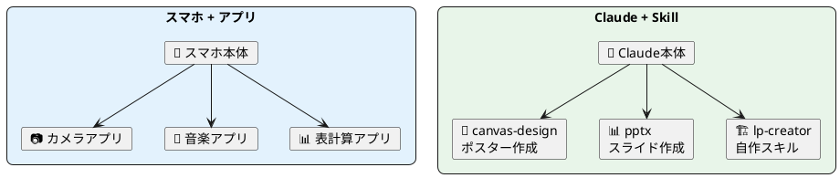
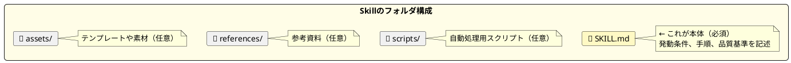
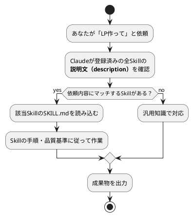
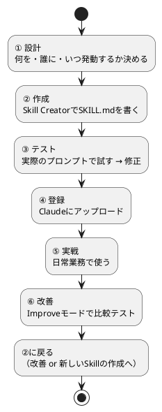
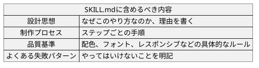
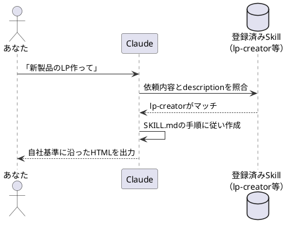
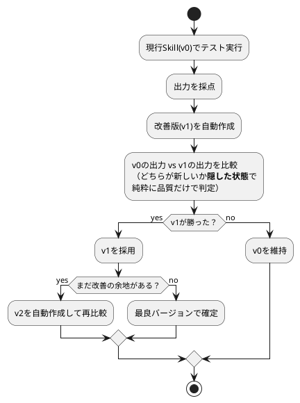
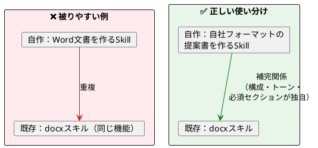
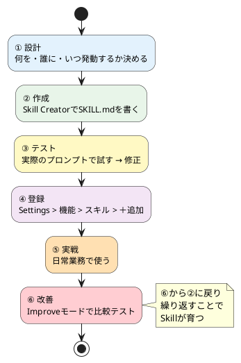

# Claude Skill — 自分だけの「指示書」をAIに焼き込む

> 60分後には、業務に合ったオリジナルSkillを設計し、Claudeに登録して使い始められるようになります。

---

## まずは体感してください

前回の授業で、Claude Desktopアプリにはサンプルスキル（pptx、canvas-designなど）が入っていることを紹介しました。トグルをオンにするだけで使えて便利でしたよね。

でもこんな場面はありませんか？

> 「毎回、自社のフォーマットに直してる…」
> 「うちのトーンに合わない出力が出てくる…」
> 「前回と同じ指示を、また最初から書いてる…」

今日紹介するのは、**自分の業務に合ったSkillを作る方法**です。

サンプルスキルが「既製品のアプリ」なら、今日作るのは**「自分専用にカスタムしたアプリ」**です。

---

## 1. Skillとは何か

### AIに「指示書」を覚えさせる仕組み

Skillとは、Claudeに特定のタスクの進め方を教える**指示書**です。



|          | スマホのアプリ            | Claude Skills              |
| -------- | ------------------------- | -------------------------- |
| 本体     | iPhone / Android          | Claude                     |
| 既製品   | App Storeのアプリ         | サンプルスキル（Anthropic公式） |
| 自作     | ショートカット等で自動化  | **自分でSKILL.mdを書く**   |
| 動き方   | タップして起動            | Claudeが自動で判断して起動 |

Skillがあると、毎回「フォントはNoto Sansで、余白は多めで、CTAは1つにして…」と細かく指示しなくても、**品質のばらつきを大幅に減らせます**。

### Skillの正体

Skillの実体は、`SKILL.md`というテキストファイル1枚です。ここに「いつ発動するか」「どんな手順で作るか」「品質基準は何か」が書かれています。プログラミングの知識は不要で、日本語の文章で書けます。



### Skillはどうやって発動するのか



「このSkillを使って」と指定する必要はなく、**ふつうに依頼するだけ**でClaudeが適切なSkillを選んでくれます。

逆に言えば、説明文がしっかり書かれていないと、使ってほしい場面で発動しないことがあります。

---

## 2. なぜ自分のSkillを作るのか

Claudeには最初からサンプルスキル（docx、pdf、pptx、canvas-designなど）が入っています。でもこれらは**汎用的**です。

自分のSkillを作るメリット：

- **業務に特化した指示を焼き込める** — 自社のトーン、フォーマット、品質基準を毎回伝えなくて済む
- **属人化を防げる** — 「あの人が作ると良いけど、他の人だと微妙」がなくなる
- **改善を蓄積できる** — 「前回こう直した」が次回からデフォルトになる

| 比較 | サンプルスキル | 自作スキル |
|------|---------------|-----------|
| 例 | pptx（スライド作成） | 自社提案書スキル |
| 品質基準 | 一般的なベストプラクティス | **自社のトーン・フォーマット・必須セクション** |
| 改善 | Anthropicが更新 | **自分で育てる** |
| 使い分け | 汎用タスク | 繰り返し発生する業務固有タスク |

---

## 3. Skill作成から改善までの全体フロー

今日お伝えするのは、以下の**6ステップの改善ループ**です。



⑥の改善から②の作成に戻り、繰り返すことでSkillが育っていきます。以下、各ステップを順に見ていきます。

---

## ステップ① 設計（5〜10分）

Skillを書き始める前に、4つの問いに答えます。

| 問い | 例（LP制作スキルの場合） |
|------|--------------------------|
| **何をするSkillか？** | ランディングページをHTML1枚で生成する |
| **いつ発動するか？** | 「LP作って」「登録ページほしい」と言われたとき |
| **入力は何か？** | プロダクト名、ターゲット、トーンなどの情報 |
| **出力は何か？** | レスポンシブ対応のHTMLファイル1枚 |

**「いつ発動するか」を日本語で具体的に書く**のがポイント。「ランディングページ」だけでなく「LP」「登録ページ」「プロダクトのページ作って」など、ユーザーが実際に使いそうな言い回しを幅広く含めておくと発動精度が上がります。

---

## ステップ② 作成（15〜20分）

### 2-1. 設定画面を開く

まず Claude Desktop アプリで **Skill Creator** を有効にします。

**1. 設定を開く**

画面左下の自分のアイコンをクリック → メニューから「設定」を選択。


*設定画面の左メニュー。「機能」を選ぶ*

**2. 「スキル」セクションを見つける**

設定 > 機能 を開くと、下にスクロールしたところに「スキル」セクションが表示されます。


*「あなたのスキル」と「サンプルスキル」の2つのタブがある。右上の「＋追加」から自作スキルもアップロードできる*

**3. Skill Creator をオンにする**

「サンプルスキル」タブから **skill-creator** を探してトグルをオン（青）にします。


*skill-creatorのトグルをオンにすると「チャットで試す」ボタンが出現。これをクリックするとすぐにSkill作成を始められる*

### 2-2. Claudeに依頼する

Skill Creatorはスキルを作るための**専用スキル**です。「チャットで試す」をクリックしたら、こう伝えるだけ：

> 「LP制作用のSkillを作りたい。ランディングページをHTML1ファイルで生成するもの。日本語で作って」

すると、Claudeが対話形式で以下を進めてくれます：

1. 追加の質問（ターゲット、トーン、こだわりなど）
2. フォルダ構造の自動生成
3. SKILL.mdの下書き作成

### 2-3. SKILL.mdに書く内容

SKILL.mdは大きく2つのパートで構成されます。

**ヘッダー（名前と説明文）**:
```yaml
---
name: lp-creator
description: |
  コンバージョン最適化されたランディングページを
  単体HTMLとして生成する。「LP作って」「登録ページほしい」
  などで発動すること。
---
```

`name` はSkillの識別名。`description` がClaudeに「いつこのSkillを使うか」を教える説明文です。ここが発動のトリガーになるため、丁寧に書く価値があります。

**本文（指示内容）**: Claudeへの手順書を文章で記述します。



### 書き方のコツ：「ルール」より「理由」

「CTAは1つにすること」とだけ書くのと、「CTAが複数あると訪問者が迷い、どれもクリックされなくなる。だからCTAは1つに絞る」と書くのでは、Claudeの判断力が変わります。

理由が書いてあると、Claudeは例外的なケース（たとえば「買う」と「デモを見る」の2つが必要な場合）でも、意図を理解した上で柔軟に判断できます。ルールだけだと機械的に従うか、無視するかの二択になりがちです。

---

## ステップ③ テスト実行（10分）

作ったSkillが実際に使えるか、1つ試してみます。

> 「AIノートアプリのウェイトリストLPを作って」

Claudeがスキルの指示に従って生成を始めます。出力されたHTMLをブラウザで開き、以下を確認：

- 見た目は意図したトーンか？
- モバイルで崩れていないか？
- CTAが明確にあるか？
- 日本語のコピーが自然か？

**問題があったらSKILL.mdを修正**します。たとえば「文字が小さすぎた」なら、SKILL.mdに「日本語本文は18-20px」と追記する。この繰り返しでSkillの精度が上がっていきます。

---

## ステップ④ 登録（2分）

完成したSkillをClaudeに登録し、次回以降のセッションでも使えるようにします。

### 手順

1. Claudeに「Skillをパッケージ化して」と伝える → アップロード用のZIPファイルが生成される


*生成されたlp-creatorスキル。「フォルダで表示」で中身を確認、「Claudeで開く」ですぐに使える*

2. 設定 > 機能 > スキル > **「＋追加」** をクリックしてZIPファイルをアップロード
3. 「あなたのスキル」タブに登録されたことを確認

登録後は、新しい会話を始めても自動的にSkillが読み込まれます。

### 登録したSkillの中身を確認する

Claudeの画面からSkillの中身を直接確認できます。


*SKILL.mdビューア。左にフォルダ構成（SKILL.md、assets、references、scripts）、右に説明文と設計思想が表示される。「自分のスキルにコピー」でカスタマイズの起点にもできる*

---

## ステップ⑤ 実戦で使う

登録が完了すれば、特別な操作は不要です。普通にClaudeに依頼するだけで、あなたの依頼内容に合ったSkillが自動的に発動します。



もしSkillが発動しなかった場合：
- Skillの説明文（description）に書かれている言い回しと、依頼文が合っていない可能性 → 説明文にバリエーションを追加
- 明示的に「lp-creatorスキルを使って」と指定することもできる

---

## ステップ⑥ 改善する

実際に使っていると「ここ毎回直すんだよな」というパターンが出てきます。そこでSkill Creatorの**改善機能（Improveモード）**を使います。

> 「lp-creatorスキルを改善したい。ヒーローの見出しがいつも長すぎる」

### 改善の流れ



ポイントは「**どちらが新しいか隠して比較する**」こと。人間もAIも「新しい方が良いはず」と思いがちですが、実際には改善のつもりが改悪になることもあります。どちらがどのバージョンか分からない状態で比較することで、この思い込みを排除できます。

---

## 4. 複数Skillを作るときのコツ

### 作る順番の考え方

**「頻度 × 手間」が大きいものから**作ります。

| タスク | 頻度 | 毎回の手間 | 優先度 |
|--------|------|------------|--------|
| 提案書のMD作成 | 週2回 | 30分 | ★★★ 高 |
| イベントアイキャッチ画像 | 月2回 | 20分 | ★★ 中 |
| 議事録の構造化 | 週3回 | 15分 | ★★★ 高 |
| SNS投稿画像 | 毎日 | 10分 | ★★★ 高 |

全部一気に作るのではなく、**2〜3個作って実戦投入し、フィードバックを回してから次に進む**のが結果的に速いです。

### 既存スキルと被らないようにする

Claudeにはサンプルスキルがすでに入っています。自分のSkillを作るときは「汎用スキルではカバーできない、自分の業務固有のルール」を入れることに集中します。



---

## 5. 【実践】Skill Creatorで自分のSkillを作ってみよう

### ⭐ 初級：サンプルスキルの中身を覗く

**目的**：Skillが「何を書いているか」を理解する

1. 設定 > 機能 > スキル > **サンプルスキル** タブを開く
2. 気になるスキル（例：`canvas-design`）をクリック
3. **SKILL.mdの中身を読んで**、「どんな指示が書かれているか」を確認する

→ 「設計思想」「制作プロセス」「品質基準」がどう書かれているか観察してください。

### ⭐⭐ 中級：Skill Creatorで1つ作ってみる

**目的**：実際にSkillを作って登録する一連の流れを体験する

1. 設定で **skill-creator** をオンにする
2. 「チャットで試す」をクリック
3. 以下のどれか1つを選んでClaudeに伝える：

```
【選択肢1】LP制作スキル
「LP制作用のSkillを作りたい。ランディングページを
HTML1ファイルで生成するもの。日本語で作って」

【選択肢2】議事録整形スキル
「議事録を整形するSkillを作りたい。雑なメモから
日時・参加者・議題・決定事項・TODOの構造に整形するもの。
日本語で作って」

【選択肢3】SNS投稿文スキル
「SNS投稿文を作るSkillを作りたい。商品情報から
X（Twitter）向けの140字以内の投稿文を3パターン
生成するもの。日本語で作って」
```

4. Claudeの質問に答えながらSKILL.mdを完成させる
5. 完成したら「Skillをパッケージ化して」→ ダウンロード → 設定からアップロード

### ⭐⭐⭐ 上級：作ったSkillを改善する

**目的**：改善ループを1回転させる

1. 中級で作ったSkillを実際に使ってみる（普通に依頼する）
2. 出力の気になる点をメモする（例：「見出しが長い」「色がダサい」）
3. Skill Creatorに改善を依頼する：

```
「lp-creatorスキルを改善したい。
ヒーローセクションの見出しが毎回長すぎるので、
8語以内に収まるようにしてほしい」
```

→ Improveモードでv0 vs v1の比較が走り、良い方が採用されます。

---

## 気をつけること

### 1. 「コード実行とファイル作成」をオンに

スキルを使うには設定画面で **「コード実行とファイル作成」** が有効になっている必要があります。オフだとスキルが動きません。

### 2. descriptionが発動の命

Skillが発動しない原因の大半は、descriptionに書かれた言い回しとユーザーの依頼文がマッチしていないことです。ユーザーが使いそうな言い回しを**なるべく多く**含めましょう。

### 3. Skillは「知識」であって「魔法」ではない

Skillはあくまで「こうやれ」という知識を与えるものです。指示が曖昧だと結果も曖昧になります。**Skillの力を最大限引き出すには、自分が何を求めているかを明確にすること**が大事です。

---

## まとめ：Skill改善の永続ループ



### 今日やったこと

1. Skillは `SKILL.md` — プロの判断基準・ベストプラクティスが書かれたテキストファイル
2. サンプルスキルは汎用、**自作スキルで業務固有のルールを焼き込む**
3. 作成はSkill Creatorに頼めば対話形式で進む
4. 改善は Improve モードで v0 vs v1 をブラインド比較

### 次のアクション

- [ ] サンプルスキルの中身（SKILL.md）を1つ読んでみる
- [ ] Skill Creatorで自分の業務用Skillを1つ作って登録する
- [ ] 1週間使ってみて、気になる点をImproveモードで改善する
- [ ] 「頻度 × 手間」が大きい業務を洗い出し、次に作るSkillを決める

---

*ソース: AI部 Claude Skills授業*
