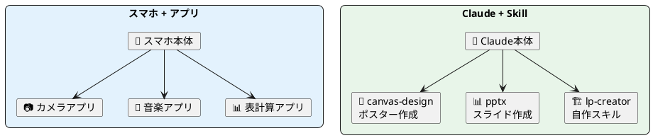
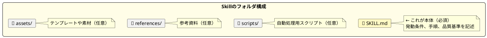
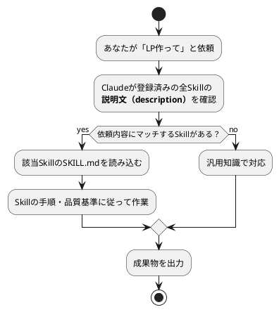
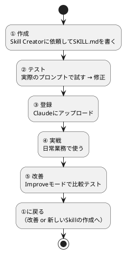
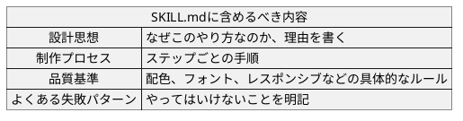
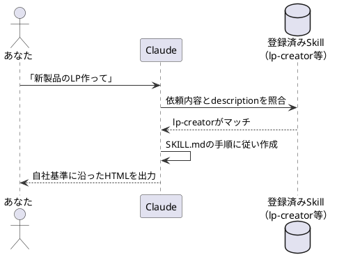
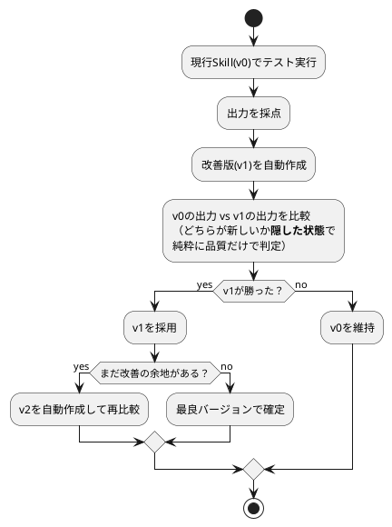
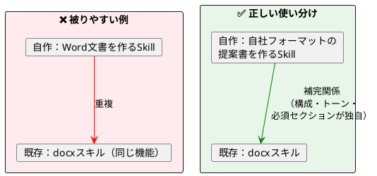
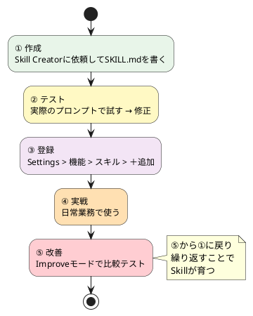

# Claude Skill — 自分だけの「指示書」をAIに焼き込む

> 60分後には、業務に合ったオリジナルSkillを設計し、Claudeに登録して使い始められるようになります。

前回の授業で、Claude Desktopアプリにはサンプルスキル（pptx、canvas-designなど）が入っていることを紹介しました。トグルをオンにするだけで使えて便利でしたよね。

でもこんな場面はありませんか？

> **「スライド作るたびに、参考資料アップするの面倒…」**
> 毎回同じフォーマットや参考資料を渡している。Skillに焼き込めば、次からは不要になる。

> **「このプロンプト、前にも書いたよな…」**
> 似たような依頼を何度も書いている。Skillにしておけば、「〇〇して」の一言で同じ品質が出る。

> **「SNSで見た"AIの精度が上がるコツ"、覚えておけない…」**
> いいノウハウを見つけても、次使うときには忘れてる。Skillに追記していけば、知見がどんどん蓄積される。

今日紹介するのは、**自分の業務に合ったSkillを作る方法**です。

サンプルスキルが「既製品のアプリ」なら、今日作るのは**「自分専用にカスタムしたアプリ」**です。

---

## 1. そもそもSkillとは何か

### AIに「指示書」を覚えさせる仕組み

Skillとは、Claudeに特定のタスクの進め方を教える**指示書**です。




|        | スマホのアプリ           | Claude Skills                   |
| -------- | -------------------------- | --------------------------------- |
| 本体   | iPhone / Android         | Claude                          |
| 既製品 | App Storeのアプリ        | サンプルスキル（Anthropic公式） |
| 自作   | ショートカット等で自動化 | **自分でSKILL.mdを書く**        |
| 動き方 | タップして起動           | Claudeが自動で判断して起動      |

Skillがあると、毎回「フォントはNoto Sansで、余白は多めで、CTAは1つにして…」と細かく指示しなくても、**品質のばらつきを大幅に減らせます**。

### Skillの正体

Skillの実体は、`SKILL.md`というテキストファイル1枚です。ここに「いつ発動するか」「どんな手順で作るか」「品質基準は何か」が書かれています。プログラミングの知識は不要で、日本語の文章で書けます。



実際にFinderで見ると、こんな構造になっています：


*lp-creatorスキルのフォルダ。SKILL.md（本体）+ assets / references / scripts の4構成*

### Skillはどうやって発動するのか



「このSkillを使って」と指定する必要はなく、**ふつうに依頼するだけ**でClaudeが適切なSkillを選んでくれます。

逆に言えば、説明文がしっかり書かれていないと、使ってほしい場面で発動しないことがあります。

> **▶ やってみよう（2分）**
> サンプルスキルの中身を1つ覗いてみましょう。
>
> 1. 設定 > 機能 > スキル > **サンプルスキル** タブを開く
> 2. 気になるスキル（例：`canvas-design`）をクリック
> 3. SKILL.mdの中身を眺めて、「設計思想」「制作プロセス」「品質基準」がどう書かれているか観察する

---

## 2. なぜ自分のSkillを作るのか

Claudeには最初からサンプルスキル（docx、pdf、pptx、canvas-designなど）が入っています。でもこれらは**汎用的**です。

自分のSkillを作るメリット：

- **毎回の手間がなくなる** — 参考資料のアップロード、フォーマット指定、トーン指示…全部Skillに焼き込める
- **同じプロンプトを二度書かない** — 一度Skillにしておけば、「〇〇して」の一言で同じ品質が出る
- **知見が蓄積される** — SNSで見たコツ、自分で発見した改善点をSkillに追記すれば、次から自動で反映される


| 比較     | サンプルスキル             | 自作スキル                                     |
| ---------- | ---------------------------- | ------------------------------------------------ |
| 例       | pptx（スライド作成）       | 自社提案書スキル                               |
| 品質基準 | 一般的なベストプラクティス | **自社のトーン・フォーマット・必須セクション** |
| 改善     | Anthropicが更新            | **自分で育てる**                               |
| 使い分け | 汎用タスク                 | 繰り返し発生する業務固有タスク                 |

---

## 3. Skill作成から改善までの全体フロー

今日お伝えするのは、以下の**5ステップの改善ループ**です。今日の授業では①〜③を実際にやり、④⑤は持ち帰り課題です。



⑥の改善から②の作成に戻り、繰り返すことでSkillが育っていきます。以下、各ステップを順に見ていきます。

---

## ステップ① 作成（25分）

### 2-1. 設定画面を開く

Claude Desktop アプリで **Skill Creator** を有効にします。

> **▶ 一緒にやりましょう** — 以下の手順を、自分のClaude Desktopアプリで同時に進めてください。

**1. 設定を開く**

画面左下の自分のアイコンをクリック → メニューから「設定」を選択。


*設定画面の左メニュー。「機能」を選ぶ*

**2. 「スキル」セクションを見つける**

設定 > 機能 を開くと、下にスクロールしたところに「スキル」セクションが表示されます。


*「あなたのスキル」と「サンプルスキル」の2つのタブがある。右上の「＋追加」から自作スキルもアップロードできる*

**3. Skill Creator をオンにする**

「サンプルスキル」タブから **skill-creator** を探してトグルをオン（青）にします。


*skill-creatorのトグルをオンにすると「チャットで試す」ボタンが出現。これをクリックするとすぐにSkill作成を始められる*

### 2-2. テーマを決めてClaudeに依頼する

**「チャットで試す」をクリック**して、新しいチャットを開いてください。

Skill Creatorはスキルを作るための**専用スキル**です。やりたいことを伝えるだけで、Claudeが「何を作るか」「いつ発動するか」「入力/出力は何か」を対話で整理しながらSKILL.mdを作ってくれます。

> **▶ やってみよう（20分）**
>
> まず、自分が作りたいSkillのテーマを1つ決めてください。
> 「普段やってるあの作業、毎回同じこと指示してるな…」と思うものがベストです。
>
> 迷ったら以下から選んでOK：
>
> | テーマ | どんな「あるある」を解決する？ |
> |--------|-------------------------------|
> | **LP制作** | 「LP作って」と頼むたびにトーンやCTAの指示を書き直してる |
> | **議事録整形** | 「議事録まとめて」のあと毎回フォーマットを直してる |
> | **SNS投稿文** | 「投稿文書いて」のたびに文字数や口調を指定してる |
>
> テーマが決まったら、「チャットで試す」をクリックして、以下のようにClaudeに伝えてください：
>
> **LP制作を選んだ人：**
>
> ```
> LP制作用のSkillを作りたい。ランディングページをHTML1ファイルで
> 生成するもの。日本語で作って
> ```
>
> **議事録整形を選んだ人：**
>
> ```
> 議事録を整形するSkillを作りたい。雑なメモから
> 日時・参加者・議題・決定事項・TODOの構造に整形するもの。
> 日本語で作って
> ```
>
> **SNS投稿文を選んだ人：**
>
> ```
> SNS投稿文を作るSkillを作りたい。商品情報から
> X（Twitter）向けの140字以内の投稿文を3パターン
> 生成するもの。日本語で作って
> ```
>
> Claudeが追加の質問をしてきます。**自分の業務に合わせて答えてください**。分からない質問は「おまかせで」と答えてOKです。
>
> Claudeがフォルダ構造とSKILL.mdを生成するまで待ちましょう。

### 2-3. SKILL.mdの読み方

Claudeが生成したSKILL.mdの中身を確認しましょう。大きく2つのパートで構成されています。

**ヘッダー（名前と説明文）**:

```yaml
---
name: lp-creator
description: |
  コンバージョン最適化されたランディングページを
  単体HTMLとして生成する。「LP作って」「登録ページほしい」
  などで発動すること。
---
```

`name` はSkillの識別名。`description` がClaudeに「いつこのSkillを使うか」を教える説明文です。ここが発動のトリガーになるため、丁寧に書く価値があります。

**本文（指示内容）**: Claudeへの手順書を文章で記述します。



### 書き方のコツ：「ルール」より「理由」

「CTAは1つにすること」とだけ書くのと、「CTAが複数あると訪問者が迷い、どれもクリックされなくなる。だからCTAは1つに絞る」と書くのでは、Claudeの判断力が変わります。

理由が書いてあると、Claudeは例外的なケース（たとえば「買う」と「デモを見る」の2つが必要な場合）でも、意図を理解した上で柔軟に判断できます。ルールだけだと機械的に従うか、無視するかの二択になりがちです。

> **▶ チェックポイント**
> ここまでで、Claudeが SKILL.md を生成してくれているはずです。
>
> - [ ] SKILL.mdが表示されている
> - [ ] description（説明文）に、自分が使いそうな言い回しが含まれている
> - [ ] 本文に「設計思想」と「制作プロセス」が書かれている
>
> まだの人はClaudeの質問に答え終わるまで進めてください。できた人は次のステップへ。

---

## ステップ② テスト実行（10分）

作ったSkillが実際に使えるか、**同じチャットの中でそのまま**試してみます。

> **▶ やってみよう（10分）**
> Claudeに以下のように伝えて、作ったSkillをテスト実行してください。
>
> **LP制作の人：**
>
> ```
> 作ったスキルを試したい。
> 「AIノートアプリのウェイトリストLPを作って」
> ```
>
> **議事録整形の人：**
>
> ```
> 作ったスキルを試したい。以下のメモを整形して。
>
> きのうの打ち合わせ 田中さんと鈴木さん
> 新機能のリリース日3月末に決定
> デザインは来週までに鈴木さんが出す
> 予算は50万以内 承認済み
> 次回は来週水曜
> ```
>
> **SNS投稿文の人：**
>
> ```
> 作ったスキルを試したい。以下の商品情報からSNS投稿文を作って。
>
> 商品名：スマートノート Pro
> 特徴：手書きメモを即座にデジタル化、AI要約機能付き
> 価格：4,980円
> ターゲット：ビジネスパーソン
> ```
>
> 出力を見て、以下を確認してください：
>
> - [ ] 意図したトーン・フォーマットになっているか？
> - [ ] 品質基準（SKILL.mdに書いた内容）が反映されているか？
> - [ ] 「ここ毎回直したくなるな」というポイントはあるか？
>
> **気になる点があったら、Claudeにそのまま伝えてSKILL.mdを修正してもらいましょう。**
> 例：「見出しが長すぎるので、8語以内にするルールを追加して」

---

## ステップ③ 登録（5分）

完成したSkillをClaudeに登録し、次回以降のセッションでも使えるようにします。

> **▶ やってみよう（5分）**
> テスト結果に満足したら、以下の手順で登録してください。

### 手順

**1. パッケージ化を依頼する**

Claudeに「Skillをパッケージ化して」と伝えてください。アップロード用のファイルが生成されます。


*生成されたlp-creatorスキル。「フォルダで表示」で中身を確認、「Claudeで開く」ですぐに使える*

**2. 設定からアップロードする**

設定 > 機能 > スキル > **「＋追加」** をクリックすると、以下のダイアログが表示されます。


*3つの方法でスキルを追加できる。今回は「スキルをアップロード」を選ぶ。.zip、.skill、.mdファイルに対応*

**「スキルをアップロード」** を選んで、先ほど生成されたファイルをアップロードします。

**3. 登録を確認する**

「あなたのスキル」タブに登録されたことを確認してください。

登録後は、新しい会話を始めても自動的にSkillが読み込まれます。

### 登録したSkillの中身を確認する

Claudeの画面からSkillの中身を直接確認できます。


*SKILL.mdビューア。左にフォルダ構成（SKILL.md、assets、references、scripts）、右に説明文と設計思想が表示される。「自分のスキルにコピー」でカスタマイズの起点にもできる*

> **▶ チェックポイント**
>
> - [ ] 「あなたのスキル」タブに自分のSkillが表示されている
> - [ ] クリックしてSKILL.mdの中身が確認できる
>
> ここまでできたら、**新しいチャットを開いて**、Skillを指定せずにいつも通り依頼してみてください。自動でSkillが発動するはずです。

---

## ステップ④ 実戦で使う（持ち帰り）

登録が完了すれば、特別な操作は不要です。普通にClaudeに依頼するだけで、あなたの依頼内容に合ったSkillが自動的に発動します。



もしSkillが発動しなかった場合：

- Skillの説明文（description）に書かれている言い回しと、依頼文が合っていない可能性 → 説明文にバリエーションを追加
- 明示的に「lp-creatorスキルを使って」と指定することもできる

---

## ステップ⑤ 改善する（持ち帰り）

実際に使っていると「ここ毎回直すんだよな」というパターンが出てきます。そこでSkill Creatorの**改善機能（Improveモード）**を使います。

> 「lp-creatorスキルを改善したい。ヒーローの見出しがいつも長すぎる」

### 改善の流れ



ポイントは「**どちらが新しいか隠して比較する**」こと。人間もAIも「新しい方が良いはず」と思いがちですが、実際には改善のつもりが改悪になることもあります。どちらがどのバージョンか分からない状態で比較することで、この思い込みを排除できます。

---

## 5. 複数Skillを作るときのコツ

### 作る順番の考え方

**「頻度 × 手間」が大きいものから**作ります。


| タスク                   | 頻度  | 毎回の手間 | 優先度    |
| -------------------------- | ------- | ------------ | ----------- |
| 提案書のMD作成           | 週2回 | 30分       | ★★★ 高 |
| イベントアイキャッチ画像 | 月2回 | 20分       | ★★ 中   |
| 議事録の構造化           | 週3回 | 15分       | ★★★ 高 |
| SNS投稿画像              | 毎日  | 10分       | ★★★ 高 |

全部一気に作るのではなく、**2〜3個作って実戦投入し、フィードバックを回してから次に進む**のが結果的に速いです。

### 既存スキルと被らないようにする

Claudeにはサンプルスキルがすでに入っています。自分のSkillを作るときは「汎用スキルではカバーできない、自分の業務固有のルール」を入れることに集中します。



---

## 気をつけること

### 1. 「コード実行とファイル作成」をオンに

スキルを使うには設定画面で **「コード実行とファイル作成」** が有効になっている必要があります。オフだとスキルが動きません。

### 2. descriptionが発動の命

Skillが発動しない原因の大半は、descriptionに書かれた言い回しとユーザーの依頼文がマッチしていないことです。ユーザーが使いそうな言い回しを**なるべく多く**含めましょう。

### 3. Skillは「知識」であって「魔法」ではない

Skillはあくまで「こうやれ」という知識を与えるものです。指示が曖昧だと結果も曖昧になります。**Skillの力を最大限引き出すには、自分が何を求めているかを明確にすること**が大事です。

---

## まとめ：Skill改善の永続ループ



### 今日やったこと

1. Skillは `SKILL.md` — 「毎回書いてたあの指示」を焼き込めるテキストファイル
2. サンプルスキルは汎用。**自作すれば、自分の業務に特化した指示・ノウハウが蓄積される**
3. Skill Creatorにテーマを伝えれば、対話形式でSkillが作れる
4. **実際にSkillを1つ作って、テストして、登録した**

### 次のアクション（持ち帰り課題）

- [ ] 登録したSkillを実務で3回以上使ってみる
- [ ] 「毎回直す」ポイントをメモしておく
- [ ] メモが溜まったらImproveモードで改善する：「〇〇スキルを改善したい。△△が毎回□□になる」
- [ ] SNSやネットで見つけた「AIの精度が上がるコツ」をSkillに追記してみる
- [ ] 「頻度 × 手間」が大きい業務を洗い出し、次に作るSkillを決める

---

*ソース: AI部 Claude Skills授業*
