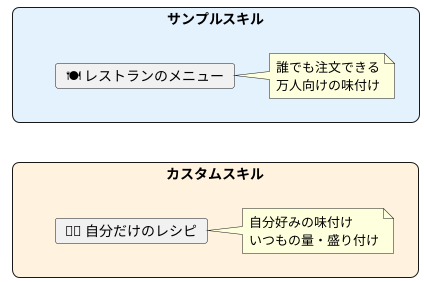

# Claude カスタムスキル構築 — 自分だけの「AIアプリ」を作る

> 60分後には、自分の業務に特化したカスタムスキルを1つ作って、Claudeにインストールできるようになります。

---

## まずは見てください

毎週、こんなことをしていませんか？

```
月曜日の朝：
「先週の作業内容を箇条書きにして、成果と来週の予定もまとめて、
 いつものフォーマットで週報を作って。宛先は〇〇部長で…」

↓ 毎回これを打っている
```

もし **「週報作って」の一言** で、いつものフォーマット・いつもの宛先・いつものトーンで週報が出てきたら？

これが「カスタムスキル」です。

**あなたの仕事のやり方を、Claudeに教え込む。** たった1つのファイルを書くだけで、それが実現します。

前回の授業で「サンプルスキル」を使いましたよね。今日は **使う側から、作る側** に進みます。

---

## これは何か？

前回やった「サンプルスキル」は、Anthropicが作った汎用的なスキルでした。
カスタムスキルは、**あなた専用のスキル** です。

料理に例えると——



| | サンプルスキル | カスタムスキル |
| --- | --- | --- |
| 誰が作った？ | Anthropic（公式） | あなた自身 |
| 内容 | 汎用的（pptx、xlsx…） | あなたの業務に特化 |
| 例 | 「スライドを作る」 | 「うちの会社のフォーマットで週報を作る」 |

---

## スキルの正体：SKILL.mdファイル

カスタムスキルの正体は **たった1つのMarkdownファイル** です。

名前は `SKILL.md`。中身はこの2つだけ：

### 1. ヘッダー（いつ使う？何する？）

```yaml
---
name: 週報ジェネレーター
description: 週報を作成する。「週報作って」「今週のレポート」と言われた場合に使用。
---
```

- **name**: スキルの名前（64文字以内）
- **description**: いつ使うかの説明（200文字以内）。**ここが一番大事。** Claudeはこの説明を読んで「このスキルを使うべきか？」を判断します

### 2. 本文（具体的な指示）

```markdown
# 週報ジェネレーター

## フォーマット
以下の形式で週報を作成してください：

### 宛先
〇〇部長

### 構成
1. 今週の実績（箇条書き3〜5個）
2. 数値成果（あれば）
3. 来週の予定（箇条書き3個）
4. 相談事項（あれば）

## トーン
- 敬体（です・ます）
- 簡潔に、1項目2行以内
- 成果は具体的な数値を入れる
```

これだけです。プログラミングは一切不要。日本語で「こうやって仕事してね」と書くだけ。

---

## 使い方（3ステップ）

### Step 1：SKILL.mdを書く

テキストエディタ（メモ帳でもOK）で `SKILL.md` を作ります。

上の「ヘッダー + 本文」を自分の業務に合わせて書いてください。

コツは **「毎回Claudeに伝えていること」を書き出す** こと。それがそのままスキルになります。

### Step 2：ZIPに圧縮する

フォルダ構造はこうです：

```
my-skill/          ← フォルダ名 = スキル名
├── SKILL.md       ← 必須（これだけでOK）
└── resources/     ← 任意（ロゴやテンプレートを入れる）
    └── template.docx
```

`my-skill` フォルダごとZIPに圧縮します。

> 【スクショ①を配置】ZIPファイルの作成手順

### Step 3：Claudeにアップロードする

1. Claude.aiの **設定 > 機能** を開く
2. 「スキル」セクションの **「スキルをアップロード」** をクリック
3. ZIPファイルを選択
4. 「あなたのスキル」タブにスキルが追加される
5. トグルをオンにする

> 【スクショ②を配置】アップロード画面とアップロード後の「あなたのスキル」タブ

あとはいつも通り話しかけるだけ。Claudeが自動的にスキルを使います。

---

## 実用スキルのアイデア集

### ビジネス系

| スキル名 | description例 | やること |
| --- | --- | --- |
| 週報ジェネレーター | 「週報作って」と言われた時に使用 | いつものフォーマットで週報を生成 |
| 議事録フォーマッター | 会議メモや音声文字起こしの整理に使用 | 決定事項・TODO・次回日程を抽出 |
| メール下書き | ビジネスメールの作成に使用 | 社内/社外で文体を変えて下書き |
| 提案書テンプレ | 提案書・企画書の作成に使用 | 自社フォーマットで提案書を生成 |

### クリエイティブ系

| スキル名 | description例 | やること |
| --- | --- | --- |
| ブランドガイドライン | 成果物のデザインに使用 | 自社カラー・フォントを自動適用 |
| SNS投稿作成 | SNS投稿を作成する時に使用 | プラットフォーム別に文体・ハッシュタグ調整 |
| ブログ記事テンプレ | ブログ記事を書く時に使用 | SEO構造・見出し・CTA付きの記事生成 |

---

## やってみよう

### ⭐ 初級：Claudeに作ってもらう

実は、Claudeにスキルを作らせることもできます。以下のように頼んでみてください：

```
私は毎週月曜日に週報を書いています。
以下の情報を参考に、週報作成用のカスタムスキル（SKILL.md）を作ってください。

- 宛先：〇〇部長
- フォーマット：実績 → 数値成果 → 来週予定 → 相談事項
- トーン：です・ます調、簡潔に
- 特記事項：成果は必ず数値を入れる
```

Claudeが `SKILL.md` を生成してくれるので、ダウンロードしてアップロードするだけです。

### ⭐⭐ 中級：自分で書いてアップロード

1. テキストエディタで `SKILL.md` を新規作成
2. ヘッダー（name, description）を書く
3. 本文に業務ルールを書く
4. フォルダに入れてZIP化
5. Claudeにアップロード → オンにする → テスト

### ⭐⭐⭐ 上級：リソース付きスキル

1. 自社のロゴファイル、テンプレートファイルを用意
2. `resources/` フォルダに入れる
3. SKILL.mdの本文で「resources/内のテンプレートを使って」と指示
4. ZIP化 → アップロード → テスト

---

## 良いスキルを作るコツ

### descriptionが命

Claudeは `description` を見てスキルを呼び出すかどうか決めます。

```
❌ 悪い例：
description: 便利なツール

✅ 良い例：
description: 週報を作成する。「週報」「今週のレポート」「ウィークリー」と言われた場合に使用。
```

**ユーザーが言いそうな言葉** を入れるのがポイントです。

### 1スキル1目的

```
❌ 悪い例：
週報もメールも提案書も全部1つのスキルに入れる

✅ 良い例：
週報スキル、メールスキル、提案書スキルを別々に作る
```

複数のスキルを同時にオンにしておけば、Claudeが状況に応じて自動で選びます。

### 例を入れる

入力と出力の具体例を入れると、Claudeの理解が格段に上がります。

```markdown
## 入力例
「今週はA案件のデザインを完了、B案件のヒアリングを2件実施」

## 出力例
### 週報（2026/02/23〜02/27）
宛先：〇〇部長

**今週の実績**
- A案件：デザインフェーズ完了（予定通り）
- B案件：クライアントヒアリング2件実施（目標3件中）
...
```

---

## 気をつけること

### 1. パスワードやAPIキーを書かない

SKILL.mdにパスワードや秘密情報を絶対に書かないでください。スキルはClaudeのサーバーにアップロードされます。

### 2. まずはシンプルに始める

最初からリソース付きの複雑なスキルを作る必要はありません。SKILL.md1つだけで十分です。使いながら少しずつ育てていきましょう。

### 3. チームで共有できる

作ったZIPファイルをチームメンバーに送れば、同じスキルを使えます。チーム全体のアウトプット品質を統一できます。

---

## 今日のまとめ & 明日からやること

### 今日やったこと

1. カスタムスキルは **SKILL.md1つ** で作れる（プログラミング不要）
2. 「毎回Claudeに伝えていること」をファイルに書くだけ
3. ZIPに圧縮してアップロードすれば、一言で業務が完了する

### 次のアクション

- [ ] 「毎回Claudeに同じことを伝えている業務」を1つ洗い出す
- [ ] その業務のSKILL.mdを書いてみる（Claudeに作ってもらってもOK）
- [ ] ZIPにしてアップロード → 実際に使ってみる

---

*ソース: AI部 カスタムスキル構築術*

---

## 📸 必要なスクリーンショット一覧

撮影時にこのセクションは削除してください。

| # | 撮影対象 | 用途 | 配置場所 |
| --- | --- | --- | --- |
| ① | SKILL.mdファイルをフォルダに入れてZIPに圧縮する手順（Finder上でフォルダ→右クリック→圧縮） | Step 2の補助 | Step 2「ZIPに圧縮する」セクション |
| ② | Claude.ai の設定 > 機能 > スキル で「スキルをアップロード」ボタンを押した画面 & アップロード後に「あなたのスキル」タブに表示された状態 | Step 3の補助 | Step 3「アップロード」セクション |
| ③ | 実際にカスタムスキルが効いている状態のチャット画面（例：「週報作って」→ フォーマット通りの週報が出力される） | 冒頭Before/Afterの補強 | 「まずは見てください」セクション（任意） |
| ④ | Claudeに「SKILL.mdを作って」と頼んで生成された結果の画面 | ハンズオン初級の補強 | 「やってみよう ⭐初級」セクション（任意） |

**推奨保存先**: `image/CustomSkill/` フォルダ
