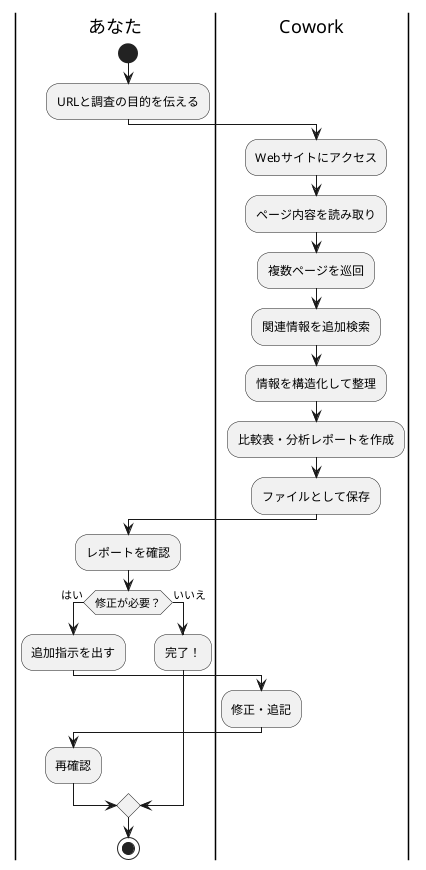

# Claude Cowork × Web調査 — 競合分析を全自動で作らせる

> 60分後には、URLを渡すだけで競合分析レポートを全自動で作成できるようになります。

---

## まずは見てください

「来週までに競合3社の調査レポートまとめといて」

上司からこう言われたら、あなたはどうしますか？

```
従来のやり方（手動）：
1. 競合A社のWebサイトを開く → メモ帳にコピペ  （15分）
2. 競合B社のWebサイトを開く → メモ帳にコピペ  （15分）
3. 競合C社のWebサイトを開く → メモ帳にコピペ  （15分）
4. 3社の情報を比較表に整理                       （30分）
5. 分析コメントを書く                             （30分）
6. レポートとして体裁を整える                     （15分）
───────────────────────────────────
合計：約2時間
```

Coworkを使うと、こうなります。

```
Coworkでの手順：
1. 「この3社を調査して比較レポート作って」と伝える  （1分）
2. Coworkが自動でWeb巡回・情報収集・分析           （5〜10分）
3. 完成したレポートを確認・修正指示                  （5分）
───────────────────────────────────
合計：約15分
```

> 【スクショ①を配置】Coworkに競合調査を指示している画面

**2時間の作業が15分。** しかも抜け漏れがない。

これが今日のゴールです。

---

## これは何か？

Coworkの授業（2/12）で、AIに「フォルダ内のファイルを操作させる」を学びました。

今日は **AIにWebを調査させる** ことをやります。

Coworkには「ブラウザを使って情報を集める」能力があります。あなたが普段やっているように、Webサイトを開いて、読んで、メモして、まとめる。これを全部AIがやります。



| | 手動リサーチ | Cowork リサーチ |
| --- | --- | --- |
| 情報収集 | 自分でサイトを巡回 | AIが自動で巡回 |
| メモ | コピペで整理 | AIが構造化して保存 |
| 比較表 | 手動で作成 | AIが自動生成 |
| 分析 | 自分で書く | AIが下書き → 人間がチェック |
| 所要時間 | 1社あたり30分〜 | 3社まとめて10分 |

---

## 使い方（3ステップ）

### Step 1：調査対象と目的を決める

Coworkに渡す前に、2つだけ決めてください。

1. **何を調査したいか**（URL、会社名、サービス名）
2. **何を知りたいか**（価格比較、機能比較、強み弱み…）

### Step 2：Coworkに指示を出す

Coworkを起動して、作業フォルダを指定したら、以下のように伝えます。

**基本テンプレート：**

```
以下の企業のWebサイトを調査して、競合比較レポートを作成してください。

【調査対象】
1. 〇〇（https://example1.com）
2. △△（https://example2.com）
3. □□（https://example3.com）

【調査項目】
- サービス概要
- 料金体系
- ターゲット顧客
- 強み・弱み
- UI/UXの特徴

【出力形式】
- Markdown形式のレポート
- 3社の比較表を含める
- 各社の総評を200字以内で
```

> 【スクショ②を配置】実際の指示を入力してCoworkが動き始めた画面（Progress表示あり）

### Step 3：レポートを確認して仕上げる

Coworkが完成したレポートをフォルダ内に保存します。開いて確認し、修正があれば追加で指示を出します。

```
例：追加指示
「料金の比較表に、年間契約時の割引率も追加して」
「各社のSNSアカウントのフォロワー数も調べて追記して」
```

> 【スクショ③を配置】完成した競合分析レポートのファイルを開いた状態

---

## 活用パターン

### ① 競合分析レポート（営業向け）

```
以下の3社を競合分析してください。
各社のWebサイトを調べて比較表を作成し、
当社が勝っている点・負けている点を明確にしてください。

1. A社（URL）
2. B社（URL）
3. C社（URL）

当社の特徴：〇〇
```

### ② 市場調査レポート（企画向け）

```
「AI チャットボット 企業導入」をテーマに市場調査してください。

調べてほしいこと：
- 主要なサービス5つ（名前、URL、価格帯）
- 導入企業の業種傾向
- 市場規模の推定（見つかる範囲で）
- 2026年のトレンド

Markdown形式のレポートにまとめてください。
```

### ③ 採用競合リサーチ（人事向け）

```
以下の求人ページを調査して、当社の採用条件と比較してください。

1. A社の採用ページ（URL）
2. B社の採用ページ（URL）

比較項目：
- 給与レンジ
- 福利厚生
- 求めるスキル
- 勤務形態（リモート可否）

当社の条件：〇〇
```

### ④ ツール・SaaS比較（IT担当向け）

```
プロジェクト管理ツールの比較レポートを作ってください。

対象：
- Notion
- Asana
- Monday.com

比較項目：
- 料金プラン
- 主要機能
- 日本語対応
- 連携サービス
- 無料プランの制限

選定ポイントも提案してください。
```

---

## やってみよう

| レベル | テーマ | やること |
| --- | --- | --- |
| ⭐ 初級 | 1社を調査 | 気になる企業のURLを1つ渡して「この会社を調査して」 |
| ⭐⭐ 中級 | 3社を比較 | 自分の業界の競合3社を比較レポートにする |
| ⭐⭐⭐ 上級 | テーマ調査 | URLなしで「〇〇の市場調査をして」と依頼する |

### ⭐ 初級：1社を調査

1. Coworkを起動 → 作業フォルダを指定
2. 以下のように指示する：

```
以下のWebサイトを調査して、この会社のサービス概要レポートを作成してください。

URL: https://（気になる企業のURL）

調査項目：
- 会社概要
- 主力サービス
- 料金
- 特徴・強み
```

3. 作成されたレポートを確認する

### ⭐⭐ 中級：3社を比較

1. 自分の業界の競合を3社ピックアップ
2. 上記「基本テンプレート」を使って指示
3. 比較表が入ったレポートが出てくるのを確認

### ⭐⭐⭐ 上級：テーマ自由調査

1. URLを渡さずに、テーマだけで指示する：

```
「2026年のAI活用トレンド」について市場調査してください。
主要プレイヤー、市場規模、注目技術をまとめたレポートを作成してください。
```

2. Coworkが自分でWeb検索→情報収集→レポート作成を全自動で実行

---

## 良い指示を出すコツ

### 1. 調査項目を具体的に書く

```
❌ 「この会社調べて」
✅ 「この会社の料金プラン、対応言語、導入事例を調べて」
```

項目が具体的だと、Coworkの調査が的確になります。

### 2. 出力形式を指定する

```
❌ 「まとめて」
✅ 「Markdown形式で、比較表を含むレポートを作成して。各社300字以内の総評もつけて」
```

### 3. 自社情報も渡す

競合分析なら、自社の情報も伝えると「自社と比較して」の分析まで作ってくれます。

```
✅ 「当社のサービスは月額5,000円、個人事業主向け。競合と比較して優位点と弱点を出して」
```

---

## 気をつけること

### 1. 情報の正確性は必ず確認する

AIが取得した情報が最新かどうか、数値に誤りがないかは **人間が最終チェック** してください。特に料金や統計データは変更されていることがあります。

### 2. 会員制サイトの中身は取れない

ログインが必要なページ、有料コンテンツの中身はCoworkでは取得できません。公開されている情報のみが調査対象です。

### 3. 大量調査はトークンを消費する

10社以上の一括調査は、大量のトークンを消費します。まずは3社程度から始めて、感覚をつかんでください。

---

## 今日のまとめ & 明日からやること

### 今日やったこと

1. CoworkにURLを渡すだけで **Web調査が全自動** でできる
2. 競合分析・市場調査・ツール比較、どんな調査にも使える
3. コツは **調査項目を具体的に書く** こと

### 次のアクション

- [ ] 自分の業務で「調べもの」に時間がかかっているタスクを1つ見つける
- [ ] そのタスクをCoworkに頼んでみる
- [ ] 出てきたレポートの品質をチェックして、追加指示で磨き上げる

---

*ソース: AI部 Cowork WEB調査自動化*

---

## 📸 必要なスクリーンショット一覧

撮影時にこのセクションは削除してください。

| # | 撮影対象 | 用途 | 配置場所 |
| --- | --- | --- | --- |
| ① | Coworkに競合調査の指示を入力している画面（URLと調査項目を含む指示文が見える状態） | 冒頭のインパクト | 「まずは見てください」セクション |
| ② | Coworkが実行中の画面（Progressに「Webサイトにアクセス中」「情報を整理中」などのステップが表示されている状態） | Step 2の補強 | 「使い方 Step 2」セクション |
| ③ | Coworkが作成した競合分析レポートをプレビューで開いた画面（比較表が見える状態がベスト） | 完成イメージ | 「使い方 Step 3」セクション |
| ④ | 実際の比較表部分のアップ（3社の機能・価格が並んだ表） | 成果物の具体感 | 「活用パターン①」セクション付近（任意） |

**推奨保存先**: `image/CoworkWebResearch/` フォルダ

**撮影のコツ**:
- 事前にデスクトップに `調査レポート` フォルダを作っておく
- 実在する企業3社（自分の業界の競合）で実演すると臨場感が出る
- Progressの途中経過が表示されているタイミングでスクショを撮ると「AIが動いている感」が伝わる
