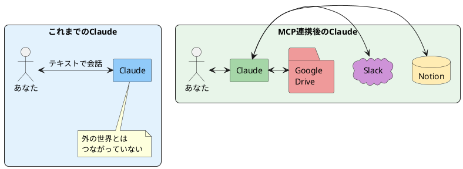

# Claude × MCP連携 — Notion・Googleドライブ・Slackと繋げる

> 60分後には、Claudeから直接Notionを更新したり、Googleドライブのファイルを操作できるようになります。

---

## まずは見てください

毎週こんなことをしていませんか？

```
1. 会議の音声をAIで文字起こし
2. 文字起こしをClaudeに渡して議事録に整形
3. できた議事録をコピーしてNotionに貼り付け
4. 要点をSlackの会議チャンネルに投稿
5. 次回のアクションアイテムをGoogleカレンダーに登録
```

5ステップ、ツール4個、コピペ3回。

MCP連携を使うと、こうなります。

```
あなた：「この会議の文字起こしから議事録を作って、
         Notionの議事録ページに保存して、
         要点をSlackの #meeting チャンネルに投稿して」

Claude：はい、3つのタスクを実行します。
        ✅ 議事録を作成しました
        ✅ Notionに保存しました
        ✅ Slackに投稿しました
```

> 【スクショ①を配置】Claudeから直接Notionのページを作成・更新している画面

**コピペゼロ。ツール間の移動ゼロ。** Claudeが直接、他のツールを操作します。

これが今日のゴールです。

---

## これは何か？

これまでの授業で学んだことを振り返ると：

- **Cowork**（2/12）：AIがPC内のファイルを操作する
- **Skills**（2/19）：AIに専門能力を追加する
- **Web調査**（3/5）：AIがWebを巡回して情報を集める

今日は最後のピース。**AIが外部ツールと直接つながる** ことをやります。

MCP（Model Context Protocol）は、Claudeと外部サービスをつなぐ **接続ケーブル** のようなものです。



| | MCP連携なし | MCP連携あり |
| --- | --- | --- |
| Notion更新 | Claudeの出力をコピペ | 「Notionに保存して」で完了 |
| Slack投稿 | Claudeの出力をコピペ | 「Slackに投稿して」で完了 |
| ファイル操作 | ダウンロード→アップロード | 「Googleドライブに保存して」で完了 |

---

## 接続できるサービス（主なもの）

Claude Desktopの「拡張機能」から、ワンクリックで接続できるサービスが増えています。

### すぐに使えるサービス

| サービス | できること | 使用場面 |
| --- | --- | --- |
| **Notion** | ページ作成・検索・更新・データベース操作 | 議事録、タスク管理、ナレッジ蓄積 |
| **Google Drive** | ファイル検索・読み込み・アップロード | ドキュメント管理、共有ファイル操作 |
| **Slack** | メッセージ送信・検索・チャンネル操作 | 通知、報告、情報共有 |
| **GitHub** | リポジトリ操作・PR管理・Issue作成 | 開発プロジェクト管理 |
| **PostgreSQL** | データベースクエリ実行 | データ分析、レポート生成 |

> 【スクショ②を配置】Claude Desktopの拡張機能（Integrations）一覧画面

---

## 使い方（Notion連携を例に）

今日は最も使いやすい **Notion連携** を中心にやります。

### Step 1：Notionインテグレーションを作る

1. https://www.notion.so/profile/integrations にアクセス
2. 「新しいインテグレーション」をクリック
3. 名前を入力（例：「Claude連携」）
4. 「送信」をクリック
5. 表示された **内部インテグレーショントークン** をコピーしておく

> 【スクショ③を配置】Notion Developer Portalでインテグレーションを作成している画面

### Step 2：Notionページに接続を許可する

ClaudeからアクセスしたいNotionページを開いて：

1. ページ右上の **「•••」** メニューをクリック
2. **「接続」** → **「Claude連携」**（Step 1で作った名前）を選択
3. 「確認」を押す

> 【スクショ④を配置】Notionページの接続設定画面

### Step 3：Claude Desktopに接続情報を設定する

Claude Desktopアプリの設定で、Notion連携を追加します。

**方法A：拡張機能から追加（簡単）**
1. 設定 → 拡張機能 を開く
2. 「Notion」を探してインストール
3. APIトークンを入力

**方法B：設定ファイルを編集（上級者向け）**
`claude_desktop_config.json` を編集：

```json
{
  "mcpServers": {
    "notion": {
      "command": "npx",
      "args": ["-y", "@modelcontextprotocol/server-notion"],
      "env": {
        "NOTION_API_KEY": "ここにコピーしたトークンを貼る"
      }
    }
  }
}
```

設定後、Claude Desktopを再起動してください。

> 【スクショ⑤を配置】Claude Desktopの拡張機能設定でNotionが接続済みの状態

### Step 4：Claudeに話しかける

接続完了したら、いつも通り話しかけるだけです。

```
あなた：「Notionの議事録データベースに、今日の会議メモを追加して」

Claude：Notionに新しいページを作成しました。
        タイトル：2026/03/12 定例会議
        内容：[議事録の内容]
```

---

## 活用パターン

### ① 議事録 → Notion自動保存

```
以下の会議メモから議事録を作成して、
Notionの「議事録」データベースに保存してください。

[会議メモを貼り付け]

フォーマット：
- 日時、参加者、議題
- 決定事項
- アクションアイテム（担当者・期限付き）
```

### ② Notion → Slackに報告

```
Notionの「今週のタスク」ページの内容を読んで、
完了したタスクのサマリーを作成し、
Slackの #weekly-report チャンネルに投稿してください。
```

### ③ Googleドライブのファイルを分析

```
Googleドライブの「売上データ.xlsx」を読み込んで、
月別の売上推移グラフと分析コメントを作成してください。
結果はNotionの「分析レポート」ページに保存してください。
```

### ④ 複数ツール横断ワークフロー

```
以下のワークフローを実行してください：

1. Googleドライブの「会議録_20260312.txt」を読み込む
2. 議事録フォーマットに整形する
3. Notionの「議事録」ページに保存する
4. 要点を3行にまとめてSlackの #team に投稿する
```

---

## やってみよう

| レベル | テーマ | やること |
| --- | --- | --- |
| ⭐ 初級 | Notion読み取り | ClaudeにNotionページの内容を読ませて要約させる |
| ⭐⭐ 中級 | Notion書き込み | ClaudeからNotionに新しいページを作成する |
| ⭐⭐⭐ 上級 | 複数ツール連携 | Notion + Slack（またはGoogleドライブ）を組み合わせる |

### ⭐ 初級：Notionの内容を読ませる

1. Notion連携を設定する（上記Step 1〜3）
2. Claudeに以下のように聞く：

```
Notionの「プロジェクト管理」ページを検索して、
今進行中のプロジェクト一覧を教えてください。
```

3. Claudeが直接Notionにアクセスして内容を返してくれる

### ⭐⭐ 中級：Notionにページを作成

1. 以下のように指示する：

```
Notionの「議事録」データベースに新しいページを作成してください。

タイトル：AI部 第5回 定例会議
日付：2026/03/12
内容：
- 今日学んだこと：Claude MCP連携
- 決定事項：全員がNotion連携を設定する
- 次回テーマ：未定
```

2. Notionを開いて、ページが作成されていることを確認する

### ⭐⭐⭐ 上級：複数ツール連携

Notion + Slackの両方が接続済みの状態で：

```
Notionの「今週のふりかえり」ページを読んで、
チームメンバー向けのサマリーを作成し、
Slackの #ai-club チャンネルに投稿してください。
```

---

## 気をつけること

### 1. 権限は最小限にする

Notion連携では、アクセスさせるページだけに接続を許可してください。全ページへのアクセスは不要です。

### 2. 機密情報に注意

接続したサービスの内容はClaudeに送信されます。社外秘の情報が含まれるページへの接続は慎重に判断してください。

### 3. 設定は最初だけ

MCP連携の設定は最初の1回だけです。一度つなげば、あとは自然言語で指示を出すだけで操作できます。

---

## 今日のまとめ & 明日からやること

### 今日やったこと

1. MCP連携は、Claudeと外部ツールをつなぐ **接続ケーブル**
2. Notion・Slack・Googleドライブなど、普段使いのツールと直接連携できる
3. 「コピペして貼り付ける」作業が **一言で完了** する

### 次のアクション

- [ ] Notionインテグレーションを作成して、Claude Desktopに接続する
- [ ] 「Notionのページを読んで要約して」を試してみる
- [ ] 自分の業務で「ツール間のコピペ」をしている作業を1つ見つけて、MCP連携で置き換える

---

*ソース: AI部 MCP連携 外部ツール自動化*

---

## 📸 必要なスクリーンショット一覧

撮影時にこのセクションは削除してください。

| # | 撮影対象 | 用途 | 配置場所 |
| --- | --- | --- | --- |
| ① | ClaudeからNotionのページを作成/更新しているチャット画面（「Notionにページを作成しました」のような結果表示） | 冒頭のインパクト | 「まずは見てください」セクション |
| ② | Claude Desktopの 設定 > 拡張機能 の一覧画面（Notion、Slack、Google Driveなどのコネクタが並んでいる状態） | 接続できるサービスの紹介 | 「接続できるサービス」セクション |
| ③ | Notion Developer Portal（https://www.notion.so/profile/integrations）で新しいインテグレーションを作成する画面 + トークンが表示された状態 | Step 1の手順 | 「使い方 Step 1」セクション |
| ④ | Notionページの右上メニュー → 「接続」から作成したインテグレーションを選択している画面 | Step 2の手順 | 「使い方 Step 2」セクション |
| ⑤ | Claude Desktopの拡張機能設定でNotionが「接続済み」になっている状態（緑のチェックやアクティブ表示） | Step 3の完了状態 | 「使い方 Step 3」セクション |
| ⑥ | 実際にClaudeに「Notionに保存して」と頼んで、Notionを開いたらページができている状態（Claude画面とNotion画面を並べたもの） | ハンズオンの成功体験 | 「やってみよう ⭐⭐中級」セクション（任意） |

**推奨保存先**: `image/MCPIntegrations/` フォルダ

**撮影のコツ**:
- Notion連携は事前に自分で設定して動作確認しておく
- 個人用のテスト用Notionワークスペースで撮影する（機密情報が映らないように）
- トークンが見えるスクショは、撮影後にトークン部分をぼかすか、テスト用の使い捨てトークンで撮る
- Claude画面とNotion画面を左右に並べたスクショが「つながっている感」を伝えやすい
