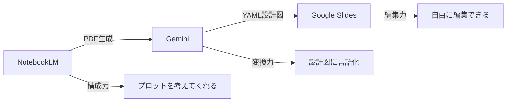
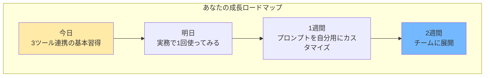

## 🧑‍🍳 NotebookLM × YAML × Google Slides で編集可能なスライドを作る

- **開催日**: 2026-01-29
- **所要時間**: 60分
- **対象者**: Google Workspace環境で働くビジネスパーソン（社内ポリシーでNotebookLM/Geminiのみ使用可能な環境）
- **ゴール（成果物）**: NotebookLMで生成したスライドを編集可能なGoogle Slidesに変換し、社内テンプレートを適用した完成版スライドが作れる
- **使用ツール**: NotebookLM / Gemini / Google Slides / Nano Banana Pro（オプション）
- **事前準備**:
  - NotebookLMアカウント作成
  - Google Workspaceアカウント（Google Slides利用可能）
  - Geminiアカウント（canvasツール利用可能）
  - 社内スライドテンプレート（任意）

### 📌 共有リンク / 配布物

- NotebookLM: https://notebooklm.google.com/
- Gemini: https://gemini.google.com/
- Google Slides: https://docs.google.com/presentation/
- 配布プロンプト集（後述）

### 🧩 当日の流れ（タイムテーブル）


| パート   | 時間 | 内容                     | ゴール                                     |
| ---------- | -----: | -------------------------- | -------------------------------------------- |
| 導入     | 15分 | NotebookLMの課題と解決策 | 「これ解決できるんだ」と期待を持つ         |
| 解説     | 15分 | YAMLの仕組みと具体例     | 「なるほど、こうすればいいのか」と納得する |
| 実践     | 25分 | 3ツール連携ワーク        | 編集可能なスライドを実際に作る             |
| 振り返り |  5分 | 次のアクション           | 明日から使えるイメージを持つ               |

---

## 🎬 セッションの流れ

### 1. 導入：NotebookLMの課題と解決策（15分）

#### NotebookLMのスライド生成、すごいですよね

NotebookLMの「スライド資料」機能はもうおなじみかと思います！

雑なメモや社内ドキュメントから、いい感じの構成を勝手に組んでくれる。たたき台として本当に強いツールです。

例えば、極論こんな一文だけでも...

```text
カレーはシチューより美味しい
```

これだけでNotebookLMは「主張 → 根拠 → まとめ」みたいなプレゼンの型に寄せてスライドを作ってくれます。

正直、スライド作成で一番大変なのって「構成を考える」ところだと思うので、
NotebookLMはそこをフォローしてくれる。これはすごい。

#### でも、困ることありますよね？

- 「この一文だけ直したい」
- 「フォントを会社のテンプレに合わせたい」
- 「ロゴを入れたい」「注釈を足したい」

**NotebookLMの生成スライドはPDFで出力されるので、そのままだと"編集できない"んです。**

「構成は最高なのに、細かい調整ができない...」
「結局、手作業でイチから作り直し...」

これ、めちゃくちゃもったいないですよね。

#### 今日、この問題を解決します

**NotebookLMの「構成力」は活かしつつ、編集可能なスライドに変換する方法**を学びます。

**📷 画像貼付け**: Before/After比較

- Before: NotebookLMで生成したPDFスライド（編集不可）
- After: Google Slidesに変換した完成版（編集可能）

（ここに画像を貼る）

60分後には、皆さんもこれができるようになります。

**3ツール連携の全体像:**



**📷 画像貼付け**: 3ツール連携の全体像

（ここに画像を貼る）

---

### 2. 解説：YAMLの仕組みと具体例（15分）

#### YAMLって何？

「YAML」という言葉が出てきました。

「YAML？なにそれ？」と思った方、安心してください。難しいことは何もありません。

**YAMLは「人間が読みやすいデータ記述形式」です。**

正式名称は「YAML Ain't Markup Language」（YAMLはマークアップ言語じゃない）という、ちょっとユニークな名前です。

**YAMLの基本構造:**

YAMLは「キー: 値」のペアでデータを表現します。インデント（字下げ）で構造を表現するのが特徴です。

```yml
# 基本的なキーと値のペア
title: "NotebookLMとは"
color: "青"

# リスト（複数の項目）
fruits:
  - apple
  - orange
  - banana

# ネスト（入れ子構造）
person:
  name: "田中"
  age: 30
  hobbies:
    - 読書
    - 映画
```

**重要なポイント:**

1. **インデントはスペースのみ**（タブは禁止）
2. **コロン(:)の後にスペースを入れる**（`key: value`）
3. **リストはハイフン(-)で表現**
4. **# でコメントを書ける**

**この授業でのYAMLの役割:**

**YAMLは「スライドを言葉で説明したもの」です。**

PDFは画像なので編集できません。でも「このスライドには、左上にタイトルがあって、中央に図があって...」と言葉で書けば、それを元に新しいスライドを作れますよね？

**YAMLは、スライドの「設計図」なんです。**

例えば、スライドのタイトルや配置をYAMLで書くと：

```yml
title: "NotebookLMとは"           # タイトル
layout_type: "2カラム"            # レイアウト
elements:                          # 要素のリスト
  - id: 1
    type: "text_block"
    position: "top-center"
    content:
      text: "NotebookLMとは"
```

このように、スライドの構造を「データ」として表現できるのがYAMLの強みです。

#### 実際のYAMLを見てみましょう

例えば、NotebookLMが作ったこのスライド...

**📷 画像貼付け**: 変換元のスライド（1枚）

（ここに画像を貼る）

これをYAMLで表現すると、こうなります。

```yml
- slide_id: 1
  title: "NotebookLMとは"
  layout_type: "2カラム"
  design_intent: "左に課題、右に解決策を配置して対比を見せる"
  
  color_theme:
    primary: "青"
    emphasis: "オレンジ（強調）"

  elements:
    - id: 1
      type: "text_block"
      position: "top-center"
      content:
        text: "NotebookLMとは"
        heading_level: "h1"
        style: "bold"
  
    - id: 2
      type: "text_block"
      position: "left"
      content:
        text: "こんな悩みありませんか？\n- 構成を考えるのに時間がかかる\n- 画像の調整作業が面倒"
        heading_level: "body"
  
    - id: 3
      type: "icon"
      position: "center"
      visual_description: "大きな矢印（左から右へ）"
  
    - id: 4
      type: "text_block"
      position: "right"
      content:
        text: "NotebookLMが解決します\n- PDFやWebを取り込み\n- スライド生成まで支援"
        heading_level: "body"

  diagram_structure:
    - from: 2
      to: 4
      type: "arrow"
      direction: "left-to-right"

  reproduction_note: "左側に課題を配置し、右側の解決策へ大きな矢印を引く"
```

どうですか？

「スライド1枚目のタイトルは『NotebookLMとは』で、左に課題、右に解決策、間に矢印がある」

**これがYAMLです。スライドを言葉で説明しただけ。**

これをGeminiに渡すと、編集可能なGoogle Slidesを作ってくれるんです。

#### どうやってYAMLを作るの？

Geminiに「このPDFをYAML形式で説明して」とお願いします。

ただし、毎回「YAMLにして」とだけ言っても、バラバラな形式で出てきます。

そこで、**「このフォーマットで出して」というテンプレート（システムプロンプト）を用意しました。**

これをGeminiに貼り付けると、毎回同じ形式でYAMLが出てきます。

**ポイント:**

- このプロンプトは「Geminiへの指示書」
- 一度貼り付ければ、あとはPDFをアップロードするだけ
- 毎回同じ形式でYAMLが生成される

---

## 🧾 配布プロンプト（コピペ用）

### 0) NotebookLMスライド生成時のプロンプト

GeminiでYAML設計図を生成するシステムプロンプト**このプロンプトをGeminiに貼り付けると、毎回同じフォーマットでYAMLが出てきます。**

# YAML出力スキーマ（テンプレート）

```yml
あなたは熟練した「UI/UXデザイナー」かつ「データアーキテクト」です。
添付のPDFスライド資料を、デザインの観点で徹底的に言語化をし、詳細な YAML形式 に変換してください。

出力は、以下の厳格な定義とスキーマに従ってください。

# 要件
## 最重要要件
1. **コンテナ禁止 (No Containers)**:
  - 「テキストを囲む枠」「背景の白いボックス」「レイアウト用の透明な箱」などは一切出力しないでください。
  - 要素はすべて、スライドのキャンバス上に直接配置される「テキストボックス」または「図形」として定義してください。
2. **テキストの完全性**: スライド内のすべての文字情報を漏らさず格納すること。

## その他要件
1. **視覚・空間情報の言語化**:
   - 単に「画像がある」ではなく、「何を描いた図か（例：本部から店舗への矢印フロー）」を記述する。
   - 配置（Layout）や色使い（強調色、背景色）、文字の強弱（サイズ、太字）を属性として持たせる。
2. **図解の構造化**:
   - 複雑な図（例：組織図や連携図）は、`nodes`（要素）と `edges`（関係性・矢印の向き）として定義する。
3. **意図の解釈**: そのスライドで伝えたい「キーメッセージ」をメタデータとして含める。

# YAML出力スキーマ（テンプレート）
各スライドを以下の構造で記述してください。
```yml
- slide_id: [ページ番号]
  title: "[スライドタイトル]"
  layout_type: "[例: 2カラム, フロー図, タイムライン, グリッド]"
  design_intent: "[このスライドのデザイン意図。例：Before/Afterの比較、左から右への時系列]"
  
  # 色彩とトーン
  color_theme:
    primary: "[例: 赤（企業カラー）]"
    secondary: "[例: グレー（背景）]"
    emphasis: "[強調されている箇所の色]"

  # コンテンツ要素のリスト
  elements:
    - id: [要素ID]
      type: "[text_block | image | diagram | icon | chart]"
      position: "[配置場所: top-left, center, bottom-right など]"
      content:
        text: "[実際のテキスト内容]"
        heading_level: "[h1, h2, body, caption]"
        style: "[bold, red-text, boxed（囲み枠）, arrow-source（矢印の始点）など]"
      visual_description: "[画像や図の場合の詳細説明。例：工場のアイコン、スマートフォンのスクリーンショット]"
  
  # 図解の関係性（矢印やフローがある場合）
  diagram_structure:
    - from: "[要素ID]"
      to: "[要素ID]"
      type: "[arrow | line | dotted-line]"
      label: "[矢印の上の文字]"
      direction: "[left-to-right | top-down]"

  # 再現のためのメモ
  reproduction_note: "[デザイナーへの指示。例：左側に課題を配置し、右側の解決策へ大きな矢印を引く]"
  
```

**ちなみになぜ「コンテナ禁止」が重要なのか？**

社内テンプレートを適用するとき、背景の白いボックスなどがあると邪魔になります。
（テンプレートレイアウトは最背面に表示されるので）
このプロンプトでは「コンテナ禁止」を最重要要件にすることで、余計な要素がGoogle Slideにしたときに生成されないようにしてあります。

### 2) canvasツールでGoogle Slidesを生成するプロンプト

YAMLが出力されたら、次のステップです。

手順：

1. Geminiで **canvasツール** を選択
2. 以下のプロンプトを入力
3. 生成されたスライドをエクスポート

   プロンプト

```text
以下の yaml に従って、google slide を作成してください。

（ここにGeminiから出力されたYAMLをコピペ）
```

**📷 画像貼付け**: canvasツールで生成されたGoogle Slidesの例

（ここに画像を貼る）

### 3) うまくいかない時の改善プロンプト

```text
上の回答を改善してください。
改善観点:
- YAMLの構造が正しいか確認
- コンテナ要素が含まれていないか確認
- テキスト情報が漏れていないか確認
- 図解の関係性が明確に記述されているか確認
- Canvasでスライドを生成して


この条件で、もう一度出力してください。
```

---

### 3. 実践ワーク（25分）

#### 準備（2分）

では実際にやってみましょう。

今日の題材は「社内で生成AIツール導入を提案する資料」です。

まず、NotebookLMに登録するメモを用意しました。

**配布用メモ:**

```text
こんな悩みありませんか？
- どんな資料だったらクオリティの高いものになるのか、考えるのに時間がかかる
- 資料に添付する画像などの調整作業が面倒

NotebookLM は、そんな悩みを解決します。
PDF や Web 記事、Google ドキュメント等を取り込み、スライド生成まで支援する AI パートナーです。

また、取り込んだソースはチームで共有できるので、
チームの情報探索負担を減らし、要点を短時間で共有資産化できます。
```

#### ステップ1：NotebookLMでスライド生成（5分）

**やること:**

1. NotebookLMを開く
2. 上のメモをソースに登録
3. 「スライド資料」を選択
4. プロンプト「背景は白、ピクトグラム中心」を入力
5. 「プレゼンターのスライド」モードで生成
6. PDFをダウンロード

#### ステップ2：GeminiでYAML変換（5分）

**やること:**

1. Geminiを開く
2. ダウンロードしたPDFをアップロード
3. YAML生成プロンプト（上記）をコピペして送信
4. 出力されたYAMLを確認

**確認ポイント:**

- スライドの枚数分のYAMLが出力されているか
- 各スライドのタイトルが正しいか
- コンテナ要素が含まれていないか

#### ステップ3：Google Slides生成（5分）

**やること:**

1. Geminiでcanvasツールを選択
2. Google Slides生成プロンプトを入力
3. YAMLをコピペ
4. 生成されたスライドを確認
5. エクスポート

#### 結果共有（3分）

- 完成したスライドを見せ合う
- うまくいったポイント
- つまずいたポイント

---

### 4. 振り返り＋次への一歩（5分）

#### ブラッシュアップ方法

Google Slidesができたら、あとは通常のスライド編集作業です。

**できること:**

- 社内テンプレートを適用
- フォント、余白の調整
- ロゴ、注釈、ページ番号の追加
- 文言の微修正

**画像の調整が必要な場合:**

- NotebookLMが作成したスライドからスクショで切り抜き
- Google Slidesのサイドパネル「Nano Banana」でブラッシュアップでもできます！

  (画像貼り付け)

#### 今日のまとめ

**NotebookLMは「完成品メーカー」ではなく「構成エンジン」です。**

構成を考えてくれる力は最高。でも、PDFで出力されるから編集できない。

今日学んだ方法を使えば：

1. NotebookLMで構成を作ってもらう
2. GeminiでYAML設計図に変換
3. Google Slidesで編集可能なスライドを作成

**白紙から構成を考えるより、この方法の方が圧倒的に楽です。**

#### 成長ロードマップ



**📷 画像貼付け**: 成長ロードマップ

（ここに画像を貼る）

---

## 💡 よくある質問と対処法

### Q. YAMLが長すぎてGeminiに貼れない

A. スライドを分割して処理してください。例えば「1-5ページ」「6-10ページ」のように。

### Q. 図解がうまく再現されない

A. YAMLの `diagram_structure` を確認し、`from`/`to`の関係性が正しく記述されているか確認してください。

---

## 💎 このセッションで得られること


| フェーズ | 内容                     | 得られるもの                           |
| ---------- | -------------------------- | ---------------------------------------- |
| 導入     | NotebookLMの課題と解決策 | 「編集できない問題」の解決方法がわかる |
| 解説     | YAMLの具体例             | 「設計図」という概念が腹落ちする       |
| 実践     | 3ツール連携ワーク        | 実際に編集可能なスライドを作れる       |
| 振り返り | 次のアクション           | 明日から実務で使えるイメージが湧く     |

---

*このセッションでは、NotebookLMの「構成エンジン」としての真価を活かしつつ、編集可能なスライドを作成する3ツール連携手法を学びます。*
