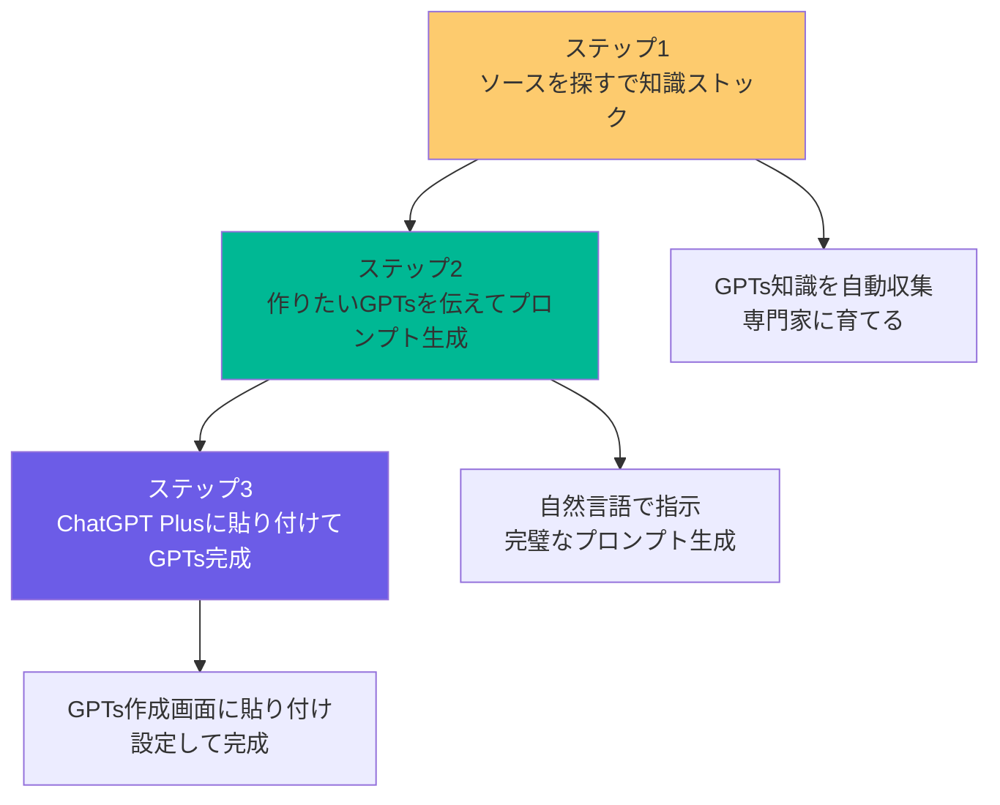
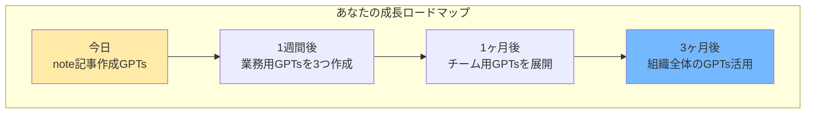

## 🧑‍🍳 セッション設計：NotebookLMでGPTsプロンプトを自動生成する

- **開催日**: 2026-02-14
- **所要時間**: 60分
- **対象者**: GPTsを作りたいがプロンプト設計で悩んでいる方 / 業務効率化に興味がある方
- **ゴール（成果物）**: NotebookLMでGPTsプロンプトを生成し、実際に使えるGPTsが完成して持ち帰れる
- **使用ツール**: NotebookLM / ChatGPT Plus（GPTs作成機能）
- **事前準備**: 
  - NotebookLMアカウント作成
  - ChatGPT Plusアカウント準備（GPTs作成権限）
  - 新規ノートブック作成

### 📌 共有リンク / 配布物

- NotebookLM: https://notebooklm.google.com/
- ChatGPT Plus: https://chat.openai.com/
- 配布プロンプト集（Notionページ）

### 🧩 当日の流れ（タイムテーブル）

| パート | 時間 | 内容 | 成果 |
|---|---:|---|---|
| 導入 | 10分 | 期待値合わせ・成果物デモ | プロンプト自動生成の可能性とゴールが明確になる |
| 解説 | 20分 | ソースを探す活用法・プロンプト生成手順 | NotebookLMでGPTs知識をストックする方法がわかる |
| 実践 | 25分 | 個人ワーク＋サポート | 実際にGPTsプロンプトが生成できてGPTsが完成する |
| 振り返り | 5分 | 共有＋次アクション | 他のGPTs作成アイデアが浮かぶ |

---

## 🧾 参加者に配るプロンプト（コピペ用）

### 0) ソースを探す用プロンプト（そのまま貼る）

```text
以下の検索キーワードで、GPTs作成に必要な情報を収集してください：

・「GPTsのプロンプトの例」
・「GPTsのプロンプトのコツ」
・「GPTsの作り方」
・「GPTsの効果的な書き方」
```

### 1) GPTsプロンプト生成プロンプト（基本形）

```text
あなたはGPTsプロンプト設計の専門家です。
目的: （例: NotebookLMで出力したネタを元に、note記事を書くGPTsを作って）
前提: 
- プロ級のプロンプト設計スキル
- セキュリティ対策も含める
- 初心者でも理解できる構造

出力形式:
- ① 役割定義（プロの専門家として）
- ② 具体的な実行ステップ（順序立てて）
- ③ 出力形式の指定（マークダウン等）
- ④ 制約条件の設定（禁止事項等）
- ⑤ セキュリティ対策（プロンプト漏洩防止等）

完成したプロンプトを、そのままChatGPT PlusのGPTs作成画面に貼り付けられる形式で出力してください。
```

### 2) うまくいかない時の改善プロンプト

```text
上のプロンプトを改善してください。
改善観点:
- より具体的な実行ステップに
- 出力品質を上げる制約を追加
- セキュリティ対策を強化
- 初心者でも迷わない構造に

この条件で、もう一度プロンプトを出力してください。
```

### 3) エラー/詰まりの切り分けプロンプト（トラブル用）

```text
状況: （何をしていて）
症状: （何が起きたか）
期待: （どうなってほしいか）
制約: （時間/環境/権限）

最短で解決するために、確認すべき項目を優先度順に質問してください。
```

---

## 🎬 各フェーズの詳細設計（60分）

### 1. 導入＋成果物確認（10分）

**実際の流れ:**
1. **プロンプトテンプレート共有（3分）**
   - ソースを探す用プロンプトとGPTs生成プロンプトを事前共有
   - 参加者にNotebookLMでコピーしてもらう
   - 「今日はこのプロンプトだけでGPTsが作れます」と宣言

   **📷 画像貼付け**: NotebookLMの画面でプロンプトを貼り付けた状態のスクショ
   
   （ここに画像を貼る）

2. **現状確認（2分）**
   - 「GPTsを作ったことある人？」→ 数名
   - 「プロンプト設計で悩んだことある人？」→ 多数
   - 「プロンプトを書くのに時間がかかったことある人？」→ 全員
   - 「プロンプトは書くものではなく生成させるものだと知ってる人？」→ ほぼゼロ

3. **成果物デモ（5分）**
   - 完成したGPTs（例: note記事作成GPTs）を実際にデモ
   - 「これが25分後にはあなたも作れます」と宣言
   - 「プロンプト設計の知識不要で、NotebookLMが完璧なプロンプトを生成します」と伝える

   **📷 画像貼付け**: 
   - Before: 手動でプロンプトを書いている画面（時間がかかっている様子）
   - After: NotebookLMで生成されたプロンプトでGPTsが完成している画面
   
   （ここに画像を貼る）

### 2. ツールと手順解説（20分）

**実際の流れ:**
1. **NotebookLM × GPTsの組み合わせ説明（5分）**
   - NotebookLMの「ソースを探す」機能の説明
   - GPTsとは何か（カスタマイズされたChatGPT）
   - なぜこの組み合わせが強力なのか
   - 「知識をストック → プロンプト生成 → GPTs作成」の流れ

2. **ソースを探すで知識ストック（10分）**
   - 実際にソースを探す用プロンプトを実行
   - 収集された情報を確認
   - 「これでNotebookLMがGPTsプロンプト設計の専門家になりました」と説明

3. **プロンプト生成のコツ（5分）**
   - 具体的な指示の出し方
   - 役割定義の重要性
   - セキュリティ対策の自動化

**基本操作の3ステップ:**

> NotionでMermaidが表示できない場合は、下のMermaidを別途レンダリングしてスクショを貼ってください（再編集のためにコードは残す）。



**📷 画像貼付け**: 「基本操作の3ステップ」図のスクショ（Mermaidを画像化したもの）

（ここに画像を貼る）

### 3. 実践ワーク（25分）

**実際の流れ:**
1. **ソースを探す実行（5分）**
   - 各自でソースを探す用プロンプトを実行
   - 知識がストックされたことを確認
   - つまずいている人への個別サポート

2. **プロンプト生成実践（10分）**
   - 基本課題：「note記事作成GPTs」のプロンプト生成
   - NotebookLMに指示を出してプロンプトを生成
   - 生成されたプロンプトを確認
   - 役割定義、実行ステップ、制約条件が含まれていることを確認

3. **GPTs作成・実装（10分）**
   - ChatGPT Plusにログイン
   - GPTs作成画面を開く
   - 生成されたプロンプトを「指示」に貼り付け
   - 名前・説明・モデルを設定
   - 実際にGPTsが動作することを確認

**実践ワークの進め方:**
| 段階 | 時間 | 内容 | サポート方法 |
|------|------|------|-------------|
| ソースを探す | 5分 | GPTs知識をストック | 全体指導＋画面共有 |
| プロンプト生成 | 10分 | note記事作成GPTsのプロンプト生成 | プロンプト例を配布 |
| GPTs作成 | 10分 | ChatGPT PlusでGPTs作成 | 個別サポート |
| 応用チャレンジ | 5分（余裕があれば） | 他の用途のGPTs作成 | ヒント提供 |

**📷 画像貼付け**: 
- NotebookLMで生成されたプロンプトの例
- ChatGPT PlusのGPTs作成画面（プロンプトを貼り付けた状態）
- 完成したGPTsの動作確認画面

（ここに画像を貼る）

### 4. 振り返り＋次への一歩（5分）

**実際の流れ:**
1. **成果確認（3分）**
   - 参加者の成果物を簡単に確認
   - 「プロンプト設計の知識不要でできた！」という体験を共有
   - 工夫したポイントがあれば共有

2. **次への一歩（2分）**
   - 他のGPTs作成アイデアを紹介
   - 1週間、1ヶ月、3ヶ月の成長ロードマップ
   - 継続学習のためのリソース紹介

**無限錬成の例:**

```text
・営業メール作成GPTs
・会議議事録整理GPTs  
・マーケティング企画GPTs
・プレゼン資料作成GPTs
・データ分析レポートGPTs
・SNS投稿作成GPTs
・翻訳・校正GPTs
```

**成長ロードマップ:**

> NotionでMermaidが表示できない場合は、下のMermaidを画像化して貼ってください（再編集のためにコードは残す）。



**📷 画像貼付け**: 成長ロードマップ図のスクショ（Mermaidを画像化したもの）

（ここに画像を貼る）

---

## 💡 実践のコツ

### 🌈 構造化と可視化の原則

1. **常に全体像を見せる**
   - 「ソースを探す → プロンプト生成 → GPTs作成」の流れを最初に提示
   - 現在地を常に明確にする
   - 「プロンプト設計の知識不要」を強調

2. **3という魔法の数字**
   - 3ステップで完結（知識ストック → 生成 → 作成）
   - 主要ポイントは3つに整理
   - 認知負荷を適切にコントロール

3. **ビジュアル思考の活用**
   - プロンプト生成前後の比較を可視化
   - GPTs作成フローを図解
   - 色分けで重要度を表現

### 💎 期待される変化

| フェーズ | あなたの状態 | 得られるもの |
|----------|-------------|-------------|
| 導入 | 不安→期待 | 「プロンプト設計は難しい」から「NotebookLMならできるかも」へ |
| 解説 | 理解→自信 | 「なるほど」から「やってみたい」へ |
| 実践 | 挑戦→達成 | 「難しいかも」から「できた！」へ |
| 振り返り | 誇り→意欲 | 「自分もできた」から「他も作りたい」へ |

### 🎯 よくある質問と回答

**Q: 生成されたプロンプトはそのまま使える？**
A: はい。NotebookLMが生成したプロンプトは、そのままChatGPT PlusのGPTs作成画面に貼り付けて使えます。セキュリティ対策も自動で含まれています。

**Q: もっと複雑なGPTsは作れる？**
A: はい。一度ソースを探すで知識をストックすれば、どんなGPTsでも作成可能です。用途に応じた最適化も自動で行われます。

**Q: プロンプト設計の知識は不要？**
A: 基本的には不要です。ただし、NotebookLMが生成したプロンプトを読むことで、自然とプロンプト設計のコツが身につきます。

**Q: 生成されたプロンプトをカスタマイズできる？**
A: はい。生成されたプロンプトをベースに、自分の用途に合わせて修正できます。NotebookLMに「この部分を改善して」と伝えれば、即座に改善版を生成してくれます。

---

## 📋 実践例選択のガイドライン

### 💡 GPTs作成のアイデア集

| 用途 | GPTs例 | 応用アイデア |
|------|--------|-------------|
| **コンテンツ作成** | note記事作成GPTs | ブログ記事、SNS投稿、プレスリリース |
| **業務効率化** | 議事録整理GPTs | メール整理、レポート作成、データ分析 |
| **マーケティング** | 企画書作成GPTs | キャンペーン企画、LP作成、広告文作成 |
| **営業支援** | メール作成GPTs | 提案書作成、見積書作成、フォローアップ |
| **学習支援** | 翻訳・校正GPTs | 要約、解説、問題作成 |

---

*このセッションは、参加者の「プロンプトは書くもの」という常識を「プロンプトは生成させるもの」という新しい可能性に変える体験を提供します。手作業でのプロンプト作成から卒業し、業務効率化のスピードが桁違いに変わる構造が特徴です。*
